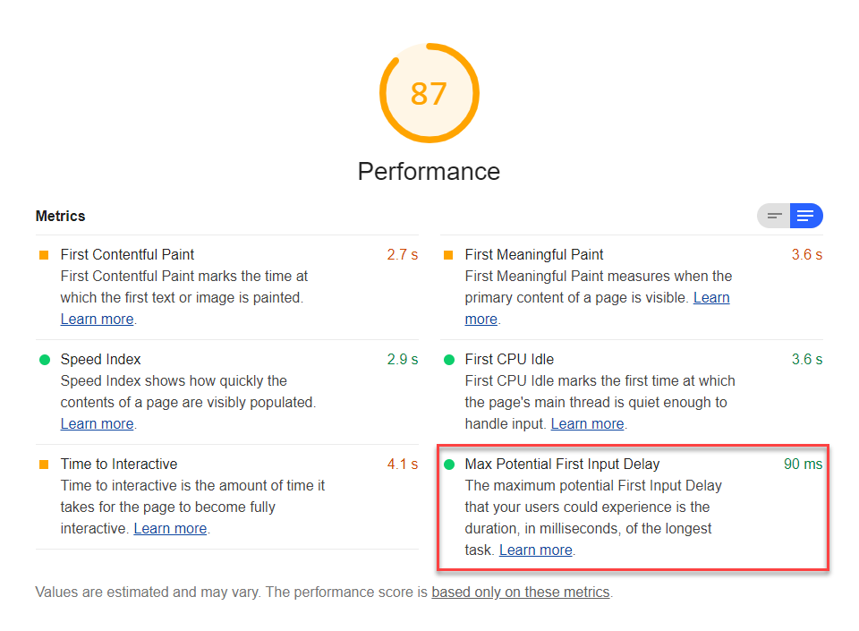

Max Potential First Input Delay (FID) is one of six metrics
tracked in the **Performance** section of the Lighthouse report.
Each metric captures some aspect of page load speed.

The Lighthouse reports displays Max Potential FID in milliseconds:

<figure class="w-figure">
  
</figure>

## What Max Potential FID measures

<!--TODO
mfriesenhahn@
I took a guess about what the "max potential" part of Max Potential FID means
based on how TTI is measured. Need confirmation from LH team.
-->

Max Potential FID is an estimate of how long your app takes to respond to user input
during the busiest 5&nbsp;seconds of page load.

FID measures the time from when a user first interacts with your site
to the time when the browser responds to that interaction.
In general, input delay happens
because the browser's main thread is busy doing something else—like
parsing a large JavaScript file—that keeps it from responding to the user.


FID focuses on _discrete_ user actions like clicks, taps, and key presses.
The performance of _continuous_ actions, like scrolling and zooming,
are affected by different factors and so should be evaluated separately.


FID can vary depending on when a user interacts with your page;
if the user happens to start an interaction
when the browser's main thread isn't busy, there won't be a delay.
That's why Lighthouse measures the _maximum potential_ FID
by checking for input delay during the main thread's busiest window.
This approach helps provide a more reliable metric that you can use to
evaluate the responsiveness of your page over time.

## How Lighthouse determines your Max Potential FID score

<!--TODO
mfriesenhahn@
I have no idea how the max potential fid score is determined.
There's not yet a report for it on HTTP Archive.
Need info from LH team.
-->



## How to improve your Max Potential FID score



FID most commonly occurs when
the browser is busy parsing and executing a large JavaScript file
loaded by your page.
So, look for opportunities to [optimize your JavaScript](/fast#optimize-your-javascript).
In particular,
consider [reducing JavaScript payloads with code splitting](/reduce-javascript-payloads-with-code-splitting)
and [applying the PRPL pattern](/apply-instant-loading-with-prpl).

These two Diagnostic audits provide additional opportunities
to reduce JavaScript work:

- [Minimize main-thread work](/mainthread-work-breakdown)
- [Reduce JavaScript execution time](/bootup-time)

## How to measure FID manually

You can use JavaScript to measure FID in all modern browsers.
Consider using Google's [First Input Delay library](https://github.com/GoogleChromeLabs/first-input-delay),
which adds the event listeners needed to detect FID.
Once you're capturing FID data, you can report it as an event
to your preferred analytics tool.

Since FID measures when actual users first interact with your page,
it's more inherently variable than typical performance metrics.
See the [Analyzing and reporting on FID data][analysis] section
of Google's [First Input Delay][fid] page for guidance
about how to evaluate the FID data you collect.

## Resources

- [Source code for **Max Potential First Input Delay** audit](https://github.com/GoogleChrome/lighthouse/blob/master/lighthouse-core/audits/metrics/max-potential-fid.js)
- [Lighthouse v3 Scoring Guide](https://developers.google.com/web/tools/lighthouse/v3/scoring)
- [First Input Delay][fid]

[analysis]: https://developers.google.com/web/updates/2018/05/first-input-delay#analyzing_and_reporting_on_fid_data
[fid]: https://developers.google.com/web/updates/2018/05/first-input-delay
