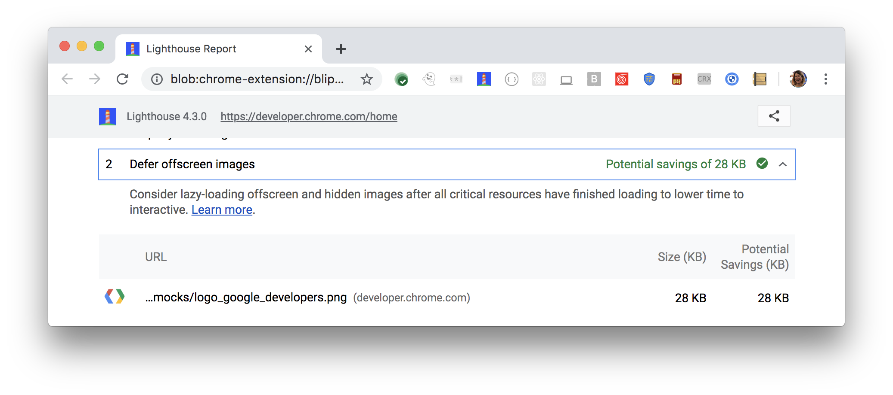

The Opportunities section of your Lighthouse report lists
all offscreen or hidden images in your page
along with the potential savings in kilobytes (KB).
Consider lazy-loading these images
after all critical resources have finished loading
to lower [Time to Interactive](/interactive):

<figure class="w-figure">
  
</figure>

See also [Lazy load offscreen images with lazysizes codelab](/codelab-use-lazysizes-to-lazyload-images).

## Bug: `loading="lazy"` images are incorrectly flagged

This audit incorrectly flags [natively lazy-loaded images](/native-lazy-loading/).
See [issue #6677](https://github.com/GoogleChrome/lighthouse/issues/6677) for details.

## Resources

- [Source code for **Defer offscreen images** audit](https://github.com/GoogleChrome/lighthouse/blob/master/lighthouse-core/audits/byte-efficiency/offscreen-images.js)
