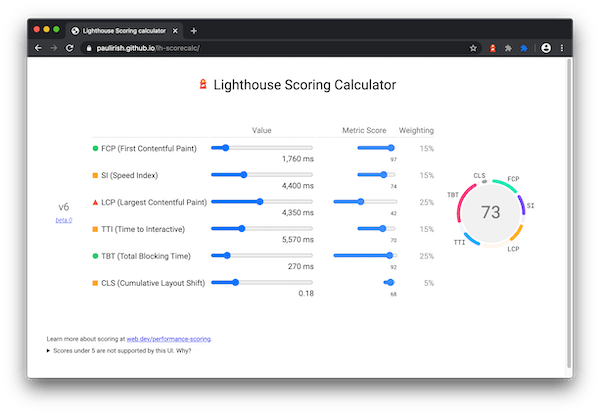
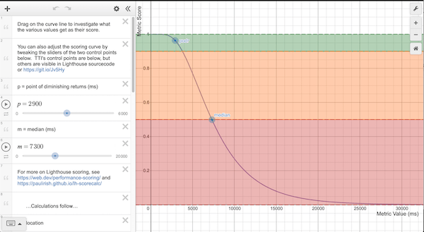

In general, only [metrics](/lighthouse-performance/#metrics)
contribute to your Lighthouse Performance score, not the results of Opportunities or Diagnostics.
That said, improving the opportunties and diagnostics likely improve the metric values, so there
is an indirect relationship.

Below, we've outlined why the score can fluctuate, how it's comprised, and how Lighthouse scores each individual metric.

## Why your score fluctuates {: #fluctuations }

A lot of the variability in your overall Performance score and metric values is not due to Lighthouse. When your Performance score fluctuates it's usually because of changes in underlying conditions. Common
problems include:

* A/B tests or changes in ads being served
* Internet traffic routing changes
* Testing on different devices, such as a high-performance desktop and a low-performance laptop
* Browser extensions that inject JavaScript and add/modify network requests
* Antivirus software

[Lighthouse's documentation on Variability](https://github.com/GoogleChrome/lighthouse/blob/master/docs/variability.md) covers this in more depth.

Furthermore, even though Lighthouse can provide you a single overall Performance score, it might be more
useful to think of your site performance as a distribution of scores, rather than a single number.
See the introduction of [User-Centric Performance Metrics](https://developers.google.com/web/fundamentals/performance/user-centric-performance-metrics)
to understand why.

## How the Performance score is weighted {: #weightings }

The Performance score is a [weighted average](https://www.wikihow.com/Calculate-Weighted-Average#Weighted_Averages_without_Percentages_sub) of the _metric scores_. Naturally, more heavily weighted metrics have a bigger effect on your overall Performance score.
The metric scores are not visible in the report, but are calculated under the hood.


  The weightings are chosen to provide a balanced representation of the user's perception of performance. The weightings have changed over time because the Lighthouse team is regularly
  doing research and gathering feedback to understand what has the biggest
  impact on user-perceived performance.


<figure class="w-figure">
  
  <figcaption class="w-figcaption">
    Explore scoring with the <a href="https://paulirish.github.io/lh-scorecalc/">Lighthouse scoring calculator</a>
  </figcaption>
</figure>

### Lighthouse 6 (draft)

  <table>
    <thead>
      <tr>
        <th>Audit</th>
        <th>Weight</th>
      </tr>
    </thead>
    <tbody>
      <tr>
        <td><a href="/first-contentful-paint/">First Contentful Paint</a></td>
        <td>15%</td>
      </tr>
      <tr>
        <td><a href="/speed-index/">Speed Index</a></td>
        <td>15%</td>
      </tr>
      <tr>
        <td><a href="/lcp/">Largest Contentful Paint</a></td>
        <td>25%</td>
      </tr>
      <tr>
        <td><a href="/interactive/">Time to Interactive</a></td>
        <td>15%</td>
      </tr>
      <tr>
        <td><a href="/lighthouse-total-blocking-time/">Total Blocking Time</a></td>
        <td>25%</td>
      </tr>
      <tr>
        <td><a href="/cls/">Cumulative Layout Shift</a></td>
        <td>5%</td>
      </tr>
    </tbody>
  </table>

### Lighthouse 5

  <table>
    <thead>
      <tr>
        <th>Audit</th>
        <th>Weight</th>
      </tr>
    </thead>
    <tbody>
      <tr>
        <td><a href="/first-contentful-paint/">First Contentful Paint</a></td>
        <td>20%</td>
      </tr>
      <tr>
        <td><a href="/speed-index/">Speed Index</a></td>
        <td>27%</td>
      </tr>
      <tr>
        <td><a href="/first-meaningful-paint/">First Meaningful Paint</a></td>
        <td>7%</td>
      </tr>
      <tr>
        <td><a href="/interactive/">Time to Interactive</a></td>
        <td>33%</td>
      </tr>
      <tr>
        <td><a href="/first-cpu-idle/">First CPU Idle</a></td>
      </tr>
    </tbody>
  </table>

### How metric scores are determined {: #metric-scores }

Once Lighthouse is done gathering the raw performance metrics (mostly reported in milliseconds), it converts them into a score by mapping the raw performance number into a metric score from 0 to 100 by looking where the metric value falls on the Lighthouse scoring distribution. The scoring distribution is
a log-normal distribution derived from the performance metrics of real website performance
data on [HTTP Archive](https://httparchive.org/).

For example, Largest Contentful Paint (LCP) measures when a user perceives that the
largest content of a page is visible. The metric value for LCP represents the time duration between
the user initiating the page load and the page rendering its primary content. Based on real
website data, top-performing sites render LCP in about 1,220ms, so that metric value is mapped to
a score of 99.

Going a bit deeper, the Lighthouse scoring curve model uses HTTPArchive data to determine two control points that then set the shape of a [log-normal](https://en.wikipedia.org/wiki/Weber%E2%80%93Fechner_law) curve. The 25th percentile of HTTPArchive data becomes a score of 50 (the median control point), and the 5th percentile becomes a score of 95-ish (the PODR - point of diminishing returns control point).

<figure class="w-figure">
  
  <figcaption class="w-figcaption">
    <a href="https://www.desmos.com/calculator/dufar5rf4g">Explore the scoring curve for TTI</a>.
  </figcaption>
</figure>

### How scores are color-coded {: #color-coding }

The metrics scores and the perf score are colored according to these ranges:

* 0 to 49 (slow): Red
* 50 to 89 (moderate): Orange
* 90 to 100 (fast): Green

### What can developers do to improve their performance score?
First, use the [Lighthouse scoring calculator](https://paulirish.github.io/lh-scorecalc/) to help understand what thresholds you should be aiming for achieving a certain Lighthouse performance score.

In the Ligthhouse report, the **Opportunities** section has detailed suggestions and documentation on how to implement them. Additionally, the **Diagnostics** section lists additional guidance that developers can explore to further improve their performance.

<!--
We don't think users care about the historical scoring rubrics, but we'd still prefer to keep them around because X
## Historical versions

### Lighthouse 3 and 4

  <table>
    <thead>
      <tr>
        <th>Audit</th>
        <th>Weight</th>
      </tr>
    </thead>
    <tbody>
      <tr>
        <td><a href="/first-contentful-paint/">First Contentful Paint</a></td>
        <td>23%</td>
      </tr>
      <tr>
        <td><a href="/speed-index/">Speed Index</a></td>
        <td>27%</td>
      </tr>
      <tr>
        <td><a href="/first-meaningful-paint/">First Meaningful Paint</a></td>
        <td>7%</td>
      </tr>
      <tr>
        <td><a href="/interactive/">Time to Interactive</a></td>
        <td>33%</td>
      </tr>
      <tr>
        <td><a href="/first-cpu-idle/">First CPU Idle</a></td>
      </tr>
    </tbody>
  </table>

### Lighthouse 2

  <table>
    <thead>
      <tr>
        <th>Audit</th>
        <th>Weight</th>
      </tr>
    </thead>
    <tbody>
      <tr>
        <td><a href="/first-contentful-paint/">First Contentful Paint</a></td>
        <td>6%</td>
      </tr>
      <tr>
        <td><a href="/speed-index/">Speed Index</a></td>
        <td>6%</td>
      </tr>
      <tr>
        <td><a href="/first-meaningful-paint/">First Meaningful Paint</a></td>
        <td>29%</td>
      </tr>
      <tr>
        <td><a href="/interactive/">Time to Interactive</a></td>
        <td>29%</td>
      </tr>
      <tr>
        <td><a href="/first-cpu-idle/">First CPU Idle</a></td>
        <td>29%</td>
      </tr>
    </tbody>
  </table>

-->
