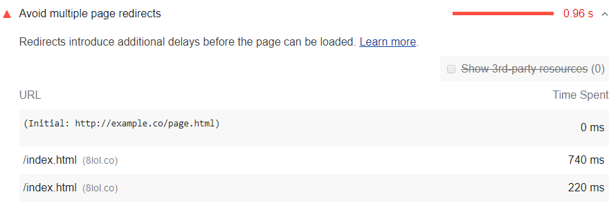

The Opportunities section of the Lighthouse report
lists resources that are being redirected:

<figure class="w-figure">
  
  <figcaption class="w-figcaption">
    Avoid multiple page redirects.
  </figcaption>
</figure>

## How redirects slow down performance

Redirects introduce additional delays before the page can load.

When a browser requests a resource that has been redirected,
the server usually returns an HTTP response like this:

```js
HTTP/1.1 301 Moved Permanently
Location: /path/to/new/location
```

The browser must then make another HTTP request at the new location
in order to retrieve the resource.
This additional trip across the network can delay the loading
of the resource by hundreds of milliseconds.

## How to eliminate redirects

Eliminate the redirects by upading the links to these resources.
Update the links to these resources.
The links should point to the current locations of the resources.
It's especially important to avoid redirects in resources
required for your [Critical Rendering Path](https://developers.google.com/web/fundamentals/performance/critical-rendering-path/).

If you're using redirects to divert mobile users to the mobile version of your page,
consider re-designing your site to use
[Responsive Design](https://developers.google.com/web/fundamentals/design-and-ux/responsive/).

## More information

- [Avoid multiple page redirects audit source](https://developers.google.com/web/tools/lighthouse/audits/redirects)
- [Redirections in HTTP](https://developer.mozilla.org/en-US/docs/Web/HTTP/Redirections)
- [Avoid multiple page redirects audit source](https://github.com/GoogleChrome/lighthouse/blob/master/lighthouse-core/audits/redirects.js)
