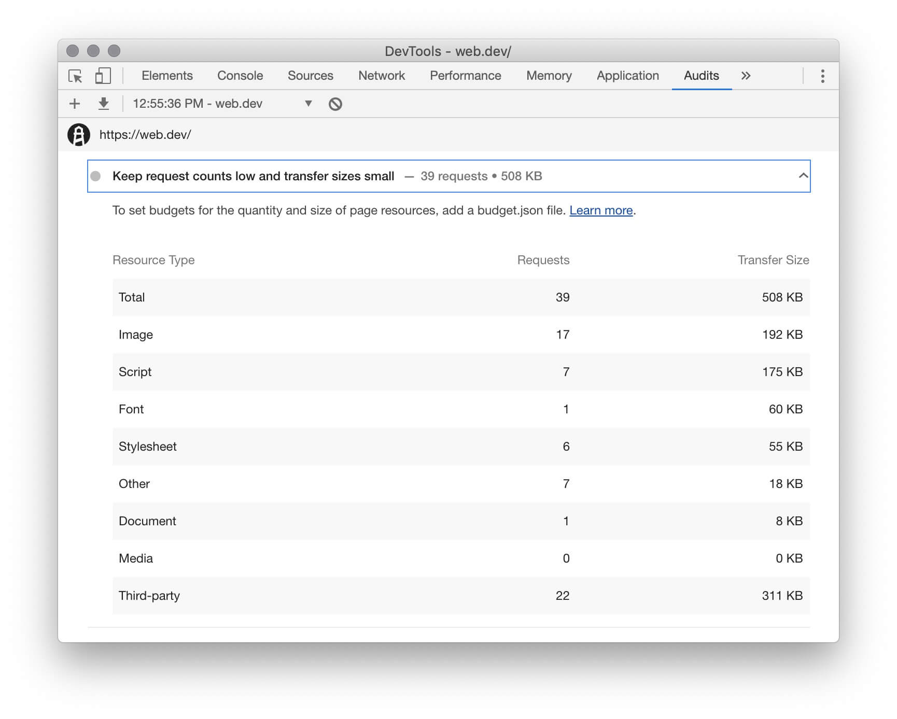

The **Keep request counts low and transfer sizes small** audit tells you how many network requests 
were made while your page loaded, as well as the total amount of data transferred:

<figure class="w-figure">
  
  <figcaption class="w-figcaption">
    <b>Keep request counts low and transfer sizes small</b>
  </figcaption>
</figure>


  Like all of the **Diagnostics** audits, the **Keep request counts low and transfer sizes small**
  audit does not directly affect your **Performance** score.


## How large transfer sizes affect load performance

### JavaScript and CSS

In general, links to large JavaScript and CSS files have the biggest potential to negatively affect
load performance:

* Requests for CSS files are [render-blocking][render].
* Requests for JavaScript files are [parser-blocking][parser].

In other words, the browser can't render content to a user's screen until all CSS and JavaScript 
network requests are complete.

If you refactor your code to only ship the JavaScript and CSS that you need in order to load the
page, you should see your [First Contentful Paint][FCP] metric improve. Your 
[First Meaningful Paint][FMP] and [Speed Index][Speed Index] metrics may also improve.

### Images

Large image files do not block the page load like JavaScript and CSS links, but they can still
negatively affect the perceived performance

### Example

Suppose that you have a link to a 1 MB JavaScript file called `utilities.js`
at the bottom of your HTML:

Now suppose that you're only using 1 function from `utilities.js`. In other words, in order to load
the page you only need 1 KB of code from this 1 MB file.

### Tools

Use the [**Coverage** tab] in Chrome DevTools to 

Network panel

## How high resource counts affect load performance

In general, links to JavaScript and CSS files have the greatest potential

Links to JavaScript and CSS files can have a particularly large impact.

https://developers.google.com/web/fundamentals/performance/critical-rendering-path/analyzing-crp

https://developers.google.com/web/fundamentals/performance/critical-rendering-path/adding-interactivity-with-javascript#parser_blocking_versus_asynchronous_javascript

Images do not block the critical rendering path, but will slow down the perceived performance
of the page

## Strategies for reducing request counts

### Bundle

## Strategies for reducing transfer sizes

### Compress text resources

### Minify code

### Use code splitting to ship only code that's needed

https://web.dev/code-splitting-suspense/
https://web.dev/route-level-code-splitting-in-angular/

### Use performance budgets to prevent regressions

https://web.dev/use-lighthouse-for-performance-budgets/
https://web.dev/performance-budgets-with-the-angular-cli/

## Resources

- [Source code](https://github.com/GoogleChrome/lighthouse/blob/master/lighthouse-core/audits/resource-summary.js)

[coverage]: https://developers.google.com/web/tools/chrome-devtools/coverage/
[render]: https://developers.google.com/web/fundamentals/performance/critical-rendering-path/render-blocking-css
[parser]: https://developers.google.com/web/fundamentals/performance/critical-rendering-path/adding-interactivity-with-javascript#parser_blocking_versus_asynchronous_javascript
[FCP]: https://developers.google.com/web/tools/lighthouse/audits/first-contentful-paint
[Speed Index]: https://developers.google.com/web/tools/lighthouse/audits/speed-index
[FMP]: https://developers.google.com/web/tools/lighthouse/audits/first-meaningful-paint