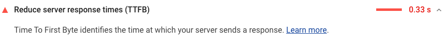

The Opportunities section of your Lighthouse report
reports Time to First Byte,
the time that it takes for a user's browser
to receive the first byte of page content:

<figure class="w-figure">
  
</figure>

## Slow server response times affect performance

This audit fails when the browser waits more than 600&nbsp;ms
for the server to respond to the main document request.
Users dislike when pages take a long time to load.
Slow server response times are one possible cause for long page loads.

When users navigate to a URL in their web browser,
the browser makes a network request to fetch that content.
Your server receives the request and returns the page content.

The server may need to do a lot of work in order to return a page with all of the content that users want.
For example, if users are looking at their order history,
the server needs to fetch each user's history from a database,
and then insert that content into the page.

Optimizing the server to do work like this as quickly as possible is one way to reduce the time that users spend waiting for pages to load.

## How to improve server response times

The first step to improving server response times is to identify the core conceptual tasks that your server must complete in order to return page content, and then measure how long each of these tasks takes. Once you've identified the longest tasks, search for ways to speed them up.

There are many possible causes of slow server responses, and therefore many possible ways to improve:

- Optimize the server's application logic to prepare pages faster. If you use a server framework, the framework may have recommendations on how to do this.
- Optimize how your server queries databases, or migrate to faster database systems.
- Upgrade your server hardware to have more memory or CPU.

## Resources

- [Source code for **Reduce server response times (TTFB)** audit](https://github.com/GoogleChrome/lighthouse/blob/master/lighthouse-core/audits/server-response-time.js)
- [Adaptive Serving with Network Information API](/adaptive-serving-based-on-network-quality)
