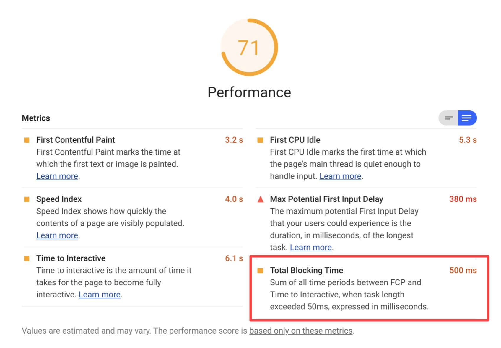

Total Blocking Time (TBT) is one of the metrics tracked in the **Performance** section
of the Lighthouse report. Each metric captures some aspect of page load speed.

The Lighthouse report displays TBT in milliseconds:

<figure class="w-figure">
  
</figure>

## What TBT measures

TBT measures the total amount of time that a page is blocked from responding to user input,
such as mouse clicks, screen taps, or keyboard presses. The sum is calculated by adding
the duration of all [long tasks] between [First Contentful Paint][fcp] and [Time to Interactive][tti].
Any task that executes for more than 50 milliseconds is a long task.

## How Lighthouse determines your TBT score

Your TBT score is a comparison of your page's TBT time and TBT times for the top 10,000 sites
when loaded on mobile devices. The top site data includes 404 pages.

This table shows how to interpret your TBT score:

  <table>
    <thead>
      <tr>
        <th>TBT time (in milliseconds)</th>
        <th>Color-coding</th>
      </tr>
    </thead>
    <tbody>
      <tr>
        <td>0–200</td>
        <td>Green (fast)</td>
      </tr>
      <tr>
        <td>200-600</td>
        <td>Orange (average)</td>
      </tr>
      <tr>
        <td>Over 600</td>
        <td>Red (slow)</td>
      </tr>
    </tbody>
  </table>



## How to improve your TBT score

See [What is causing my long tasks?](/long-tasks-devtools/#what-is-causing-my-long-tasks) to learn
how to diagnose the root cause of long tasks with the Performance panel of Chrome DevTools.

In general, the most common causes of long tasks are:

* Inefficient JavaScript statements. For example, after analyzing your code in the Performance panel, suppose
  you see a call to `document.querySelectorAll('a')` that returns 2000 nodes. Refactoring your code to
  use a more specific selector that only returns 10 nodes should improve your TBT score.
* Unnecessary JavaScript loading, parsing, or execution. While analyzing your code in the Performance panel
  you might discover that the main thread is doing work that isn't really necessary to load the page.
  [Reducing JavaScript payloads with code splitting][split], [removing unused code][unused], or 
  [efficiently loading third-party JavaScript][3p] should improve your TBT score.

## Resources

- [Source code for **Total Blocking Time** audit](https://github.com/GoogleChrome/lighthouse/blob/master/lighthouse-core/audits/metrics/total-blocking-time.js)
- [Are long JavaScript tasks delaying your Time to Interactive?][long tasks]
- [First Contentful Paint][fcp]
- [Time to Interactive][tti]
- [Reduce JavaScript payloads with code splitting][split]
- [Remove unused code][unused]
- [Efficiently load third-party resources][3p]

[long tasks]: /long-tasks-devtools
[fcp]: /first-contentful-paint/
[tti]: /interactive/
[split]: /reduce-javascript-payloads-with-code-splitting/
[unused]: /remove-unused-code/
[3p]: /efficiently-load-third-party-javascript/
