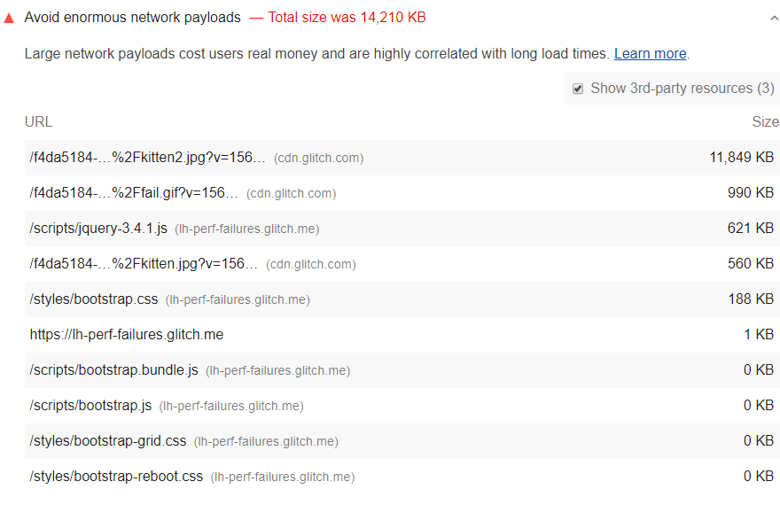

Large network payloads are highly correlated with long load times.
They also cost users money;
for example, users may have to pay for more cellular data.
So, reducing the total size of your page's network requests is good
for your users' experience on your site _and_ their wallets.


To see what accessing your site costs around the world,
check out WebPageTest's [What Does My Site Cost?](https://whatdoesmysitecost.com/)
You can adjust the results to factor in purchasing power.


## How the Lighthouse network payload audit fails

[Lighthouse](https://developers.google.com/web/tools/lighthouse/)
shows the total size in kilobytes of all resources requested by your page.
The largest requests are presented first:

<figure class="w-figure">
  
</figure>

Based on [HTTP Archive data](https://httparchive.org/reports/state-of-the-web?start=latest#bytesTotal),
the median network payload is between 1,700 and 1,900&nbsp;KB.
To help surface the highest payloads,
Lighthouse flags pages whose total network requests exceed 5,000&nbsp;KB.



## How to reduce payload size

Aim to keep your total byte size below 1,600&nbsp;KB.
This target is based on the amount of data that can be
theoretically downloaded on a 3G connection
while still achieving a [Time to Interactive](/interactive) of 10&nbsp;seconds or less.

Here are some ways to keep payload size down:
- Defer requests until they're needed.
  See the [PRPL Pattern](/apply-instant-loading-with-prpl) for one possible approach.
- Optimize requests to be as small as possible. Possible techniques include:
  - [Minify and compress network payloads](/reduce-network-payloads-using-text-compression).
  - [Use WebP instead of JPEG or PNG for your images](/serve-images-webp).
  - [Set the compression level of JPEG images to 85](/use-imagemin-to-compress-images).
- Cache requests so that the page doesn't re-download the resources
  on repeat visits. (See the [Network reliability landing page](/reliable)
  to learn how caching works and how to implement it.)

## Resources

[Source code for **Avoid enormous network payloads** audit](https://github.com/GoogleChrome/lighthouse/blob/master/lighthouse-core/audits/byte-efficiency/total-byte-weight.js)
