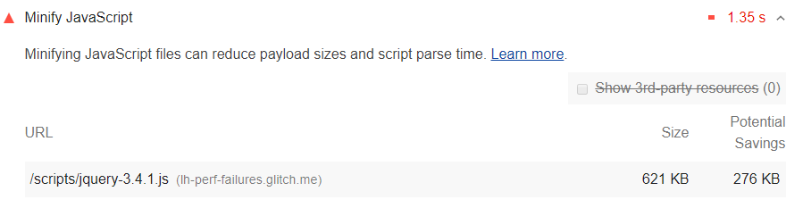

Minifying JavaScript files can reduce payload sizes and script parse time.
The Opportunities section of your Lighthouse report lists
all unminified JavaScript files,
along with the potential savings in kilobytes (KB)
when these files are minified:

<figure class="w-figure">
  
  <figcaption class="w-figcaption">
    Minify JavaScript.
  </figcaption>
</figure>

## How to minify & compress your JavaScript files

There are two useful techniques that can be used to improve the performance of your web page:

- Minification
- Data compression

Incorporating both of these techniques reduces payload sizes and in turn improves page load times
(see [Minify and compress network payloads](/reduce-network-payloads-using-text-compression)).

Minification is the process of removing whitespace and any code that is not necessary
to create a smaller but perfectly valid code file.
[Terser](https://github.com/terser-js/terser) is a popular JavaScript compression tool and
webpack v4 includes a plugin for this library by default to create minified build files.

Compression is the process of modifying data using a compression algorithm.
[Gzip](https://www.youtube.com/watch?v=whGwm0Lky2s&feature=youtu.be&t=14m11s)
is the most widely used compression format for server and client interactions
(see [Minify and compress network payloads with gzip codelab](/codelab-text-compression)).

[Brotli](https://opensource.googleblog.com/2015/09/introducing-brotli-new-compression.html)
is a newer compression algorithm which can provide even better compression results than Gzip
(see [Minify and compress network payloads with brotli](/codelab-text-compression-brotli)).

## More information

- [Unminified JavaScript audit source](https://github.com/GoogleChrome/lighthouse/blob/master/lighthouse-core/audits/byte-efficiency/unminified-javascript.js)
