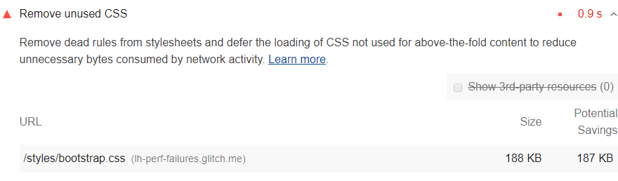
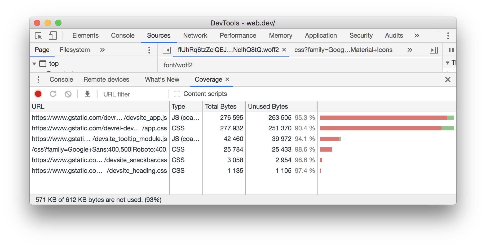

The Opportunities section of your Lighthouse report lists
all stylesheets with unused CSS with a potential savings of 2 KBs or more.
Remove the unused CSS
to reduce unnecessary bytes consumed by network activity:

<figure class="w-figure">
  
</figure>


## How unused CSS slows down performance

Using a `<link>` tag is a common way to add styles to a page:

```html
<!doctype html>
<html>
  <head>
    <link href="main.css" rel="stylesheet">
    ...
```

The `main.css` file that the browser downloads is known as an external stylesheet,
because it's stored separately from the HTML that uses it.

By default, a browser must download, parse, and process all external stylesheets
that it encounters before it can display, or render, any content to a user's screen.
It wouldn't make sense for a browser to attempt to display content
before the stylesheets have been processed,
because the stylesheets may contain rules that affect the styling of the page.

Each external stylesheet must be downloaded from the network.
These extra network trips can significantly increase the time
that users must wait before they see any content on their screens.

Unused CSS also slows down a browser's construction of the
[render tree](https://developers.google.com/web/fundamentals/performance/critical-rendering-path/render-tree-construction).
The render tree is like the DOM tree, except that it also includes the styles for each node.
To construct the render tree, a browser must walk the entire DOM tree, and check which CSS rules apply to each node.
The more unused CSS there is,
the more time that a browser might potentially need to spend calculating the styles for each node.

## How to detect unused CSS

The Coverage tab of Chrome DevTools can help you discover critical and uncritical CSS.
See [View used and unused CSS with the Coverage tab](https://developers.google.com/web/tools/chrome-devtools/css/reference#coverage).

<figure class="w-figure">
  
  <figcaption class="w-figcaption">
    Chrome DevTools: Coverage tab.
  </figcaption>
</figure>

You can also extract this information from Puppeteer.
See [page.coverage](https://github.com/GoogleChrome/puppeteer/blob/master/docs/api.md#pagecoverage).

## Inline critical CSS and defer non-critical CSS

Similar to inlining code in a `<script>` tag,
inline critical styles required for the first paint
inside a `<style>` block at the `head` of the HTML page.
Then load the rest of the styles asynchronously using the `preload` link.

Consider automating the process of extracting and inlining "Above the Fold" CSS
using the [Critical tool](https://github.com/addyosmani/critical/blob/master/README.md).

Learn more in [Defer non-critical CSS](/defer-non-critical-css).

## Resources

- [Source code for **Remove unused CSS** audit](https://github.com/GoogleChrome/lighthouse/blob/master/lighthouse-core/audits/byte-efficiency/unused-css-rules.js)
