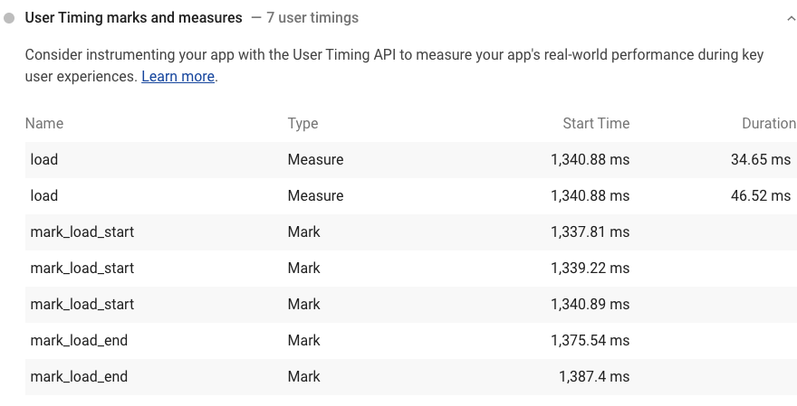

Consider instrumenting your app with the
[User Timing API](https://www.html5rocks.com/en/tutorials/webperformance/usertiming/)
to measure your app's real-world performance during key user experiences.

When your app includes User Timing Marks and Measures,
[Lighthouse](https://developers.google.com/web/tools/lighthouse/) reports them:

<figure class="w-figure">
  
</figure>

## What is the User Timing API

The User Timing API enables you to measure your app's JavaScript performance.
The basic idea is that you decide which parts of your scripts you want to optimize,
and then you instrument those parts of your scripts with the User Timing API.
From there, you can access the results from JavaScript using the API,
or view them on your Chrome DevTools Timeline Recordings.

Check out [User Timing API](https://www.html5rocks.com/en/tutorials/webperformance/usertiming/)
for an introduction on using the User Timing API to measure your app's JavaScript performance.

## Scoring

When your app includes User Timing Marks and Measures,
you'll see these Marks and Measures in your Lighthouse report.
This audit is not structured as a "pass" or "fail" test.
It's just an opportunity to discover a useful API that can aid you in measuring your app's performance.

The score that Lighthouse reports for this audit corresponds to the number of User Timing Marks and Measures
that it finds in your app.
Lighthouse extracts User Timing data from
[Chrome's Trace Event Profiling Tool](https://www.chromium.org/developers/how-tos/trace-event-profiling-tool).

## Resources

- [Source code for **User Timing marks and measures** audit](https://github.com/GoogleChrome/lighthouse/blob/master/lighthouse-core/audits/user-timings.js)
