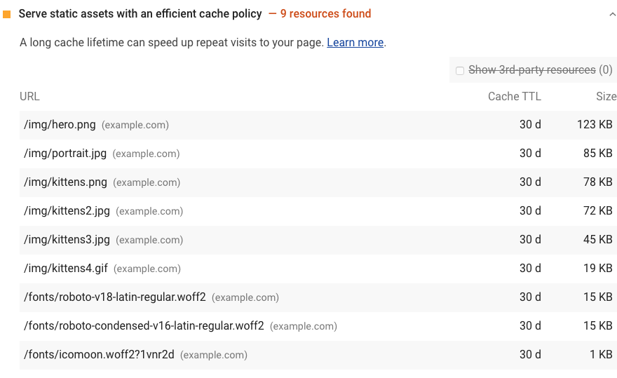
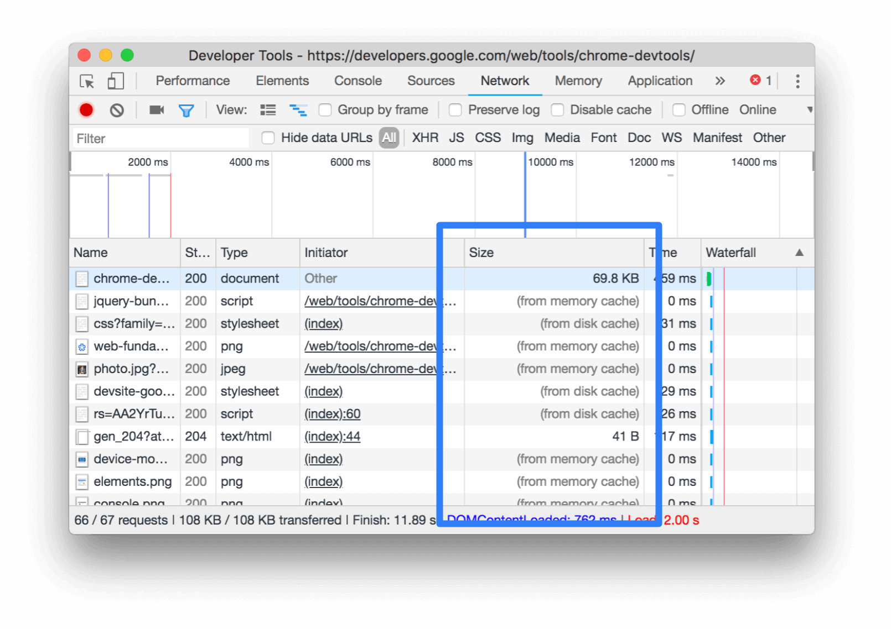
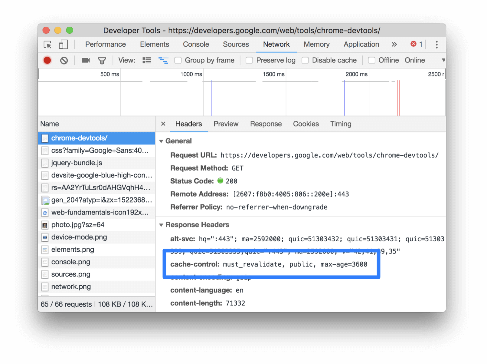

A long cache lifetime can speed up repeat visits to your page.
Lighthouse reports all static resources that aren't cached
in the Diagnostics section:

<figure class="w-figure">
  
  <figcaption class="w-figcaption">
    Serve static assets with an efficient cache policy.
  </figcaption>
</figure>

## Cache static resources to speed up page loads

HTTP caching can speed up your page load time on repeat visits.

When a browser requests a resource, the server providing the resource can tell the browser
how long it should temporarily store or **cache** the resource. For any subsequent request for that
resource, the browser uses its local copy, rather than going to the network to get it.

Lighthouse considers a resource cache-able if all of the following conditions are met:

- It's a font, image, media file, script, or stylesheet.
- It has a `200`, `203`, or `206` HTTP status code.
- It doesn't have an explicit no-cache policy.

Lighthouse then estimates how much network data you could have saved your users
if the resources had been cached. This estimate includes some calculations of
optimal cache duration for each resource, based on aggregate usage statistics reported
to Chrome.

A longer duration is not necessarily better.
Check out the [audit source](https://github.com/GoogleChrome/lighthouse/blob/master/lighthouse-core/audits/byte-efficiency/uses-long-cache-ttl.js) for details.
Ultimately,
it's up to you to decide what the optimal cache duration is for your resources.

## How to cache static resources using HTTP caching

Configure your server to return the `Cache-Control` HTTP response header.

```js
Cache-Control: max-age=31536000
```

The `max-age` directive tells the browser how long it should cache the resource, in seconds.
`31536000` corresponds to 1 year: 60 seconds × 60 minutes × 24 hours × 365 days = 31536000 seconds.

When possible, cache immutable static assets for a long time,
such as a year or longer.
Configure your build tool to embed a hash in your static asset filenames,
so that each one is unique (see
[Caching](https://webpack.js.org/guides/caching/) for webpack guidance).

Use `no-cache` if the resource changes and freshness matters
but you still want to get some of the speed benefits of caching.
The browser still caches a resource that's set to `no-cache`,
but checks with the server first to make sure that the resource is still current.

There are many directives for customizing how the browser caches different resources.
Learn more about caching resources in
[The HTTP cache: your first line of defense guide](/http-cache)
and [Configuring HTTP caching behavior codelab](/codelab-http-cache).

## Verify cached responses in Chrome DevTools

The **Size** column in Chrome DevTools can help you verify that a resource has been cached.

<figure class="w-figure">
  
  <figcaption class="w-figcaption">
    The <b>Size</b> column.
  </figcaption>
</figure>

Chrome serves the most requested resources from the memory cache, which is very fast,
but is cleared when the browser is closed.

The **Headers** tab can help you verify a resource's `Cache-Control` header is set
as expected.

<figure class="w-figure">
  
  <figcaption class="w-figcaption">
    Inspecting the <code>Cache-Control</code> header via the <b>Headers</b> tab.
  </figcaption>
</figure>

## More information

- [Serve static assets with an efficient cache policy audit source](https://github.com/GoogleChrome/lighthouse/blob/master/lighthouse-core/audits/byte-efficiency/uses-long-cache-ttl.js)
- [Cache-Control specification](https://www.w3.org/Protocols/rfc2616/rfc2616-sec14.html#sec14.9)
- [Cache-Control (MDN)](https://developer.mozilla.org/en-US/docs/Web/HTTP/Headers/Cache-Control)
