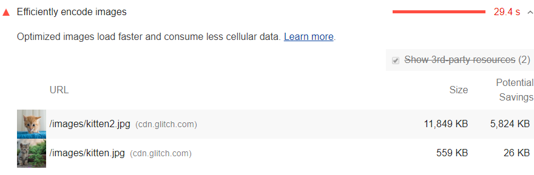

The Opportunities section of your Lighthouse report lists
all unoptimized images, with potential savings in [kibibytes (KiB)](https://en.wikipedia.org/wiki/Kibibyte).
Optimize these images so that the page loads faster and consumes less data:

<figure class="w-figure">
  
</figure>

## How Lighthouse flags images as optimizable

Lighthouse collects all the JPEG or BMP images on the page,
sets each image's compression level to 85,
and then compares the original version with the compressed version.
If the potential savings are 4KiB or greater, Lighthouse flags the image as optimizable.

## How to optimize images

There are many steps you can take to optimize your images, including:

- [Using image CDNs](/image-cdns/)
- [Compressing images](/use-imagemin-to-compress-images)
- [Replacing animated GIFs with video](/replace-gifs-with-videos)
- [Lazy loading images](/use-lazysizes-to-lazyload-images)
- [Serving responsive images](/serve-responsive-images)
- [Serving images with correct dimensions](/serve-images-with-correct-dimensions)
- [Using WebP images](/serve-images-webp)

## Optimize images using GUI tools

Another approach is to run your images through an optimizer
that you install onto your computer and run as a GUI.
For example,
with [ImageOptim](https://imageoptim.com/mac) you drag and drop images into its UI,
and then it automatically compresses the images without compromising quality noticeably.
If you're running a small site and can handle manually optimizing all images,
this option is probably good enough.

[Squoosh](https://squoosh.app/) is another option.
Squoosh is maintained by the Google Web DevRel team.

## Resources

- [Source code for **Efficiently encode images** audit](https://github.com/GoogleChrome/lighthouse/blob/master/lighthouse-core/audits/byte-efficiency/uses-optimized-images.js)
