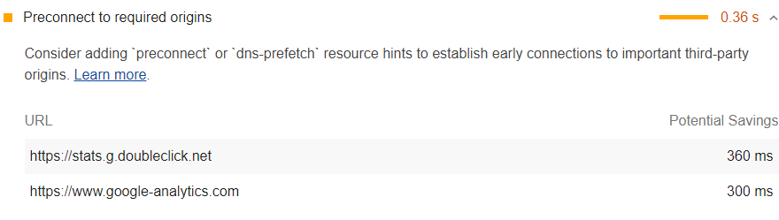

The Opportunities section of your Lighthouse report lists all URLs
requested later in the page load.
Consider using <link rel=preload> to prioritize fetching resources
that are currently requested later in page load:

<figure class="w-figure">
  
  <figcaption class="w-figcaption">
    Fig. 1 — Preconnect to required origins
  </figcaption>
</figure>

## More information

- [Preconnect to required origins audit source](https://github.com/GoogleChrome/lighthouse/blob/master/lighthouse-core/audits/uses-rel-preconnect.js)