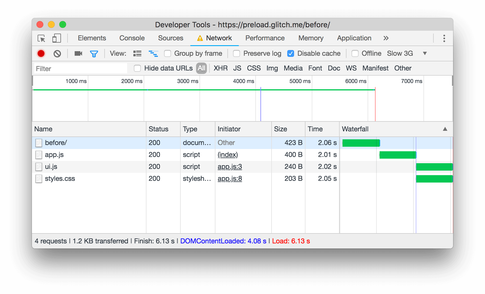
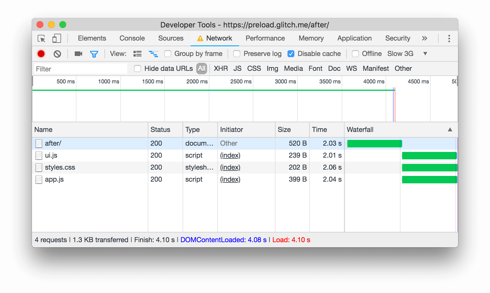

The Opportunities section of your Lighthouse report
flags the third level of requests in your critical request chain as preload candidates:

<figure class="w-figure">
  
</figure>

## How Lighthouse flags determines preload candidates

Suppose your page's
[critical request chain](/critical-request-chains) looks like this:

```html
index.html
|--app.js
   |--styles.css
   |--ui.js
```

Your `index.html` file declares `<script src="app.js">`. When  `app.js` runs , it calls
`fetch()` in order to download `styles.css` and `ui.js`. The page doesn't appear complete
until those last 2 resources are downloaded, parsed, and executed.
Using the example above, Lighthouse would flag `styles.css` and `ui.js` as candidates.

The potential savings are based on how much earlier the browser would be able
to start the requests if you declared preload links.
For example, if `app.js` takes 200ms to download, parse, and execute,
the potential savings for each resource is 200ms since `app.js` is no longer a bottleneck for each of the requests.

Preloading requests can make your pages load faster.

<figure>
  
  <figcaption>
    Without preload links, <code>styles.css</code> and
    <code>ui.js</code> are requested only after <code>app.js</code> has been downloaded,
    parsed, and executed.
  </figcaption>
</figure>

The problem here is that the browser only becomes aware
of those last 2 resources after it downloads, parses, and executes `app.js`.
But you know that those resources are important and
should be downloaded as soon as possible.

## Declare your preload links

Declare preload links in your HTML to instruct the browser to download key resources
as soon as possible.

```html
<head>
  ...
  <link rel="preload" href="styles.css" as="style">
  <link rel="preload" href="ui.js" as="script">
  ...
</head>
```

<figure>
  
  <figcaption>
    With preload links, <code>styles.css</code> and
    <code>ui.js</code> are requested at the same time as <code>app.js</code>.
  </figcaption>
</figure>

See also [Preload critical assets to improve loading speed](/preload-critical-assets)
for more guidance.

### Browser compatibility

As of June 2020 preloading is supported in Chromium-based browsers. See
[Browser compatibility](https://developer.mozilla.org/en-US/docs/Web/HTML/Preloading_content#Browser_compatibility)
for updates.

### Build tool support for preloading {: #tools }

See [Tooling.Report's Preloading Assets](https://bundlers.tooling.report/non-js-resources/html/preload-assets/?utm_source=web.dev&utm_campaign=lighthouse&utm_medium=uses-rel-preload)
page.

## Stack-specific guidance

### Angular

[Preload routes](/route-preloading-in-angular/) ahead of time to speed up navigation.

### Magento

[Modify your themes's
layout](https://devdocs.magento.com/guides/v2.3/frontend-dev-guide/layouts/xml-manage.html)
and add `<link rel=preload>` tags.

## Resources

- [Source code for **Preload key requests** audit](https://github.com/GoogleChrome/lighthouse/blob/master/lighthouse-core/audits/uses-rel-preload.js)
