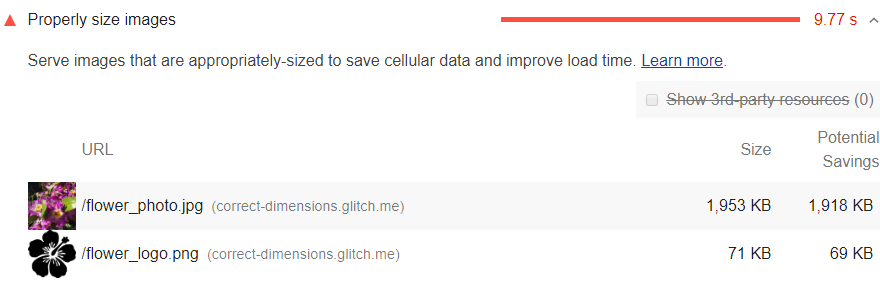

The Opportunities section of your Lighthouse report lists all images in your page
that aren't appropriately sized,
along with the potential savings in [kibibytes (KiB)](https://en.wikipedia.org/wiki/Kibibyte).
Resize these images to save data and improve page load time:

<figure class="w-figure">
  
</figure>

## How Lighthouse calculates oversized images

For each image on the page,
Lighthouse compares the size of the rendered image against the size of the actual image.
The rendered size also accounts for device pixel ratio.
If the rendered size is at least 4KiB smaller than the actual size,
then the image fails the audit.

## Strategies for properly sizing images

Ideally, your page should never serve images that are larger than the version
that's rendered on the user's screen.
Anything larger than that just results in wasted bytes and slows down page load time.

The main strategy for serving appropriately sized images is called "responsive images".
With responsive images, you generate multiple versions of each image,
and then specify which version to use in your HTML or CSS using media queries, viewport dimensions, and so on.
See [Serve responsive images](/serve-responsive-images) to learn more.

[Image CDNs](/image-cdns/) are another main strategy for serving appropriately sized images.
You can think of image CDNs like web service APIs for transforming images.

Another strategy is to use vector-based image formats, like SVG.
With a finite amount of code, an SVG image can scale to any size.
See [Replace complex icons with SVG](https://developers.google.com/web/fundamentals/design-and-ux/responsive/images#replace_complex_icons_with_svg) to learn more.

Tools like
[gulp-responsive](https://www.npmjs.com/package/gulp-responsive) or
[responsive-images-generator](https://www.npmjs.com/package/responsive-images-generator)
can help automate the process of converting an image into multiple formats.
There are also image CDNs which let you generate multiple versions,
either when you upload an image, or request it from your page.

## Resources

- [Source code for **Properly size images** audit](https://github.com/GoogleChrome/lighthouse/blob/master/lighthouse-core/audits/byte-efficiency/uses-responsive-images.js)
- [Serve images with correct dimensions](/serve-images-with-correct-dimensions)
