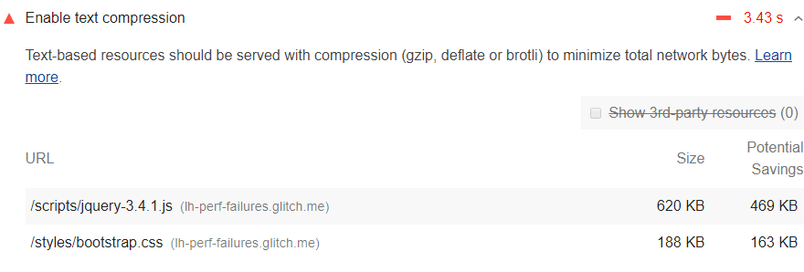
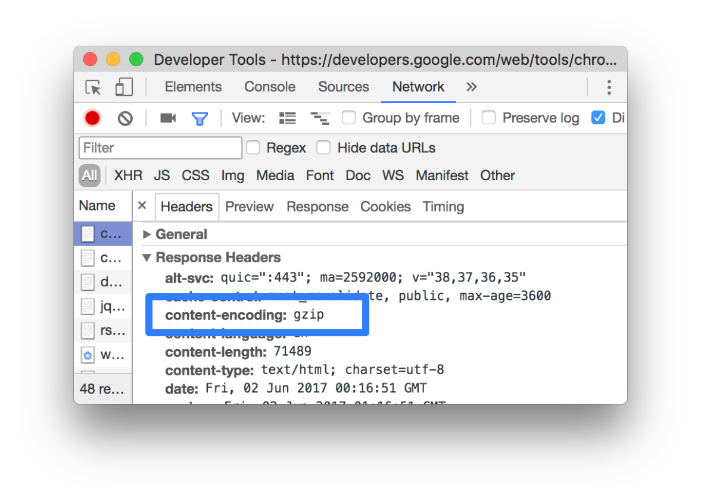

Text-based resources should be served with compression
to minimize total network bytes.
The Opportunities section of your Lighthouse report lists all text-based resources
that aren't compressed:

<figure class="w-figure">
  
  <figcaption class="w-figcaption">
    Fig. 1 — Enable text compression
  </figcaption>
</figure>

## How Lighthouse handles text compression

Lighthouse gathers all responses that:

* Have text-based resource types.
* Do not include a `content-encoding` header set to `br`, `gzip`, or
  `deflate`.

Lighthouse then compresses each of these with
[GZIP](https://www.gnu.org/software/gzip/) to compute the potential
savings.

If the original size of a response is less than 1.4KB, or if the 
potential compression savings is less than 10% of the original size, then
Lighthouse does not flag that response in the results.


The potential savings that Lighthouse lists are the potential savings
when the response is encoded with GZIP.
If Brotli is used, even more savings are possible.


## How to enable text compression on your server

Enable text compression on the server(s) that served these responses in order to
pass this audit.

Configure your server to compress the response with [Brotli](https://opensource.googleblog.com/2015/09/introducing-brotli-new-compression.html),
if the browser
supports it.
Brotli is a newer compression format, but it's not universally
supported in browsers.
Do a search for "how to enable Brotli compression in
`<server>`" to learn how to implement it, where `<server>` is the name of
your server.

Use GZIP as a fallback to Brotli.
GZIP is universally supported in all
modern browsers, but is less efficient than Brotli.
See [Server Configs](https://github.com/h5bp/server-configs)
for examples.

## Check if a response was compressed in Chrome DevTools

To check if a server compressed a response:

1. Go to the **Network** panel in DevTools.
1. Click the request that caused the response you're interested in.
1. Click the **Headers** tab.
1. Check the `content-heading` header in the **Response Headers** section.

<figure class="w-figure">
  
  <figcaption class="w-figcaption">
    Fig. 1 — The <code>content-encoding</code> response header
  </figcaption>
</figure>

To compare the compressed and de-compressed sizes of a response:

1. Go to the **Network** panel.
1. Enable large request rows.
See [Use large request rows](https://developers.google.com/web/tools/chrome-devtools/network/reference#request-rows).
1. Look at the **Size** column for the response you're interested in. The
   top value is the compressed size. The bottom value is the de-compressed
   size.

## More information

- [Enable text compression audit source](https://github.com/GoogleChrome/lighthouse/blob/master/lighthouse-core/audits/byte-efficiency/uses-text-compression.js)