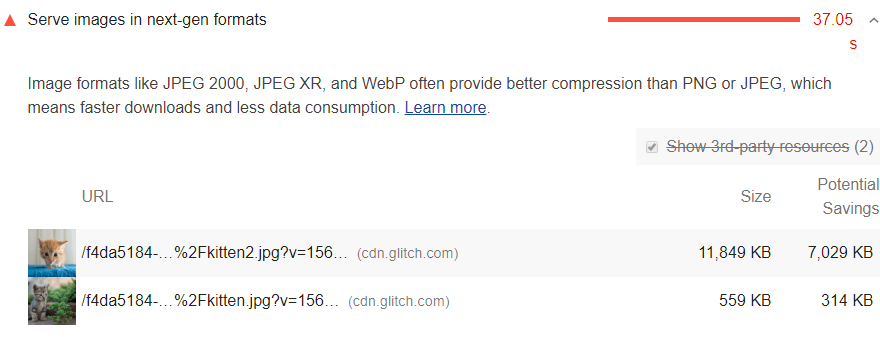

The Opportunities section of your Lighthouse report lists all images
in older image formats,
showing potential savings gained by serving WebP versions of those images:

<figure class="w-figure">
  
</figure>

## Why serve images in WebP format

JPEG 2000, JPEG XR, and WebP are image formats that have superior compression and quality characteristics compared to their older JPEG and PNG counterparts. Encoding your images in these formats rather than JPEG or PNG means that they will load faster and consume less cellular data.

WebP is supported in Chrome and Opera and provides better lossy and lossless compression for images on the web.
See [A New Image Format For The Web](https://developers.google.com/speed/webp/)
for more on WebP.


[Create WebP Images with the Command Line](/codelab-serve-images-webp)


## How Lighthouse calculates potential savings

Lighthouse collects each BMP, JPEG, and PNG image on the page,
and then converts each to WebP,
reporting the potential savings based on the conversion figures.


Lighthouse omits the image from its report if the potential savings are less than 8KB.


## WebP browser support

Browser support is not universal for WebP, but similar savings should be available in most major browsers in an alternative next-gen format. You'll need to serve a fallback PNG or JPEG image for other browser support. See
[How can I detect browser support for WebP?](https://developers.google.com/speed/webp/faq#how_can_i_detect_browser_support_for_webp) for an overview of fallback techniques and the list below for browser support of image formats.

To see the current browser support for each next-gen format, check out the entries below:

- [WebP](https://caniuse.com/#feat=webp)
- [JPEG 2000](https://caniuse.com/#feat=jpeg2000)
- [JPEG XR](https://caniuse.com/#feat=jpegxr)

## Resources

- [Source code for **Serve images in next-gen formats** audit](https://github.com/GoogleChrome/lighthouse/blob/master/lighthouse-core/audits/byte-efficiency/uses-webp-images.js)
- [Use WebP images](/serve-images-webp)
