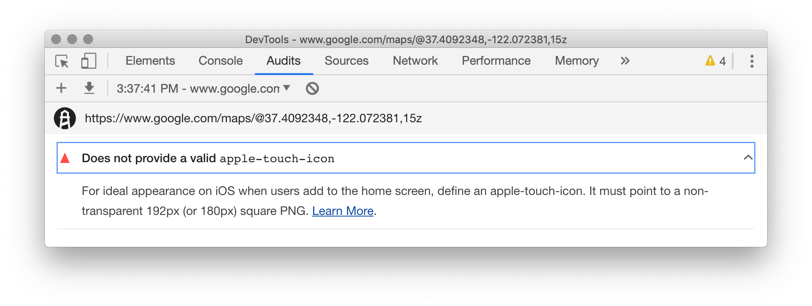

iOS Safari users can manually add [Progressive Web Apps (PWAs)](/discover-installable) to 
their home screens. The icon that appears on the iOS home screen when the user adds a PWA is
called the *Apple touch icon*. You can specify what icon your app should use by including a 
`<link rel="apple-touch-icon" href="/example.png">` tag in the `<head>` of your
page. If your page doesn't have this link tag, iOS generates an icon by taking a screenshot of
the page content. In other words, instructing iOS to download an icon results in a more polished 
user experience.

## How this audit fails

This audit fails when Lighthouse doesn't find a `<link rel="apple-touch-icon" href="/example.png">` 
tag in the `<head>` of the page. 

<figure class="w-figure">
  
  <figcaption class="w-figcaption">
    The <b>Does not provide a valid apple-touch-icon</b> audit
  </figcaption>
</figure>


  A `rel="apple-touch-icon-precomposed"` link passes the audit, but it has been
  obsolete since iOS 7. Use `rel="apple-touch-icon"` instead.


Lighthouse doesn't check whether the icon actually exists or whether the icon is
the correct size.



## How to add an Apple touch icon

- Add `<link rel="apple-touch-icon" href="/example.png">` to the `<head>` of your page.
- Replace `/example.png` with the actual path to your icon.

```html
...
<head>
  ...
  <link rel="apple-touch-icon" href="/example.png">
  ...
</head>
...
```


  Check out the [Add an Apple touch icon to your Progressive Web App](/codelab-apple-touch-icon)
  codelab to see how adding an Apple touch icon creates a more polished user experience.


To provide a good user experience, make sure that:

- The icon is 180 pixels wide and 180 pixels tall or 192 pixels wide and 192 pixels tall
- The specified URL to the icon is valid
- The background of the icon is not transparent

## Resources

- [Source code for the **Does not provide a valid `apple-touch-icon`** audit][source]
- <a href="https://webhint.io/docs/user-guide/hints/hint-apple-touch-icons/" rel="noreferrer">Use Apple Touch Icon</a>

[a2hs]: https://support.apple.com/guide/shortcuts/run-shortcuts-from-the-ios-home-screen-apd735880972/ios#apd175362e63
[source]: https://github.com/GoogleChrome/lighthouse/blob/master/lighthouse-core/audits/apple-touch-icon.js
