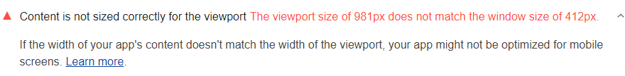

When content width is smaller or larger than viewport width,
that's often a cue that the page is not optimized for mobile screens.
This audit checks that the width of the content on your page is equal
to the width of the viewport:

<figure class="w-figure">
  
  <figcaption class="w-figcaption">
    Content not correctly sized for viewport.
  </figcaption>
</figure>

## How this audit fails

The audit fails if `window.innerWidth` does not equal `window.outerWidth`.



## Recommendations

This audit is a roundabout way of determining
if your page is optimized for mobile devices.
If your site is not optimized and you want it to be, then see
[Responsive Web Design Basics](https://developers.google.com/web/fundamentals/design-and-ux/responsive/)
to get started.

You can ignore this audit if:

- Your site does not need to be optimized for mobile screens.
- The content width of your page is intentionally smaller or larger than the
  viewport width.

## More information

[Content not sized correctly for viewport audit source](https://github.com/GoogleChrome/lighthouse/blob/master/lighthouse-core/audits/content-width.js)
