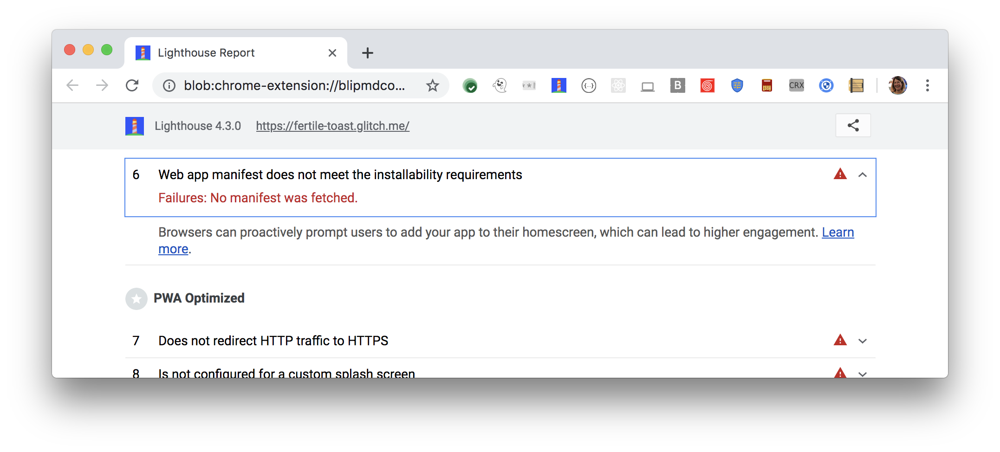

The prompt to install a Progressive Web App (PWA) lets users add your app to their home screen.
Users that add apps to home screens engage those apps more.
Learn more in [Discover what it takes to be installable](/discover-installable/).

For example, shortly after launching this feature,
Twitter reported an average of 250K unique daily users
launching their Twitter Lite progressive web app 4 times a day from the home screen.
See
[Twitter Lite PWA Significantly Increases Engagement and Reduces Data Usage](https://developers.google.com/web/showcase/2017/twitter#increasing_engagement_with_add_to_homescreen_prompt_and_web_push_notifications) for more on
Twitter's case study.

## How the Lighthouse web app manifest audit fails

[Lighthouse](https://developers.google.com/web/tools/lighthouse/)
flags pages missing an installable manifest:

<figure class="w-figure">
  
</figure>

This audit fails when the following criteria isn't met:

- The web app is not already installed and
[`prefer_related_applications`](https://developers.google.com/web/fundamentals/app-install-banners/native)
is not `true`.
- Meets a user engagement heuristic
(currently, the user has interacted with the domain for at least 30 seconds)
- Includes a [web app manifest](/add-manifest/) that includes:
  - `short_name` or `name`
  - `icons` must include a 192px and a 512px sized icons
  - `start_url`
  - `display` must be one of: `fullscreen`, `standalone`, or `minimal-ui`
- Served over [HTTPS](/is-on-https) (required for service workers)
- Has registered a
[service worker](/service-workers-cache-storage) with a `fetch` event handler



## How to make your PWA installable

In order for a user to be able to install your Progressive Web App,
check that it meets the above criteria.
When these criteria are met,
the browser fires a `beforeinstallprompt` event that you can use to prompt the user to install your Progressive Web App, and may show a [mini-info bar](https://developers.google.com/web/fundamentals/app-install-banners/#mini-info-bar).

Other browsers have different criteria for installation, or to trigger the `beforeinstallprompt` event. Check their respective sites for full details:
[Edge](https://docs.microsoft.com/en-us/microsoft-edge/progressive-web-apps#requirements),
[Firefox](https://developer.mozilla.org/en-US/docs/Web/Progressive_web_apps/Add_to_home_screen#How_do_you_make_an_app_A2HS-ready),
[Opera](https://dev.opera.com/articles/installable-web-apps/),
[Samsung Internet](https://hub.samsunginter.net/docs/ambient-badging/), and
[UC Browser](https://plus.ucweb.com/docs/pwa/docs-en/zvrh56).

In addition, the scope of the service worker includes the page you audited
and the page specified in the `start_url` property of the web app manifest.

  

    <h2 class="w-codelabs-callout__lockup">Codelabs</h2>
    
See it in action

    

      Learn more and put this guide into action.
    

  

  <ul class="w-unstyled-list w-codelabs-callout__list">
    <li class="w-codelabs-callout__listitem">
      <a class="w-codelabs-callout__link" href="/codelab-make-installable">
        Make it installable
      </a>
    </li>
  </ul>

Learn more in [Add a Web App Manifest](/add-manifest/).

## Resources

[Source code for **Web app manifest does not meet the installability requirements** audit](https://github.com/GoogleChrome/lighthouse/blob/master/lighthouse-core/audits/installable-manifest.js)
