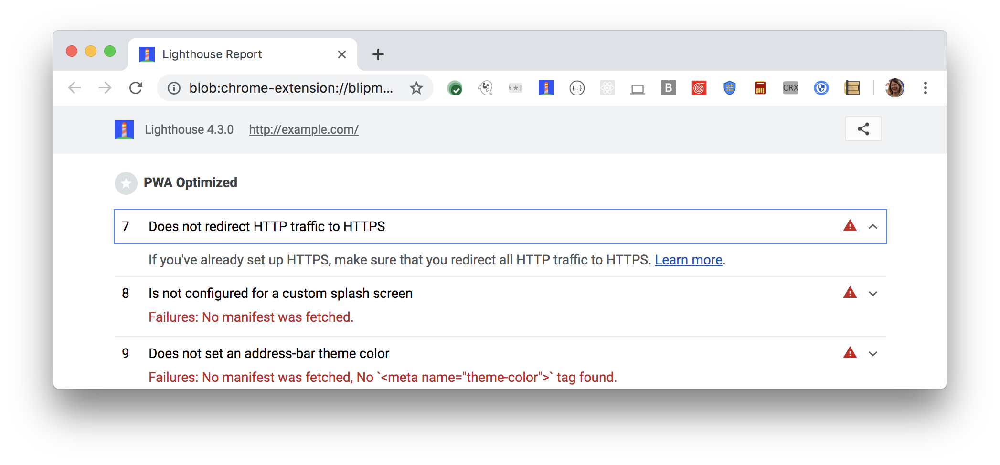

All websites should be protected with HTTPS, even ones that don't handle
sensitive data. HTTPS prevents intruders from tampering with or passively
listening in on the communications between your site and your users.
Lighthouse flags any pages that aren't on HTTPS:

<figure class="w-figure">
  
  <figcaption class="w-figcaption">
    Fig. 1 — Page isn't on HTTPS
  </figcaption>
</figure>

## How this audit fails

Lighthouse waits for an event from the Chrome Debugger Protocol indicating that
the page is running on a secure connection. If the event is not heard within 10
seconds, the audit fails.

## Recommendations

Migrate your site to HTTPS.
Many hosting platforms, such as
[Firebase](https://firebase.google.com/docs/hosting/) or
[GitHub Pages](https://pages.github.com/), are secure by default.

If you're running your own servers and need a cheap and easy way to generate
certificates, check out [Let's Encrypt](https://letsencrypt.org/). For more help
on enabling HTTPS on your servers, see the following set of docs: [Encrypting
data in transit](https://developers.google.com/web/fundamentals/security/encrypt-in-transit/enable-https).

If your page is already running on HTTPS but you're failing this audit, then
you may have problems with mixed content. Mixed content is when a secure site
requests an unprotected (HTTP) resource. Check out the following doc on the
Chrome DevTools Security panel to learn how to debug these situations:
[Understand security issues](https://developers.google.com/web/tools/chrome-devtools/debug/security).



## Why all sites should be on HTTPS

HTTPS is a prerequisite for many new, powerful web platform features, such
as taking pictures or recording audio.

By definition,
an app cannot qualify as a progressive web app if it does not run on HTTPS.
This is because many core progressive web app technologies, such as
service workers, require HTTPS.

For more information on why all sites should be protected with HTTPS, see
[Why You Should Always Use HTTPS](https://developers.google.com/web/fundamentals/security/encrypt-in-transit/why-https).

## More information

[Not on HTTPS audit source](https://github.com/GoogleChrome/lighthouse/blob/master/lighthouse-core/audits/is-on-https.js)
