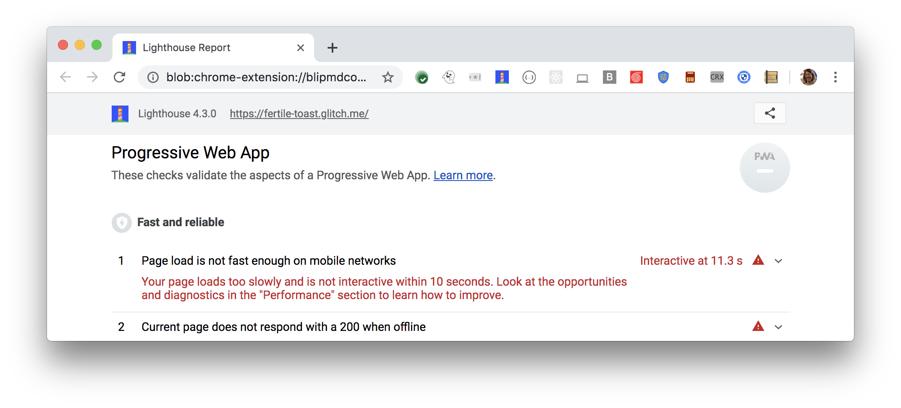

Many users of your page visit over a slow cellular network connection. 
Ensuring that your page loads fast over a simulated mobile network
ensures that your page loads in a reasonable amount of time for your mobile
users.
Lighthouse flags any pages that don't load fast enough on mobile:

<figure class="w-figure">
  
  <figcaption class="w-figcaption">
    Fig. 1 — Page doesn't load fast enough on mobile
  </figcaption>
</figure>


A fast page load on a mobile network is a baseline requirement for a site
to be considered a Progressive Web App. See [Baseline Progressive Web App
Checklist](https://developers.google.com/web/progressive-web-apps/checklist#baseline).


## How this audit fails

There are two main metrics regarding how users perceive load time:

- The page appears visually complete.
- The page is interactive. If a page appears visually complete at 1s,
but the user can't interact with it until 10s,
then the perceived page load time is 10s.

Lighthouse computes what time to interactive would be on a slow 4G network 
connection. If the time to interactive is more than 10s, the audit fails.



## Recommendations

To speed up time-to-visually-complete, only load the resources you need in order
to display the page.
See
[Critical Rendering Path](https://developers.google.com/web/fundamentals/performance/critical-rendering-path/) and 
[Optimizing Content Efficiency](/web/fundamentals/performance/optimizing-content-efficiency/).

To speed up time-to-interactive, only execute the JavaScript that you need in
order to display the page, and defer the rest.
See
[Get Started With Analyzing
Runtime Performance](https://developers.google.com/web/tools/chrome-devtools/evaluate-performance/)
to learn how to analyze JavaScript execution with Chrome DevTools.

[Record load performance](/web/tools/chrome-devtools/evaluate-performance/reference#record-load)
shows you how to record a page load.
Once you're familiar with the basics,
do a page load recording and analyze the results to find JS work that can be deferred.
See
[Rendering Performance](https://developers.google.com/web/fundamentals/performance/rendering/) for strategies.

## More information

[Page doesn't load fast enough on mobile audit source](https://github.com/GoogleChrome/lighthouse/blob/master/lighthouse-core/audits/load-fast-enough-for-pwa.js)