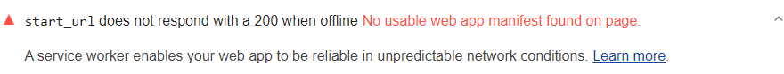

If Lighthouse does not receive an HTTP 200
response when accessing a page from the `start_url`,
then either the `start_url` isn't correct,
or ths page is not accessible offline
(see also [What is network reliability and how do you measure it?](/network-connections-unreliable/)).
Lighthouse flags web apps when the start URL doesn't respond with a 200 when offline

<figure class="w-figure">
  
  <figcaption class="w-figcaption">
    Fig. 1 — Start URL doesn't respond with 200 when offline
  </figcaption>
</figure>

## Recommendations

1. Check that the `start_url` in your manifest is correct [Add a web app manifest](/add-manifest/). 
2. Add a service worker to your app.
4. Use the service worker to cache files locally.
4. When offline, use the service worker as a network proxy to return the locally cached version of the file.

Use what you learn in this step-by-step,
hands-on codelab to learn how to add a service
worker into your own app.

  

    <h2 class="w-codelabs-callout__lockup">Codelabs</h2>
    
See it in action

    

      Learn more and put this guide into action.
    

  

  <ul class="w-unstyled-list w-codelabs-callout__list">
    <li class="w-codelabs-callout__listitem">
      <a class="w-codelabs-callout__link" href="/codelab-service-workers">
        Working with service workers
      </a>
    </li>
  </ul>

Learn more in [Current page responds with a 200 when offline](/works-offline).



## More information

[Start URL doesn't respond with 200 when offline audit source](https://github.com/GoogleChrome/lighthouse/blob/master/lighthouse-core/audits/offline-start-url.js)
