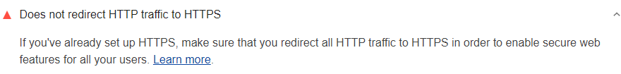

Redirects slow down your page load speed.
Lighthouse flags pages that have multiple page redirects:

<figure class="w-figure">
  
  <figcaption class="w-figcaption">
    Page doesn't avoid multiple redirects.
  </figcaption>
</figure>

## How this audit fails

A page fails this audit when it has 2 or more redirects.



## Recommendations

Your Lighthouse report lists resources that are being redirected.
Update the links to these resources. The links should
point to the current locations of the resources, so that the redirects are
eliminated. It's especially important to avoid redirects in resources that
are required for your [Critical Rendering Path](https://developers.google.com/web/fundamentals/performance/critical-rendering-path/).

If you're using redirects to divert mobile users to the mobile version of your
page, consider re-designing your site to use [Responsive Design](https://developers.google.com/web/fundamentals/design-and-ux/responsive/).

## Why you should avoid multiple page redirects

When a browser requests a resource that has been redirected,
the server usually returns an HTTP response like this:

```html
HTTP/1.1 301 Moved Permanently
Location: /path/to/new/location
```

The browser must then make another HTTP request at the new location in order to
retrieve the resource. This additional trip across the network can delay the
loading of the resource by hundreds of milliseconds.

## More information

- [Page doesn't avoid multiple redirects audit source](https://github.com/GoogleChrome/lighthouse/blob/master/lighthouse-core/audits/redirects.js)
- [Redirections in HTTP](https://developer.mozilla.org/en-US/docs/Web/HTTP/Redirections)
- [Avoid Landing Page Redirects](https://developers.google.com/speed/docs/insights/AvoidRedirects)
