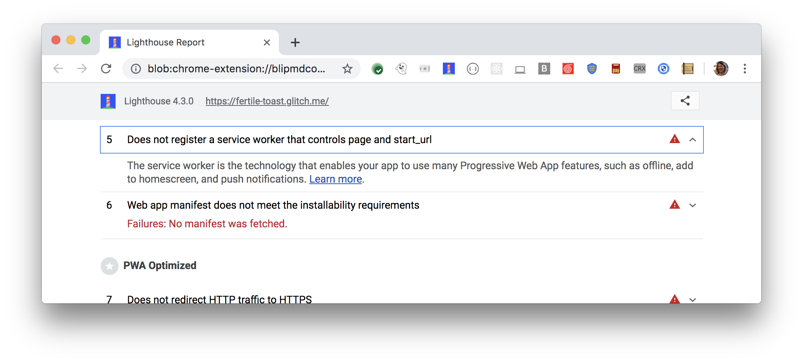

Registering a service worker is the first step towards enabling the following
progressive web app features:

- Offline
- Push notifications
- Add to homescreen

Learn more in [Service workers and the Cache Storage API](/service-workers-cache-storage/).
Lighthouse flags pages that don't register a service worker:

<figure class="w-figure">
  
  <figcaption class="w-figcaption">
    Site doesn't register a service worker.
  </figcaption>
</figure>

## How this audit fails

Lighthouse checks if the Chrome Debugger returns a service worker version.
If it does not, the audit fails.



## Recommendations

Registering a service worker involves only a few lines of code, but the only
reason you'd use a service worker is to implement one of the progressive
web app features outlined above.
Implementing those features requires more work.
For more help on caching files for offline use, see
[What is network reliability and how do you measure it?](/network-connections-unreliable).

For enabling push notifications or "add to homescreen", complete the
following step-by-step tutorials and then use what you learn to implement
the features in your own app:

- [Make it installable](/codelab-make-installable/).
- [Enable push notifications for your web app](https://codelabs.developers.google.com/codelabs/push-notifications).

## More information

[Page doesn't register a service worker audit source](https://github.com/GoogleChrome/lighthouse/blob/master/lighthouse-core/audits/service-worker.js)
