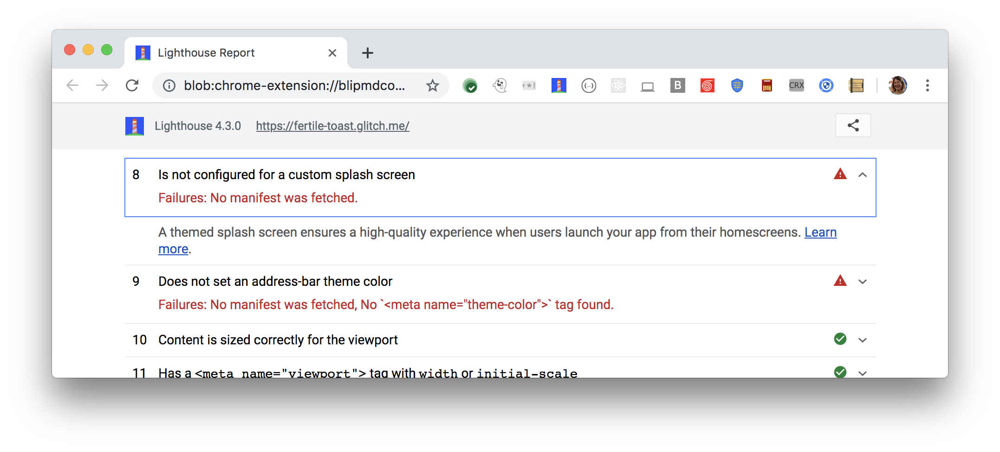

A custom splash screen makes your progressive web app (PWA) feel more like a
native app.

When a user launches your PWA from the homescreen, Android's default behavior
is to display a white screen until the PWA is ready. The user may see a blank,
white screen for up to 200ms. With a custom splash screen, the user sees a
custom background color and your PWA's icon instead.

See [Adding a Splash Screen for Installed Web Apps in Chrome 47](https://developers.google.com/web/updates/2015/10/splashscreen) for more information.

## How the Lighthouse splash screen audit fails

[Lighthouse](https://developers.google.com/web/tools/lighthouse/)
flags pages that don't have a custom splash screen:

<figure class="w-figure">
  
</figure>



## How to create a custom splash screen

Chrome for Android automatically shows your custom splash screen so long as
you meet the following requirements in your web app manifest:

- The `name` property is set to the name of your PWA.
- The `background_color` property is set to a valid CSS color value.
- The `icons` array specifies an icon that is at least 512px by 512px.
- The icon exists and is a PNG.

See [Audit: icon size coverage](https://github.com/GoogleChrome/lighthouse/issues/291) for a discussion on what icon
sizes should be included in your project. Lighthouse's opinion is that a
single, 512px icon is sufficient, but other members of the Google Web
Developer Relations team have different opinions.

## Resources

[Source code for **Is not configured for a custom splash screen** audit](https://github.com/GoogleChrome/lighthouse/blob/master/lighthouse-core/audits/splash-screen.js)
