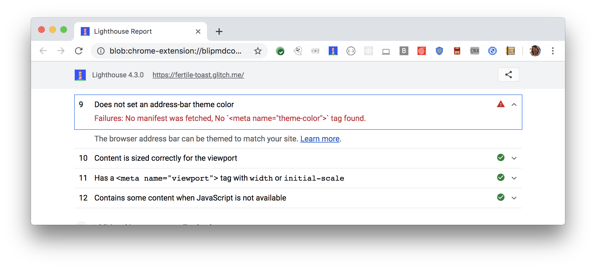

Theming the browser's address bar to match your brand's colors provides
a more immersive user experience.

## How the Lighthouse theme color audit fails

[Lighthouse](https://developers.google.com/web/tools/lighthouse/)
flags pages that don't apply a theme to the address bar:

<figure class="w-figure">
  
</figure>

The audit fails if Lighthouse doesn't find a `theme-color` meta tag in the page's
HTML and a `theme_color` property in the Web App Manifest.
Lighthouse does not test whether the values are valid CSS color values.



## How to set a theme color for the address bar

1. Add a `theme-color` meta tag to the HTML of every page you want to brand.
2. Add the `theme_color` property to your Web App Manifest.

The `theme-color` meta tag ensures that the address bar is branded when
a user visits your site as a normal webpage. Set `content` to any valid CSS
color value. You need to add this meta tag to every page that you want to
brand.

```html
<head>
  <meta name="theme-color" content="#317EFB"/>
  ...
```

Learn more about `theme-color` in
[Support for theme-color in Chrome 39 for Android](https://developers.google.com/web/updates/2014/11/Support-for-theme-color-in-Chrome-39-for-Android).

The `theme_color` property in your Web App Manifest ensures that the address
bar is branded when a user launches your progressive web
app from the home screen. Unlike the `theme-color` meta tag, you only need
to define this once, in the manifest. The browser colors every page of your
app according to the manifest's `theme_color`. Set the property to any valid
CSS color value.

```html
{
  "theme_color": "#317EFB"
  ...
}
 ```

See [User can be prompted to install the web app](/installable-manifest)
for more resources on adding a manifest to your app.

## Resources

[Source code for **Does not set a theme color for the address bar** audit](https://github.com/GoogleChrome/lighthouse/blob/master/lighthouse-core/audits/themed-omnibox.js)
