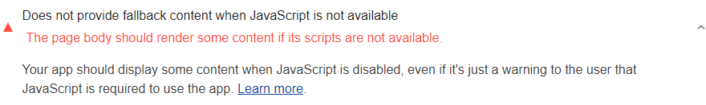

[Progressive Enhancement](https://en.wikipedia.org/wiki/Progressive_enhancement)
is a web development strategy that ensures that your site is accessible to the
largest possible audience. The most common definition of progressive
enhancement is as follows:

Basic content and page functionality should rely on
only the most fundamental web technologies, to ensure that the page is usable
across all browsing conditions. Enhanced experiences, such as sophisticated
styling using CSS, or interactivity using JavaScript, can be layered on top for
the browsers that support those technologies. But basic content and page
functionality should not rely on CSS or JavaScript.

Lighthouse flags pages that don't contain some content
when JavaScript is unavailable:

<figure class="w-figure">
  
  <figcaption class="w-figcaption">
    Page doesn't contain some content when JS is unavailable.
  </figcaption>
</figure>

## How this audit fails

Lighthouse disables JavaScript on the page and then inspects the page's HTML. If
the HTML is empty then the audit fails. If the HTML is not empty then the audit
passes.



## Recommendations

Progressive enhancement is a large and contentious topic. One camp says that,
in order to adhere to the strategy of progressive enhancement, pages should
be layered so that basic content and page functionality only require HTML. See
[Progressive Enhancement: What It Is, And How To Use It](https://www.smashingmagazine.com/2009/04/progressive-enhancement-what-it-is-and-how-to-use-it/)
for an example of this approach.

Another camp believes that this strict approach is unfeasible or unnecessary
for many modern, large-scale web applications and suggests using inline
critical path CSS in the document `<head>` for absolutely critical page styles.
See [Critical Rendering Path](https://developers.google.com/web/fundamentals/performance/critical-rendering-path/) for more on this approach.

Given these considerations, this Lighthouse audit performs a simple check to
ensure that your page isn't blank when JavaScript is disabled. How strictly your
app adheres to progressive enhancement is a topic of debate, but there's
widespread agreement that all pages should display at least *some* information
when JavaScript is disabled, even if the content is just an alert to the user
that JavaScript is required to use the page.

For pages that absolutely must rely on JavaScript, one approach is to use a
[`<noscript>`](https://developer.mozilla.org/en-US/docs/Web/HTML/Element/noscript)
element to alert the user that JavaScript is required for the page. This is
better than a blank page, because the blank page leaves users uncertain
about whether there's a problem with the page, their browsers, or their
computers.

To see how your site looks and performs when JavaScript is disabled, use
Chrome DevTools' [Disable
JavaScript](https://developers.google.com/web/tools/chrome-devtools/settings#disable-js) feature.

## More information

[Page doesn't contain content when JS unavailable audit source](https://github.com/GoogleChrome/lighthouse/blob/master/lighthouse-core/audits/without-javascript.js)
