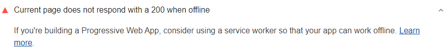

Progressive web apps must work offline. Lighthouse checks whether a page sends
an HTTP 200 response to tell if the page is accessible while the user is
offline.

Learn more in [What is network reliability and how do you measure it?](/network-connections-unreliable/)
Lighthouse flags when the page doesn't respond with a 200 when offline:

<figure class="w-figure">
  
  <figcaption class="w-figcaption">
    Page doesn't respond with a 200 when offline.
  </figcaption>
</figure>

## How this audit fails

Lighthouse emulates an offline connection using the Chrome Debugging Protocol,
and then attempts to retrieve the page using `XMLHttpRequest`.



## Recommendations

1. Add a service worker to your app.
2. Use the service worker to cache files locally.
3. When offline, use the service worker as a network proxy to return the
   locally cached version of the file.

  

    <h2 class="w-codelabs-callout__lockup">Codelabs</h2>
    
See it in action

    

      Learn more and put this guide into action.
    

  

  <ul class="w-unstyled-list w-codelabs-callout__list">
    <li class="w-codelabs-callout__listitem">
      <a class="w-codelabs-callout__link" href="/codelab-service-workers">
        Working with service workers
      </a>
    </li>
  </ul>

The codelab above shows some basics about how to debug a service worker
using Chrome DevTools. For more detailed help, see the
[Debugging Service Workers](https://codelabs.developers.google.com/codelabs/debugging-service-workers)
codelab.

## More information

[Page doesn't respond with 200 when offline audit source](https://github.com/GoogleChrome/lighthouse/blob/master/lighthouse-core/audits/works-offline)
