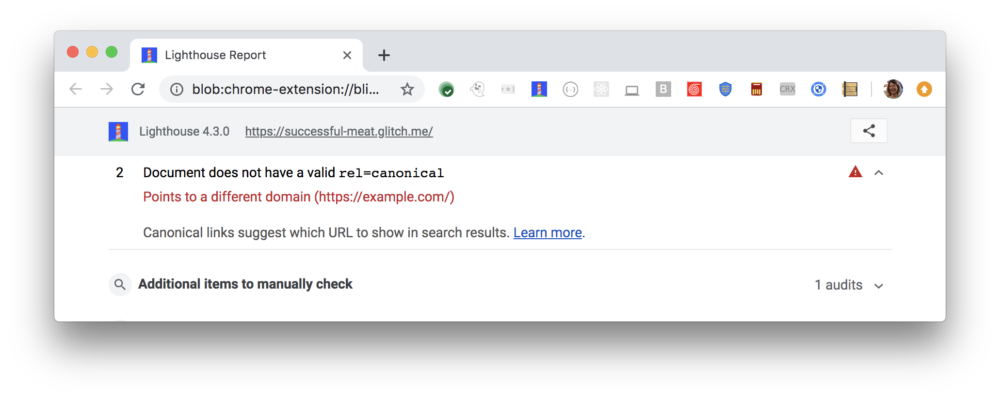

When multiple pages have similar content,
search engines consider them duplicate versions of the same page.
Search engines select one of the pages as the canonical version and crawl that one more.
Canonical links let you explicitly specify which version to crawl.
Lighthouse flags pages with an invalid `rel=canonical`:

<figure class="w-figure">
  
  <figcaption class="w-figcaption">
    Document has an invalid canonical link.
  </figcaption>
</figure>

## What causes the audit to fail

Lighthouse marks the audit as a fail if any of the following are true:

- There is more than 1 canonical link.
- The canonical link is not a valid URL.
- The canonical link points to a page for a different region or language.
- The canonical link points to a different domain.
- The canonical link points to the site root. Note that this may be valid in some scenarios,
  such as for AMP or mobile page variations, but nonetheless Lighthouse marks this scenario as
  a failure.



## How to add canonical links to your pages

Add a canonical link element to the `head` element of your HTML:

```html
<!doctype html>
<html>
  <head>
    ...
    <link rel="canonical" href="https://example.com"/>
    ...
```
Or, add a `Link` header to your HTTP response:

```html
Link: https://example.com; rel=canonical
```

Learn more in [Tell search engines which version of a page to crawl](/tell-search-engine-canonical-url).

## Implementation guidelines

- Make sure that the canonical URL is valid.
- Use secure HTTPS canonical URLs over HTTP ones as much as possible. Make sure that the page
  is completely secure and doesn't have any mixed content errors. See [Understand Security
  Issues](https://developers.google.com/web/tools/chrome-devtools/security/) to learn how to diagnose security errors in Chrome DevTools.
- Make sure that the canonical URL is valid.
- If you use [hreflang links](https://support.google.com/webmasters/answer/189077) to serve different versions of a page
  depending on a user's language or country, make sure that the canonical URL points to the
  proper page for that respective language or country.
- Don't point the canonical URL to a different domain. Yahoo and Bing don't allow this.
- Don't point pages to the site's root page, unless their content is the same. This may be
  valid in some cases, such as for AMP or mobile page variations, but nonetheless Lighthouse
  treats this scenario as a failure.

## Google-specific guidelines

- Use the [Index Status Report](https://search.google.com/search-console/index) to see which URLs Google considers canonical
  or duplicate across your entire site.
- Don't use Google's URL removal tool for canonization. It removes *all* versions of a URL
  from search.
- You can use the Search Console to specify a preferred domain for all pages. See [Set your
  preferred domain](https://support.google.com/webmasters/answer/44231).


Recommendations for other search engines are welcome.
[Edit this page.](https://github.com/google/WebFundamentals/tree/master/src/content/en/tools/lighthouse/audits/canonical.md)


## Why you should add canonical links to your pages

There are multiple advantages to adding canonical links:

- You get to specify which URL should appear in search results.
- It helps search engines consolidate multiple URLs into a single, preferred URL. For example,
  if other sites put query parameters on the ends of links to your page, search engines
  consolidate those URLs to your preferred version.
- It simplifies tracking methods. Tracking one URL is easier than tracking many.
- It improves the page ranking of syndicated content by consolidating the syndicated links to
  your original content back to your preferred URL.
- It optimizes crawling time. Time spent crawling duplicate pages is time not spent crawling
  other pages with truly unique content.

## More information

- [Invalid canonical link audit source](https://github.com/GoogleChrome/lighthouse/blob/master/lighthouse-core/audits/seo/canonical.js)
- [Consolidate duplicate URLs](https://support.google.com/webmasters/answer/139066)
- [Learn the impact of duplicate URLs](https://support.google.com/webmasters/answer/6080548)
- [5 common mistakes with rel=canonical](https://webmasters.googleblog.com/2013/04/5-common-mistakes-with-relcanonical.html)
