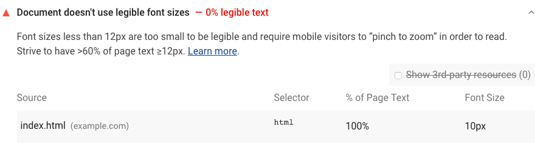

Font sizes smaller than 12px are often difficult to read on mobile devices,
and may require users to pinch-to-zoom in order
to display the text at a comfortable reading size.
Lighthouse flags pages with illegible font sizes:

<figure class="w-figure">
  
  <figcaption class="w-figcaption">
    Fig. 1 — Font sizes illegible
  </figcaption>
</figure>

## What causes this audit to fail

When a page fails the audit,
Lighthouse lists the results in a table with 4 columns:

- **Source**.
The source location of the CSS ruleset that is causing the illegible text.
- **Selector**.
The selector of the ruleset.
- **% of Page Text**.
The percentage of text on the page that is affected by the ruleset.
- **Font Size**.
The computed size of the text.



## How to fix illegible fonts

Aim to have a font size of at least 12px on at least 60% of the text on your pages. 
Learn more in [Fix small font sizes](/fix-small-fonts).

## Text is illegible because of a missing viewport config

If Lighthouse reports `Text is illegible because of a missing viewport config`,
add a `<meta name="viewport" content="width=device-width, initial-scale=1">` tag
to the `<head>` of your document.

See also [Has a `<meta name="viewport">` tag with `width` or `initial-scale`](/viewport).

## More information

[Illegible font sizes audit source](https://github.com/GoogleChrome/lighthouse/blob/master/lighthouse-core/audits/seo/font-size.js)