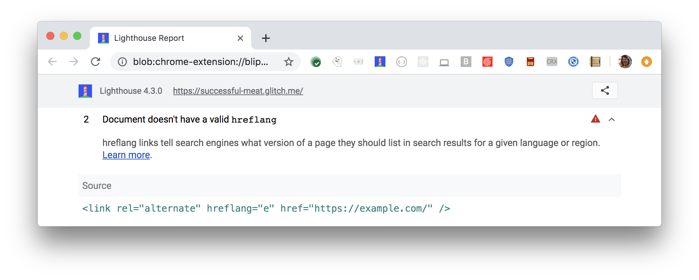

If you serve different content based on a user's language or region,
use `hreflang` links to ensure that search engines serve the correct content
for that language or region.

Lighthouse flags incorrect `hreflang` links:

<figure class="w-figure">
  
</figure>

## How this audit fails

Lighthouse checks for `hreflang` links
in the page's `head` and in its response headers.
Lighthouse then checks for valid language codes within the `hreflang`links.
Lighthouse reports any `hreflang` links with invalid language codes.

Lighthouse does not check region codes or your sitemap.



## How to define an `hreflang` link

Define an `hreflang` link for each language version of a page.

Suppose that you have three versions of a page:

- An English version at `https://example.com`
- A Spanish version at `https://es.example.com`
- A German version at `https://de.example.com`

Tell search engines that these pages are equivalent
by adding `<link>` elements to the `<head>` of each page:

```html
<link rel="alternate" hreflang="en" href="https://example.com" />
<link rel="alternate" hreflang="es" href="https://es.example.com" />
<link rel="alternate" hreflang="de" href="https://de.example.com" />
```

Or you can add `Link` headers to your HTTP response:

```html
Link: <https://example.com>; rel="alternate"; hreflang="en", <https://es.example.com>;
rel="alternate"; hreflang="es", <https://de.example.com>; rel="alternate"; hreflang="de"
```

Or you can add language version information to your Sitemap.

For pages that allow users to select their language,
use the `x-default` keyword.

```html
<link rel="alternate" href="https://example.com" hreflang="x-default" />
```

Each language version of a page must link to all other versions,
**including itself**. Otherwise, search engines may ignore the `hreflang` links
or interpret them incorrectly.

See the [Tell search engines translated pages are equivalent](/tell-search-translated-pages-equal)
post for more information.

## Guidelines for `hreflang` values

- The `hreflang` value must always specify a language code.
- The language code must follow
[ISO 639-1 format](https://wikipedia.org/wiki/List_of_ISO_639-1_codes).
- The `hreflang` value can also include an optional regional code.
For example, `en-ie` is for English speakers in Ireland,
and `es-ie` is for Spanish speakers in Ireland.
- The region code must follow the
[ISO 3166-1 alpha-2 format](https://wikipedia.org/wiki/ISO_3166-1_alpha-2).

## More information

- [**Document does not have a valid `hreflang`** audit source](https://github.com/GoogleChrome/lighthouse/blob/master/lighthouse-core/audits/seo/hreflang.js)
- [Use hreflang for language and regional URLs](https://support.google.com/webmasters/answer/189077)
