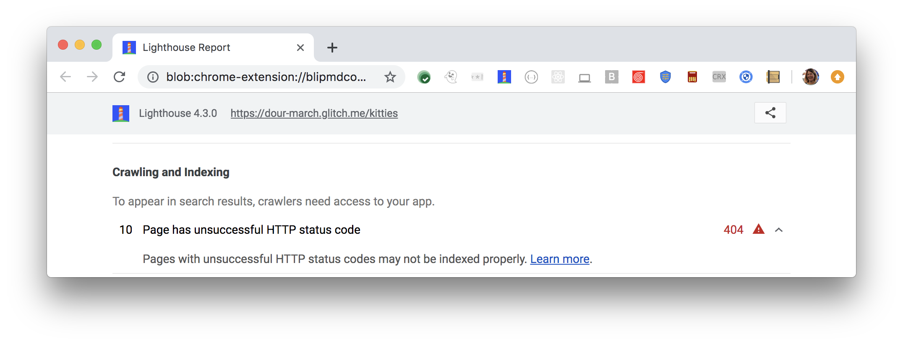

Servers provide a three-digit [HTTP status code](https://developer.mozilla.org/en-US/docs/Web/HTTP/Status)
for each resource request they receive. Status codes in the 400s and 500s
[indicate that there's an error](https://developer.mozilla.org/en-US/docs/Web/HTTP/Status#Client_error_responses)
with the requested resource. If a search engine encounters a status code error
when it's **crawling** a web page, it may not index that page properly.


_Crawling_ is how a search engine updates its index of content on the web.


## How the Lighthouse HTTP status code audit fails

[Lighthouse](https://developers.google.com/web/tools/lighthouse/) flags pages
that return an unsuccessful HTTP status code (in the 400s or 500s):

<figure class="w-figure">
  
</figure>



## How to fix an unsuccessful HTTP status code

First make sure you actually want search engines to crawl the page. Some pages,
like your 404 page or any other page that shows an error, shouldn't be included
in search results.

To fix an HTTP status code error, refer to the documentation for your server or
hosting provider. The server should return a status code in the 200s for all
valid URLs or a status code in the 300s for a resource that has moved to
another URL.


If you're
[using Github Pages to host a single-page app](https://www.smashingmagazine.com/2016/08/sghpa-single-page-app-hack-github-pages/),
you'll likely need to serve valid content with a 404 status code.



Single-page applications can make fixing HTTP status code errors a bit more
complicated. Learn how to [fix sneaky 404s in an Express application](/codelab-fix-sneaky-404).


## Resources

- [Source code for **Page has unsuccessful HTTP status code** audit](https://github.com/GoogleChrome/lighthouse/blob/master/lighthouse-core/audits/seo/http-status-code.js)
- [HTTP response status codes](https://developer.mozilla.org/en-US/docs/Web/HTTP/Status)


