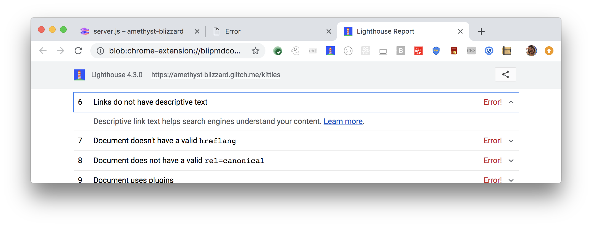

Link descriptions,
which are the clickable words in links,
help users and search engines better understand your content.
Lighthouse flags any links with non-descriptive text:

<figure class="w-figure">
  
  <figcaption class="w-figcaption">
    Links don't have descriptive text.
  </figcaption>
</figure>

## What causes this audit to fail

Lighthouse flags the following generic link descriptions:

- `click here`
- `click this`
- `go`
- `here`
- `this`
- `start`
- `right here`
- `more`
- `learn more`



## How to add descriptive link text

Replace generic descriptions, such as `click here` in the example below:

```html
<p>To see all of our basketball videos, <a href="videos.html">click here</a>.</p>
```

...with specific descriptions, such as `basketball videos` in the example below:

```html
<p>Check out all of our <a href="videos.html">basketball videos</a>.</p>
```

In general,
the link text should clearly indicate to users what type of content they'll get
if they click the link.

Learn more in [Add descriptive link text ](/write-descriptive-text#add-descriptive-link-text).

## Link text guidelines

- Stay on topic. Don't use text that has no relation to the page's content.
- Don't use the page's URL as the link description, unless you have a good reason to do so,
such as referencing a site's new address.
- Keep descriptions concise. Aim for a few words or a short phrase.
- Format links so that they're easy to spot.
- Pay attention to your internal links, too. Improving the quality of internal links can
help users and Google navigate your site easier.

## More information

[Links do not have descriptive text audit source](https://github.com/GoogleChrome/lighthouse/blob/master/lighthouse-core/audits/seo/link-text.js)
