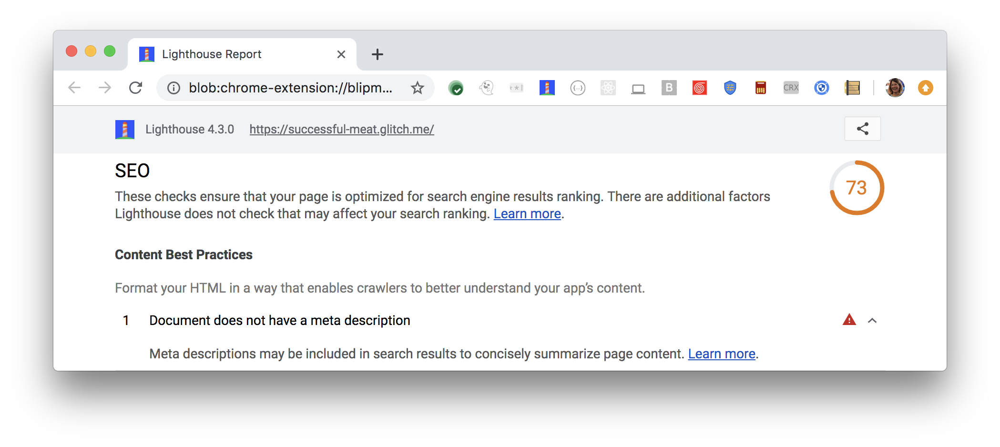

Meta descriptions introduce users to your site's content in search results.
High-quality, unique descriptions make your results more relevant
and can increase your search traffic.
Lighthouse flags your page when it's missing a meta description:

<figure class="w-figure">
  
  <figcaption class="w-figcaption">
    Document doesn't have a meta description.
  </figcaption>
</figure>

## What causes this audit to fail

This audit fails if your page doesn't have a description,
or if the `content` attribute of the description is empty.
Lighthouse doesn't evaluate the quality of your description.



## How to add a meta description

Add a description tag to the `<head>` of each of your pages:

```html
<meta name="Description" content="Put your description here.">
```

Include clearly-tagged facts in the descriptions, for example:

```html
<meta name="Description" content="Author: A.N. Author,
    Illustrator: P. Picture, Category: Books, Price: $17.99,
    Length: 784 pages>
```

Learn more in [Add tags to the head of the page](/write-descriptive-text#add-tags-to-the-head-of-the-page).

## Meta description guidelines

- Make them descriptive and concise.
- Avoid [keyword stuffing](https://support.google.com/webmasters/answer/66358).
- Create a description for every page.
- Avoid repeated or boilerplate titles.
- Use different descriptions for different pages.
- Descriptions don't have to be in sentence format; they can contain structured data.

See [Create good meta descriptions](https://support.google.com/webmasters/answer/35624#1) for more guidance.

## More information

[Document doesn't have a meta description audit source](https://github.com/GoogleChrome/lighthouse/blob/master/lighthouse-core/audits/seo/meta-description.js)
