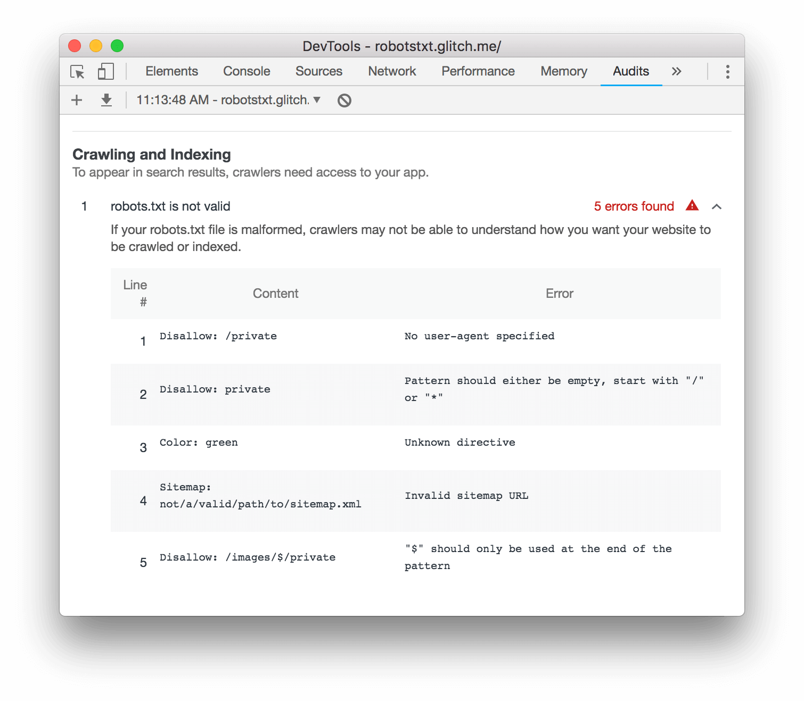

The `robots.txt` file tells search engines what pages of your site they can crawl. An
invalid `robots.txt` configuration can cause 2 general types of problems:

- Not crawling public pages, causing your relevant content to show up less in search results.
- Crawling private pages, exposing private information in search results.

Note: Most Lighthouse audits only apply to the page that you're currently on. However,
since `robots.txt` is defined at the domain level, this audit applies to your entire
domain (or subdomain).

## Recommendations

Expand the **robots.txt is not valid** audit in your report to learn why your `robots.txt` file is
invalid.

<figure class="w-figure">
  
  <figcaption class="w-figcaption">
    Fig. 1 — Viewing the robots.txt audit.
  </figcaption>
</figure>

Here is an explanation of common errors:

- `No user-agent specified`. Put a `User-agent` directive before your `Allow`
or `Disallow` directive.
- `Pattern should either be empty, start with "/" or "*"`. Start your `Allow` or
`Disallow` directive with one of these characters, or leave it empty.
- `Unknown directive`. The directive name listed in the **Content** column is not part
of the `robots.txt` specification.
- `Invalid sitemap URL`. The sitemap URL should begin with `http`, `https`, or `ftp`.
- `"$" should only be used at the end of the pattern`. Note that the [original `robots.txt`
specification](http://www.robotstxt.org/orig.html) does not define the `$` pattern, so it may not
be recognized by all search engines. It is recognized by Google Search, however. See
URL matching based on path values](https://developers.google.com/search/reference/robots_txt#url-matching-based-on-path-values).

## More information {: #more-info }

Lighthouse does not ensure that your `robots.txt` file is in the correct location.

Sources:

- [Audit source](https://github.com/GoogleChrome/lighthouse/blob/master/lighthouse-core/audits/seo/robots-txt.js)
- [Create a robots.txt file](https://support.google.com/webmasters/answer/6062596)
- [Robots.txt](https://moz.com/learn/seo/robotstxt)