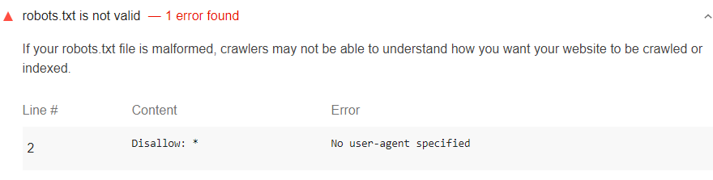

The `robots.txt` file tells search engines
what pages of your site they can crawl.
An invalid `robots.txt` configuration can cause
2 general types of problems:

- Not crawling public pages, causing your relevant content
to show up less in search results.
- Crawling private pages,
exposing private information in search results.

Lighthouse flags invalid `robots.txt` files:

<figure class="w-figure">
  
  <figcaption class="w-figcaption">
    Fig. 1 — <code>robots.txt</code> isn't valid
  </figcaption>
</figure>

## What causes this audit to fail

Expand the **robots.txt is not valid** audit in your report
to learn why your `robots.txt` file is invalid.

Common errors include:

- `No user-agent specified`
- `Pattern should either be empty, start with "/" or "*"` 
- `Unknown directive`
- `Invalid sitemap URL`
- `"$" should only be used at the end of the pattern` 

Most Lighthouse audits only apply to the page that you're currently on.
However, since `robots.txt` is defined at the domain level,
this audit applies to your entire domain (or subdomain). 


Lighthouse does not ensure that your `robots.txt` file is
in the correct location.


## How to fix the errors in `robots.txt`

- Make sure the `robots.txt` doesn't return `HTTP 50X`.
- Make sure the `robots.txt` file is smaller than 500 KB.
- Review the format.
- Make sure there are no `allow` or `disallow` directives before `user-agent`.
- Make sure there's a value for `user-agent`.
- Provide an absolute URL for `sitemap` with http/https/ftp scheme.

Learn more in [Fix robots.txt errors](/fix-robot-errors).

## More information

- [Invalid `robots.txt` audit source](https://github.com/GoogleChrome/lighthouse/blob/master/lighthouse-core/audits/seo/robots-txt.js)
- [Create a `robots.txt file`](https://support.google.com/webmasters/answer/6062596)
- [Robots.txt](https://moz.com/learn/seo/robotstxt)

