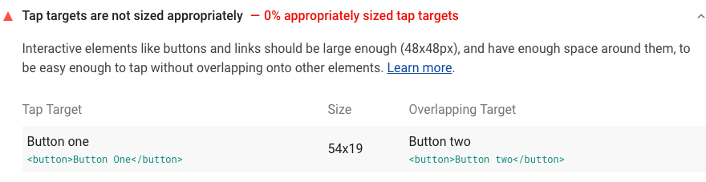
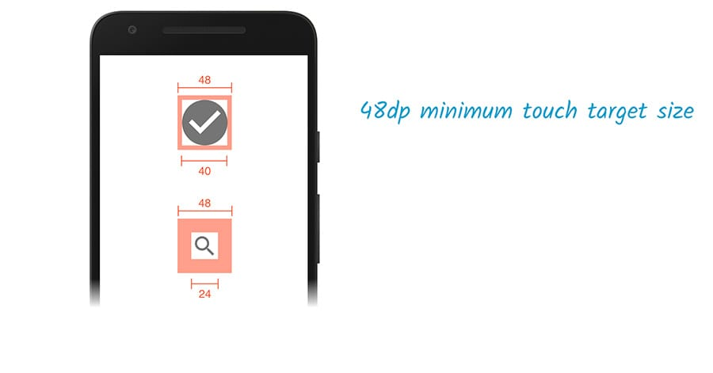

Tap targets are interactive elements, like buttons or links,
that users frequently tap.
Appropriately-sized tap targets make pages more mobile-friendly and accessible.
In-appropriately sized tap-targets have the opposite effect.

A tap target is inappropriately-sized when it's too small, or too close to other tap targets.
Lighthouse flags pages with inappropriately-sized tap targets:

<figure class="w-figure">
  
  <figcaption class="w-figcaption">
    Tap targets are inappropriately sized.
  </figcaption>
</figure>


Google Search started boosting the ranking of mobile-friendly pages
on mobile search results back in 2015.
See [Rolling out the mobile-friendly update](https://webmasters.googleblog.com/2015/04/rolling-out-mobile-friendly-update.html).


## What causes this audit to fail

Click the audit to see which tap targets are causing the audit to fail.
The **Tap Target** column tells you which tap target is inappropriately-sized.
The **Size** column tells you the size of the target's bounding rectangle, in pixels.
The **Overlapping Target** column tells you which other tap target is too close.

In practice, Lighthouse provides some leniency on the size,
So tap targets as small as 40 pixels by 40 pixels usually pass.



## How to fix inappropriately-sized tap targets

To fix the inappropriately-sized tap targets,
increase the size of the failing tap targets.
Tap targets that are 48 pixels wide and 48 pixels tall never fail:

<figure class="w-figure">
  
  <figcaption class="w-figcaption">
    Appropriately-sized tap targets.
  </figcaption>
</figure>

Increase the spacing between tap targets,
using properties such as `padding` or `margin`.
There should be at least 8 pixels of space between tap targets.

## More information

[Inappropriately-sized tap targets audit source](https://github.com/GoogleChrome/lighthouse/blob/master/lighthouse-core/audits/seo/tap-targets.js)
