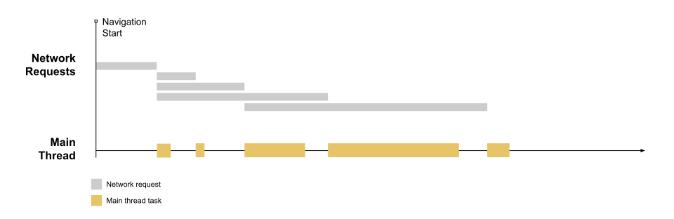
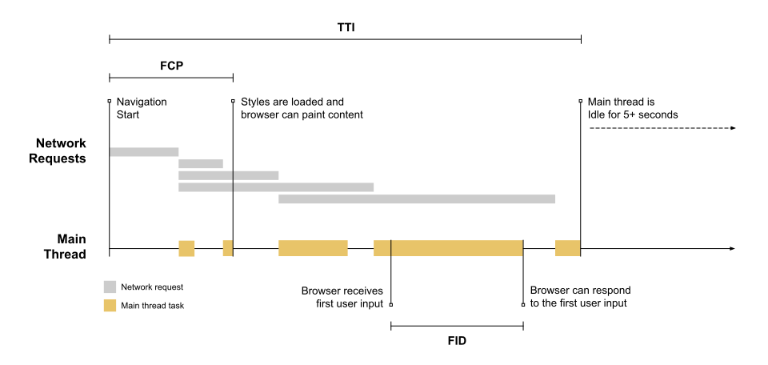


  First Input Delay (FID) is an important, user-centric metric for measuring
  [load responsiveness](/user-centric-performance-metrics/#types-of-metrics)
  because it quantifies the experience users feel when trying to interact with
  unresponsive pages&mdash;a low FID helps ensure that the page is
  [usable](/user-centric-performance-metrics/#questions).


We all know how important it is to make a good first impression. It's important
when meeting new people, and it's also important when building experiences on
the web.

On the web, a good first impression can make the difference between someone
becoming a loyal user or them leaving and never coming back. The question is,
what makes for a good impression, and how do you measure what kind of impression
you're likely making on your users?

On the web, first impressions can take a lot of different forms&mdash;we have first
impressions of a site's design and visual appeal as well as first impressions of
its speed and responsiveness.

While it is hard to measure how much users like a site's design with web APIs,
measuring its speed and responsiveness is not!

The first impression users have of how fast your site loads can be measured with
[First Contentful Paint (FCP)](/fcp/). But how fast your site can paint pixels to
the screen is just part of the story. Equally important is how responsive your
site is when users try to interact with those pixels!

The First Input Delay (FID) metric helps measure your user's first impression of
your site's interactivity and responsiveness.

## What is FID?

FID measures the time from when a user first interacts with a page (i.e. when
they click a link, tap on a button, or use a custom, JavaScript-powered control)
to the time when the browser is actually able to respond to that interaction.

<picture>
  <source srcset="../vitals/fid_8x2.svg" media="(min-width: 640px)">
  
</picture>

### What is a good FID score?

To provide a good user experience, sites should strive to have a First Input
Delay of less than **100 milliseconds**. To ensure you're hitting this target
for most of your users, a good threshold to measure is the **75th percentile**
of page loads, segmented across mobile and desktop devices.


## FID in detail

As developers who write code that responds to events, we often assume our code
is going to be run immediately&mdash;as soon as the event happens. But as users,
we've all frequently experienced the opposite&mdash;we've loaded a web page on
our phone, tried to interact with it, and then been frustrated when nothing
happened.

In general, input delay (a.k.a. input latency) happens because the browser's
main thread is busy doing something else, so it can't (yet) respond to the user.
One common reason this might happen is the browser is busy parsing and executing
a large JavaScript file loaded by your app. While it's doing that, it can't run
any event listeners because the JavaScript it's loading might tell it to do
something else.

Consider the following timeline of a typical web page load:

[](fid-base.svg)

The above visualization shows a page that's making a couple of network requests
for resources (most likely CSS and JS files), and&mdash;after those resources
are finished downloading&mdash;they're processed on the main thread.

This results in periods where the main thread is momentarily busy, which is
indicated by the beige-colored
[task](https://html.spec.whatwg.org/multipage/webappapis.html#concept-task)
blocks.

Long first input delays typically occur between [First Contentful Paint
(FCP)](/fcp/) and [Time to Interactive (TTI)](/tti/) because the page has
rendered some of its content but isn't yet reliably interactive. To illustrate
how this can happen, FCP and TTI have been added to the timeline:

[](fid-fcp-tti.svg)

You may have noticed that there's a fair amount of time (including three [long
tasks](/custom-metrics/#long-tasks-api)) between FCP and TTI, if a user tries to
interact with the page during that time (e.g. click on a link), there will be a
delay between when the click is received and when the main thread is able to
respond.

Consider what would happen if a user tried to interact with the page near the
beginning of the longest task:

[](fid-full.svg)

Because the input occurs while the browser is in the middle of running a task,
it has to wait until the task completes before it can respond to the input. The
time it must wait is the FID value for this user on this page.


  In this example the user just happened to interact with the
  page at the beginning of the main thread's most busy period. If the user had
  interacted with the page just a moment earlier (during the idle period) the
  browser could have responded right away. This variance in input delay
  underscores the importance of looking at the distribution of FID values when
  reporting on the metric. You can read more about this in the section below on
  analyzing and reporting on FID data.


### What if an interaction doesn't have an event listener?

FID measures the delta between when an input event is received and when the main
thread is next idle. This means FID is measured **even in cases where an event
listener has not been registered.** The reason is because many user interactions
do not require an event listener but _do_ require the main thread to be idle in
order to run.

For example, all of the following native HTML elements need to wait for
in-progress tasks on the main thread to complete prior to responding to user
interactions:

- Text fields, checkboxes, and radio buttons (`<input>`, `<textarea>`)
- Select dropdowns (`<select>`)
- links (`<a>`)

### Why only consider the first input?

While a delay from any input can lead to a bad user experience, we primarily
recommend measuring the first input delay for a few reasons:

- The first input delay will be the user's first impression of your site's
  responsiveness, and first impressions are critical in shaping our overall
  impression of a site's quality and reliability.
- The biggest interactivity issues we see on the web today occur during page
  load. Therefore, we believe initially focusing on improving site's first user
  interaction will have the greatest impact on improving the overall
  interactivity of the web.
- The recommended solutions for how sites should fix high first input delays
  (code splitting, loading less JavaScript upfront, etc.) are not necessarily
  the same solutions for fixing slow input delays after page load. By separating
  out these metrics we'll be able to provide more specific performance
  guidelines to web developers.

### What counts as a first input?

FID is a metric that measures a page's responsiveness during load. As such, it
only focuses on input events from discrete actions like clicks, taps, and key
presses.

Other interactions, like scrolling and zooming, are continuous actions and have
completely different performance constraints (also, browsers are often able to
hide their latency by running them on a separate thread).

To put this another way, FID focuses on the R (responsiveness) in the [RAIL
performance
model](https://developers.google.com/web/fundamentals/performance/rail), whereas
scrolling and zooming are more related to A (animation), and their performance
qualities should be evaluated separately.

### What if a user never interacts with your site?

Not all users will interact with your site every time they visit. And not all
interactions are relevant to FID (as mentioned in the previous section). In
addition, some user's first interactions will be at bad times (when the main
thread is busy for an extended period of time), and some user's first
interactions will be at good times (when the main thread is completely idle).

This means some users will have no FID values, some users will have low FID
values, and some users will probably have high FID values.

How you track, report on, and analyze FID will probably be quite a bit different
from other metrics you may be used to. The next section explains how best to do
this.

## How to measure FID

FID is a metric that can only be measured [in the
field](/user-centric-performance-metrics/#in-the-field), as it requires a real
user to interact with your page. You can measure FID with the following tools.

### Field tools

- [PageSpeed Insights](https://developers.google.com/speed/pagespeed/insights/)
- [Chrome User Experience
  Report](https://developers.google.com/web/tools/chrome-user-experience-report)
- [Search Console (Speed
  Report)](https://webmasters.googleblog.com/2019/11/search-console-speed-report.html)
- [Firebase Performance
  Monitoring](https://firebase.google.com/docs/perf-mon/get-started-web) (beta)

### Measure FID in JavaScript

The easiest way to measure FID (as well as all Web Vitals [field
metrics]((/metrics/#in-the-field))) is with the [`web-vitals` JavaScript
library](https://github.com/GoogleChrome/web-vitals), which wraps all the
complexity of manually measuring FID into a single function:

```js
import {getFID} from 'web-vitals';

// Measure and log the current FID value,
// any time it's ready to be reported.
getFID(console.log);
```

To manually measure FID, you can use the [Event Timing
API](https://wicg.github.io/event-timing). The following example shows how to
create a
<code>[PerformanceObserver](https://developer.mozilla.org/en-US/docs/Web/API/PerformanceObserver)</code>
that listens for
<code>[first-input](https://wicg.github.io/event-timing/#sec-performance-event-timing)</code>
entries, calculates FID, and logs the value to the console:




```js



  function onFirstInputEntry(entry) {
    // Only report FID if the page wasn't hidden prior to
    // the entry being dispatched. This typically happens when a
    // page is loaded in a background tab.
    if (entry.startTime < firstHiddenTime) {
      const fid = entry.processingStart - entry.startTime;

      // Report the FID value to an analytics endpoint.
      sendToAnalytics({fid});
    }
  }



```

### Analyzing and reporting on FID data

Due to the expected variance in FID values, it's critical that when reporting on
FID you look at the distribution of values and focus on the higher percentiles.
In fact, we recommend specifically focusing on the 95th–99th percentile, as that
will correspond to the particularly bad first experiences users are having with
your site. And it will show you the areas that need the most improvement.

This is true even if you segment your reports by device category or type. For
example, if you run separate reports for desktop and mobile, the FID value you
care most about on desktop should be the 95th–99th percentile of desktop users,
and the FID value you care about most on mobile should be the 95th–99th
percentile of mobile users.

## How to improve FID

To learn how to improve FID for a specific site, you can run a Lighthouse
performance audit and pay attention to any specific
[opportunities](/lighthouse-performance/#opportunities) the audit suggests.

While FID is a field metric (and Lighthouse is a lab metric tool), the guidance
for improving FID is the same as that for improving the lab metric [Total
Blocking Time (TBT)](/tbt/).

For a deep dive on how to improve FID, see [Optimize FID](/optimize-fid/). For
additional guidance on individual performance techniques that can also improve
FID, see:

- [Reduce the impact of third-party code](/third-party-summary/)
- [Reduce JavaScript execution time](/bootup-time/)
- [Minimize main thread work](/mainthread-work-breakdown/)
- [Keep request counts low and transfer sizes small](/resource-summary/)


