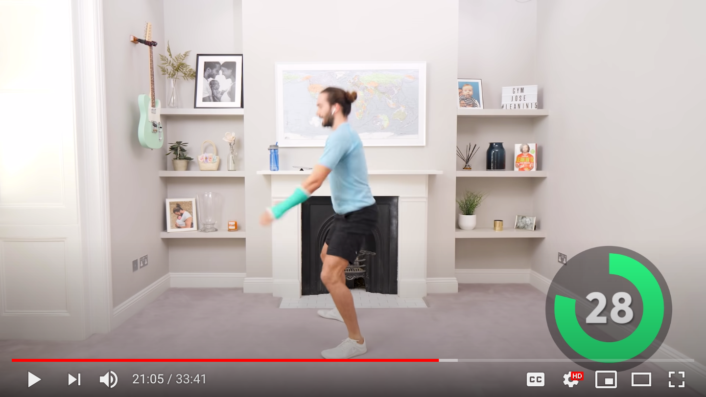
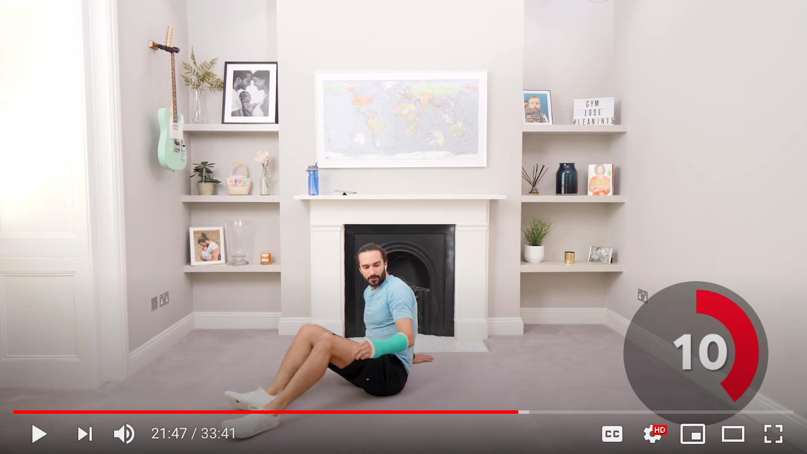
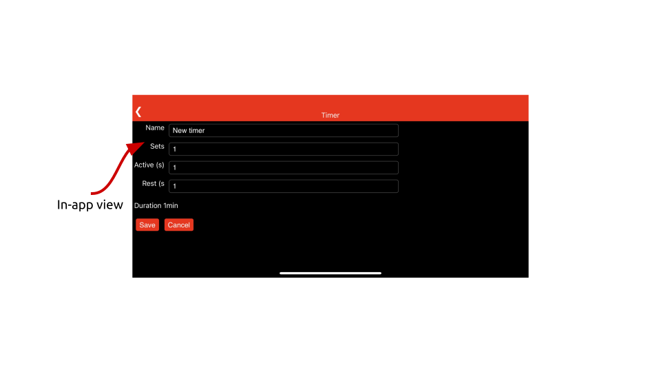
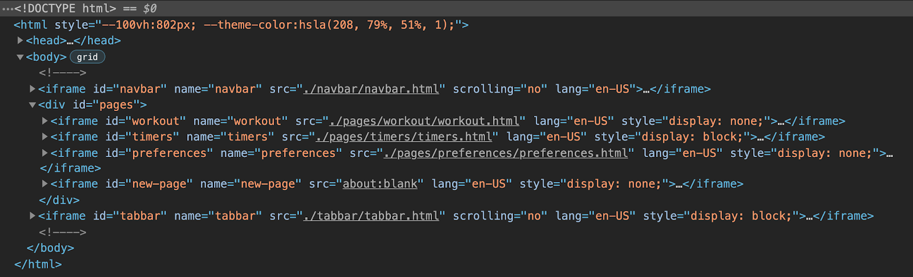
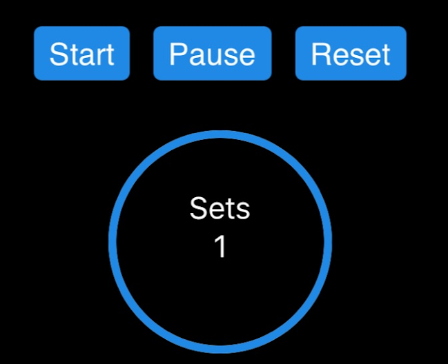
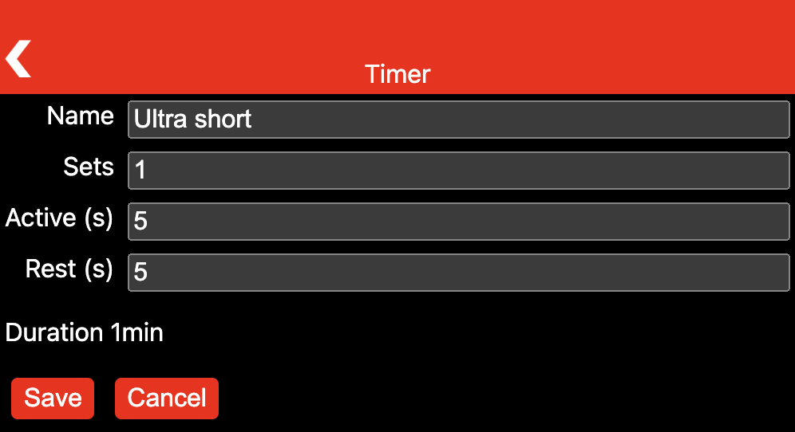
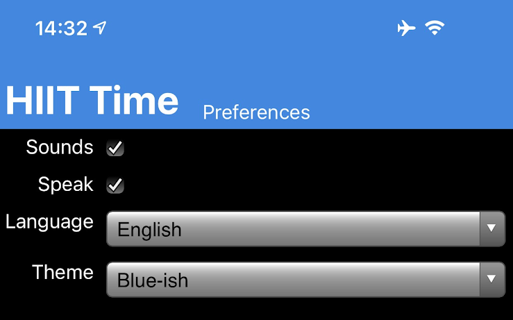

## The app domain

[High-intensity interval training](https://en.wikipedia.org/wiki/High-intensity_interval_training) (HIIT)
is a cardiovascular exercise strategy of alternating short periods of intense anaerobic exercise with less intense recovery periods.
Many HIIT trainings use HIIT timers, for example, this [30min online session](https://www.youtube.com/watch?v=tXOZS3AKKOw)
from [The Body Coach TV](https://www.youtube.com/user/thebodycoach1) YouTube channel.

<div class="w-columns">
  <figure class="w-figure">
    
    <figcaption class="w-figcaption">
      Active period.
    </figcaption>
  </figure>
  <figure class="w-figure">
    
    <figcaption class="w-figcaption">
      Resting period.
    </figcaption>
  </figure>
</div>

## HIIT Time example app

For this chapter, I have built a baseline example of such a HIIT timer application aptly named
"HIIT Time" that lets the user define and manage various timers,
always consisting of a high and a low intensity interval,
and then select one of them for a training session.

<figure class="w-figure">
  
  <figcaption class="w-figcaption">
    HIIT Time "Workout" tab in portrait mode.
  </figcaption>
</figure>

<figure class="w-figure">
  
  <figcaption class="w-figcaption">
    HIIT Time "Workout" tab in landscape mode.
  </figcaption>
</figure>

<figure class="w-figure">
  
  <figcaption class="w-figcaption">
    HIIT Time timer management.
  </figcaption>
</figure>

## App structure

<figure class="w-figure">
  
  <figcaption class="w-figcaption">
    The app consists of six iframes.
  </figcaption>
</figure>

## Components-based lit-html markup

```html
<div>
  <button class="start" @click="${eventHandlers.start}" type="button">
    ${strings.START}
  </button>
  <button class="pause" @click="${eventHandlers.pause}" type="button">
    ${strings.PAUSE}
  </button>
  <button class="reset" @click="${eventHandlers.reset}" type="button">
    ${strings.RESET}
  </button>
</div>

<div class="progress-rings">
  <sl-progress-ring
    class="sets"
    percentage="${Math.floor(data.sets/data.activeTimer.sets*100)}"
  >
    <div class="progress-ring-caption">
      <span>${strings.SETS}</span>
      <span>${data.sets}</span>
    </div>
  </sl-progress-ring>
</div>
```

<figure class="w-figure">
  
  <figcaption class="w-figcaption">
    Rendered section of the page corresponding to the mark-up above.
  </figcaption>
</figure>

## Programming model

```js
import Page from '../page.js';

const page = new Page({
  eventHandlers: {
    back: (e) => {
      e.preventDefault();
      window.top.history.back();
    },
  },
});
```

<figure class="w-figure">
  
  <figcaption class="w-figcaption">
    Navigation happens from iframe to iframe.
  </figcaption>
</figure>

## Styling

```css
main {
  max-width: 600px;
}

form {
  display: grid;
  grid-template-columns: auto 1fr;
  grid-gap: 0.5rem;
  margin-block-end: 1rem;
}

label {
  text-align: end;
  grid-column: 1 / 2;
}

input,
select {
  grid-column: 2 / 3;
}
```

<figure class="w-figure">
  
  <figcaption class="w-figcaption">
    Every view is its own world, styling happens directly with the element names.
  </figcaption>
</figure>

The final chapter ends this collection on mini apps with a [conclusion](/conclusion).
