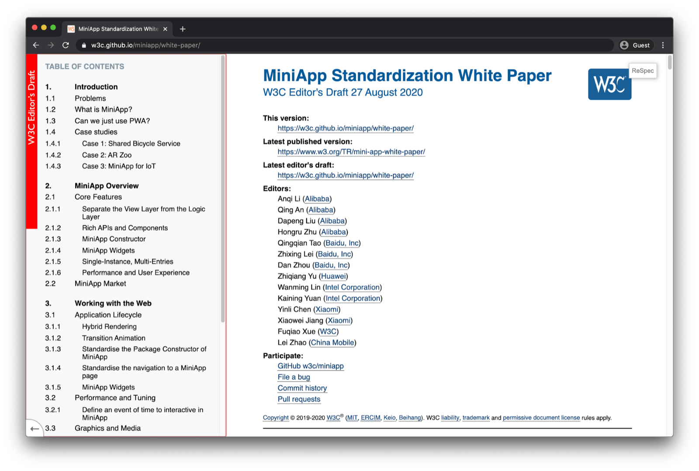

## Mini app popularity

Mini apps have seen tremendous growth. WeChat mini apps as of June 2020 have reached
[830 million active users](https://www.questmobile.com.cn/research/report-new/122), Alipay mini apps
[401 million active users](https://kr-asia.com/the-mau-of-wechat-alipay-and-baidus-mini-programs-now-add-up-to-more-than-1-billion)
as of April 2019, and Baidu mini apps in the same month
[115 million active users](https://kr-asia.com/the-mau-of-wechat-alipay-and-baidus-mini-programs-now-add-up-to-more-than-1-billion).
Effectively companies have traded building apps for the two operating systems iOS and Android and
additionally the Web for building apps for three or more super apps platforms. The differences
between each super app platform may not be as big as the differences between Android, iOS, and the
Web, but nevertheless they exist. Where on Android, iOS, and the Web we have seen cross-platform
approaches like [Flutter](https://flutter.dev/), [Ionic](https://ionicframework.com/), and
[React Native](https://reactnative.dev/) ([for Web](https://github.com/necolas/react-native-web))
gain popularity, in the mini apps ecosystem, we can see an effort led by the
[MiniApps Ecosystem Community Group](https://www.w3.org/community/miniapps/) with
[members](https://www.w3.org/community/miniapps/participants) from, among others, Alibaba, Baidu,
ByteDance, Huawei, Intel, Xiaomi, China Mobile, Facebook, and Google to standardize aspects of mini
apps.

## Publications

Notable publications of the group so far include a
[whitepaper](https://w3c.github.io/miniapp/white-paper/), a
[Comparison of APIs in MiniApps, W3C specs, and PWAs](https://www.w3.org/TR/mini-app-white-paper/comparison.html),
and specifications and explainers on the following aspects:

- URI Scheme: [spec](https://w3c.github.io/miniapp/specs/uri/),
  [explainer](https://github.com/w3c/miniapp/blob/gh-pages/specs/uri/docs/explainer.md)
- Lifecycle: [spec](https://w3c.github.io/miniapp/specs/lifecycle/),
  [explainer](https://github.com/w3c/miniapp/blob/gh-pages/specs/lifecycle/docs/explainer.md)
- Manifest: [spec](https://w3c.github.io/miniapp/specs/manifest/),
  [explainer](https://github.com/w3c/miniapp/blob/gh-pages/specs/manifest/docs/explainer.md)
- Packaging: [spec](https://w3c.github.io/miniapp/specs/packaging/),
  [explainer](https://github.com/w3c/miniapp/blob/gh-pages/specs/packaging/docs/explainer.md)
- An exploration of [widget requirements](https://w3c.github.io/miniapp/specs/widget-req/)

W3C member and group participant Fuqiao Xue (W3C) has further published a
[Comparison of MiniApps and web apps](https://xfq.github.io/miniapp-comparison/) on his own behalf,
that is, not as an official group publication, but nonetheless worth the read.

<figure class="w-figure">
  
  <figcaption class="w-figure">
    The MiniApp Standardization White Paper.
  </figcaption>
</figure>

The following chapter looks at [other mini app runtime environments](/other-mini-app-runtime-environments/) apart from mobile devices.
