When you look at the applications on your phone, you probably have specific apps for specific tasks. You might have a banking app, you might have an app for buying public transit tickets, likely you have an app for getting directions, etc. In this post, I introduce you to the concept of a different kind of app, namely mini apps, sometimes also referred to as mini programs or applets. I first provide some background on the various mini app platforms and their developer experience, and then focus on things the Web can learn from mini apps. But before I start writing about mini apps, I first need to talk about super apps.

## What are super apps?

Super apps are apps that are hosts to other apps that run within the super app: the so-called mini apps. Popular super apps are Tencent's [WeChat](https://weixin.qq.com/) (微信), the app of the search engine [Baidu](https://baidu.com/) (百度), Ant Group's (an affiliate company of the Chinese Alibaba Group) [Alipay](https://www.alipay.com/) (支付宝), but also ByteDance's [Douyin](https://www.douyin.com/) (抖音), which you might know as TikTok (蒂克托克). The first three are commonly also referred to as **B**(aidu)**A**(libaba)**T**(encent). Super apps have taken the Chinese market by storm, which is why a lot of the examples in this article are Chinese.

### Short characterization of each super app platform

WeChat aims to make itself a one-stop shop to meet almost any need users might have in their daily lives. Alipay builds its platforms on top of its payment system, focusing on retail and finance services, including credit, loan, insurance, installment, and local life services. Baidu strives to transform its search engine from solely connecting people, services, and information into information-as-a-service through mini programs for travel, retail, ads, payment, and more. Last but not least Douyin wants to boost itself as a hub for social e-commerce and transform to more of an entertainment and shopping platform.

### Installing super apps

Super apps are available on multiple operating systems. Please note that the versions available in the official app stores may not always contain all features or be available in all locales. The links below point to links that work universally, but that may require loading from untrusted sources, so download and install the apps **at your own risk**. You typically need to create an account, which involves revealing your phone number. You might want to consider getting a burner phone. Be advised that many super apps only allow you to create a so-called overseas account, which does not have all features of a domestic account.

- **WeChat:** [iOS](https://apps.apple.com/us/app/wechat/id414478124), [Android](https://weixin.qq.com/cgi-bin/readtemplate?uin=&stype=&promote=&fr=&lang=zh_CN&ADTAG=&check=false&t=weixin_download_method&sys=android&loc=weixin,android,web,0), [macOS](https://mac.weixin.qq.com/), [Windows](https://pc.weixin.qq.com/))
- **Baidu:** [iOS](https://apps.apple.com/us/app/%E7%99%BE%E5%BA%A6/id382201985), [Android](https://play.google.com/store/apps/details?id=com.baidu.searchbox&hl=en)
- **Alipay:** [iOS](https://itunes.apple.com/app/id333206289?mt=8), [Android](https://t.alipayobjects.com/L1/71/100/and/alipay_wap_main.apk)
- **Douyin:** [iOS](https://itunes.apple.com/cn/app/%E6%8A%96%E9%9F%B3%E7%9F%AD%E8%A7%86%E9%A2%91/id1142110895?l=zh&ls=1&mt=8) (CN-only), [Android](http://s.toutiao.com/UsMYE/)

**💡 Tip:** Since the user interface of many super apps is Chinese-only, use the [Google Translate app](https://translate.google.com/intl/en/about/#!#speak-with-the-world) in camera mode with a secondary phone (if you have one) to understand what is going on.


<figure>
  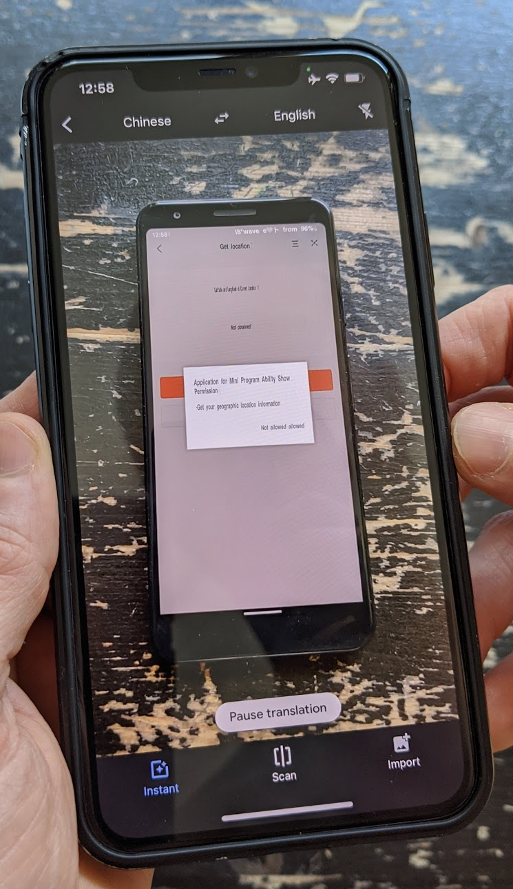
  <figcaption>
    Using Google Translate in camera mode to live-translate a Chinese mini app.
  </figcaption>
</figure>

## What are mini apps?

### Building blocks and compatibility

Mini apps are small (commonly less than 4MB) apps that require a super app to run. What they have in common, independent of the super app, is that they are built with ("dialects" of) the Web technologies HTML, CSS, and JavaScript. The runtime of a mini app is a [WebView](https://research.google/pubs/pub46739/) in the super app, not the underlying operating system, which means mini apps are cross platform. What this means is that the same mini app can run in the same super app, no matter if the super app runs on Android, iOS, or another OS. However, not all mini apps can run in all super apps, more on this [later](#standardization-of-mini-apps).

### Discovery

Mini apps are often discovered *ad-hoc* via branded 2d barcodes, which solves an important offline-to-online challenge, for example, getting from a physical restaurant menu to a payment mini app, or from a physical e-scooter to a rental min app. The image below depicts an example of such a branded 2d barcode. It is for [WeChat's demo mini app](https://github.com/wechat-miniprogram/miniprogram-demo). When the code is scanned with the WeChat super app, the mini app launches directly. Super apps other than in this case WeChat typically will not recognize the barcode.


<figure>
  
  <figcaption>
    Scanning this 2d barcode with the WeChat app launches a demo mini app.
  </figcaption>
</figure>

Mini apps can also be discovered through regular in-app search in the super app, be shared in chat messages, or be part of a news item in a news feed. Some super apps have the notion of verified accounts that can contain mini apps in their profiles. Mini apps can be highlighted when they are *(i)* physically geographically close, like the mini app of a business in front of which the user stands, or *(ii)* virtually close, like when the user gets directions on a map shown in the super app. Frequently used mini apps are available in an app drawer that in many super apps can be accessed through a swipe down gesture or through a special section in the super app menu.

### The user experience

All super apps have more or less the same user interface for mini apps. A themeable top bar with the mini app's name, and, in the upper corner of the screen, a close button on the far right preceded by an action menu that provides access to common features like sharing the app, adding it to a favorites list or the home screen, reporting abusive apps, providing feedback, and settings. The screenshot below shows a shopping mini app running in the context of the Alipay super app with the action menu opened.


<figure>
  
  <figcaption>
    Opened action menu of a shopping mini app running in the Alipay super app.
  </figcaption>
</figure>

### UI paradigms

Usually there is a bottom tab bar for the mini app's main navigation. Most super app providers offer components (see [below](#components)) that help developers implement common UI paradigms quickly, like carousels, accordions, progress bars, spinners, switches, maps, etc., which also helps make the user experience from mini app to mini app consistent. This is actually encouraged by [WeChat's Mini Program Design Guidelines](https://developers.weixin.qq.com/miniprogram/en/design/), similar to what Apple incentivizes with its [Apple Human Interface Guidelines](https://developer.apple.com/design/human-interface-guidelines/ios/overview/themes/), and Google with its [Design for Android](https://developer.android.com/design) recommendations.


<figure>
  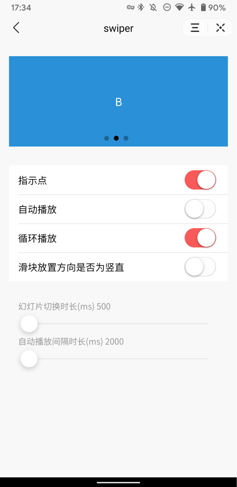
  <figcaption>
    Douyin's slider (carousel) component with various options.
  </figcaption>
</figure>

### Serving

Rather than being served piece by piece as separate resources, mini apps are served as encrypted packaged apps, that is, as archives that contain all resources in just one file. Unlike regular Web apps, they are also not served from the particular origin of the mini app creator, but from the super app provider directly. They can still access APIs from the servers of the mini app creator, but the core resources (commonly referred to as the app shell), must be served from the super app provider. Mini apps have to declare the origins they request additional data from.

### Caching, updates, and deep-linking

Mini apps are kept in the cache of the super app, so the next time the user launches a cached mini app, it loads almost instantly. If there is an update, a new app package is loaded. The version number can be part of the launch URI (see [Discovery](#discovery)), so the super app knows early on if the locally cached version is still current. The launch URI also optionally contains the desired page of the mini app, so deep-linking into specific pages of mini apps is possible. Via a sitemap, mini apps can declare which of their pages should be indexable by the super app provider's mini app crawler.

<figure>
  
  <figcaption>
    Mini apps are cached as encrypted packaged apps.
  </figcaption>
</figure>

### Security and permissions

Mini apps are reviewed by the super app provider, which means users perceive them as more secure than Web apps. They need to declare their potentially required permissions beforehand in a manifest or mini app configuration file, which, for some providers, also requires explanations for why each permission is needed. Mini apps can of course still lie, but they would have a hard time justifying why they are, for example, [trying to access motion sensors](https://twitter.com/search?q=why%20website%20access%20%22motion%20sensors%22%20&src=typed_query&f=live) without a reason that is apparent to the user. The incentive to fingerprint the user is notably a lot lower compared to the Web, since the user is typically already logged in to the super app anyway (see [Identity, payement, and social graph](#dentity-payment-social-graph)).

Whenever a mini app performs an operation that requires a special permission, a prompt is shown to the user that, if enforced by the platform, also includes the usage justification, as stated by the developer. The screenshot below shows the [Douyin demo mini app](https://microapp.bytedance.com/docs/zh-CN/mini-app/introduction/plug-in/example/) as it asks the user for permission to share their location. In some super apps, there is also an imperative API that mini apps can leverage to request permissions without immediately using them, or to only check the status of a permission. This may even include an API to open the central super app permission settings, which corresponds to [Chrome's *Site Settings*](chrome://settings/content/siteDetails?site=https%3A%2F%2Fexample.com%2F). Mini apps also have to declare beforehand the origins of all servers that they potentially will request data from.


<figure>
  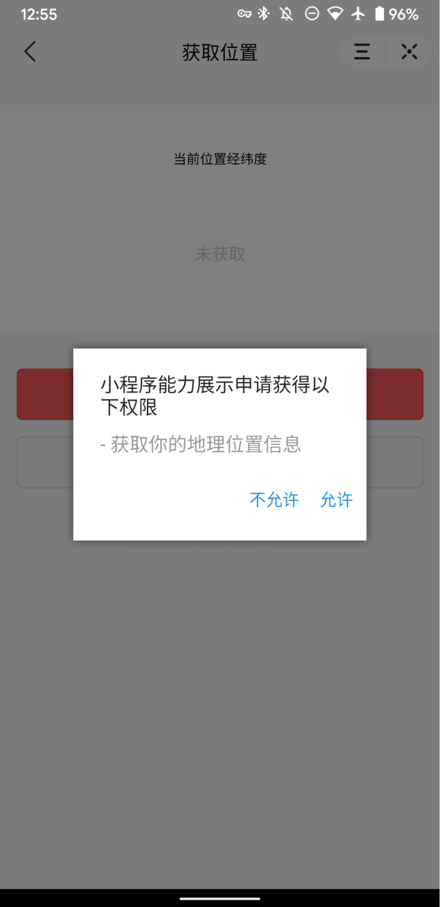
  <figcaption>
    The Douyin demo mini app asking for the geolocation permission.
  </figcaption>
</figure>

### Access to powerful features

The hosting super app offers access to powerful APIs via a JavaScript bridge that gets injected into the WebView offered by the super app (see [Building blocks and compatibility](#building-blocks-and-compatibility)). This JavaScript bridge provides hooks into the operating system's APIs. For example, a mini app JavaScript function like `getConnectedWifi()`—the capability of a mini app to obtain the name of the currently active Wi-Fi network—under the hood is facilitated through Android's [`getConnectionInfo()`](https://developer.android.com/reference/android/net/wifi/WifiManager#getConnectionInfo()) API or iOS' [`CNCopyCurrentNetworkInfo()`](https://developer.apple.com/documentation/systemconfiguration/1614126-cncopycurrentnetworkinfo) API. Other examples of powerful device APIs exposed in common super apps are Bluetooth, NFC, iBeacon, GPS, system clipboard, orientation sensors, battery information, calendar access, phonebook access, screen brightness control, file system access, vibration hardware for physical feedback, camera and microphone access, screen recording and screenshot creation, network status, UDP sockets, barcode scanning, device memory information, and more.


<figure>
  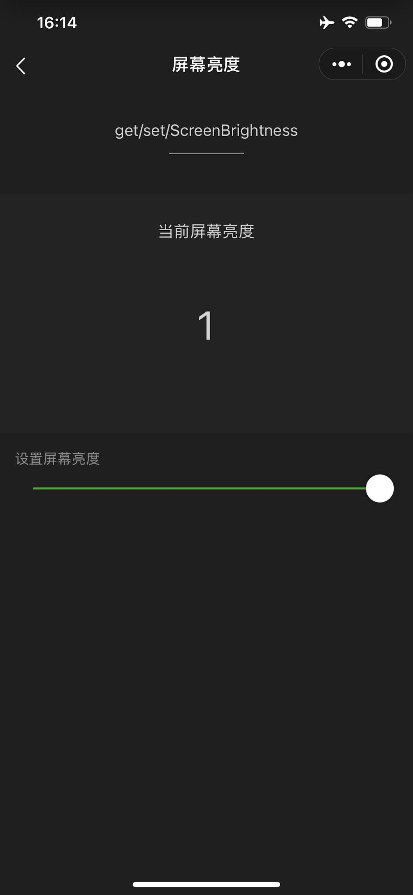
  <figcaption>
    The WeChat demo mini app setting the device's screen brightness to the maximum.
  </figcaption>
</figure>

### Access to cloud services

Many super apps also provide "serverless" access to cloud services of the super app provider that, apart from raw cloud computing and cloud storage, frequently also include higher-level tasks like text translation, object detection or content classification in images, speech recognition, or other Machine Learning tasks. Mini apps can be monetized with ads, which are commonly made available by super apps providers. Super app platforms usually also provide cloud analytics data, so mini app developers can better understand how users interact with their apps.

### Identity, payment, social graph

A very important feature of mini apps is the identity and social graph information that is shared from the super app. Super apps like Douyin or WeChat started as social networking sites in the broadest sense, where users have a (sometimes even government-verified) identity, a friend or follower network, and frequently also payment data stored. For example, a shopping mini app can (or sometimes even must) process any payments directly through the payment APIs of the super app and, upon user consent, can obtain user data like their shipping address, phone number, and full name, all without ever having to force the user to painfully fill out forms. Below, you can see the Walmart mini app running in WeChat, opened for the very first time, greeting me with a familiar face.


<figure>
  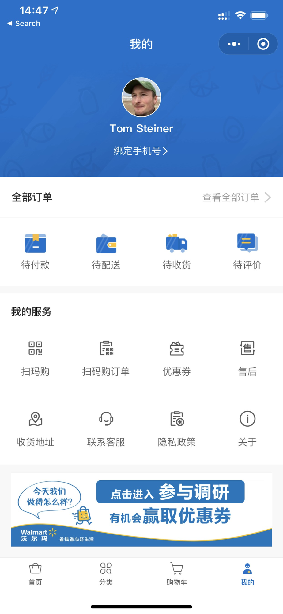
  <figcaption>
    The Walmart mini app with a personalized "Me" view on the first visit.
  </figcaption>
</figure>

Mini apps can get highly popular by letting people share their achievements like highscores in a game and challenge their contacts through status updates. The mini app is then only a tap away, so users can enter into competition without any friction and the mini app thereby grow its reach.

## H5 and Quick App

Before I go into more detail on the developer experience of mini apps, I want to briefly mention and set apart two technologies that come up in the context of mini apps, H5 and Quick App.

### H5

H5 apps (or pages) are commonly seen as the predecessor of mini apps. What people mean by H5 is essentially a well-designed mobile Web app (or page) that can be shared easily on chat applications. H5 is a reference to the HTML5 umbrella of technologies that includes responsive design, snappy CSS animations, multimedia content, etc. The Chinese Wikipedia actually [redirects](https://zh.wikipedia.org/wiki/H5) from H5 to HTML5. A good example of a representative H5 page experience is the [WeChat H5 boilerplate](https://panteng.github.io/wechat-h5-boilerplate/) project's demo.

### Quick App

[Quick App](https://www.quickapp.cn/) is an industry alliance consisting of [vivo open platform](https://dev.vivo.com.cn/), [Huawei Developer Alliance](http://developer.huawei.com/cn/consumer), [OPPO open platform](https://open.oppomobile.com/), [Xiaomi Open Platform](https://dev.mi.com/console/app/newapp.html), [Lenovo Open Platform](http://open.lenovo.com/developer/), [Gionee Open Platform](http://devquickapp.gionee.com/), [Meizu Open Platform](http://open.flyme.cn/), [ZTE Developer Platform](https://dev.ztems.com/), [Nubian Open Platform](http://developer.nubia.com/developer/view/index.html), [OnePlus Open Platform](http://www.oneplus.cn/), [Hisense Open Platform](http://dev.hismarttv.com/), and [China Mobile Terminal Corporation](https://www.chinamobileltd.com/tc/global/home.php). While the technology of Quick App is comparable to "regular" mini apps (see [Building blocks and compatibility](#building-blocks-and-compatibility)), the discovery of Quick App is different. They are meant to be listed in stores, which come pre-installed on devices of the manufacturers in the alliance, but can also be shared by means of a deep link (see the [Quick App showcase](https://www.quickapp.cn/quickAppShow)). They do not run in the context of a super app, but launch as seemingly self-contained full screen applications that feel native to the device. What happens in the background is that they are opened in a full screen view rendered by the operating system that provides the JavaScript bridge.

## Mini apps developer experience

Now that I have covered mini apps *per se*, I want to focus on the developer experience for the various super app platforms. Mini app development on all platforms happens in IDEs that are provided for free by the super app platforms. While there are more, I want to focus on the four most popular ones, and a fifth for Quick App for comparison.

### Mini app IDEs

Like the super apps, the IDEs are in the majority available in only Chinese. You actually want to make sure that you install the Chinese version and not a sometimes available English (or overseas) version, since it might not be up-to-date. If you are a macOS developer, be aware that not all IDEs are signed, which means macOS refuses to run the installer. You can, **at your own risk**, bypass this as [outlined by Apple help](https://support.apple.com/guide/mac-help/open-a-mac-app-from-an-unidentified-developer-mh40616/mac).

- [WeChat DevTools](https://developers.weixin.qq.com/miniprogram/dev/devtools/download.html)
- [Alipay DevTools](https://render.alipay.com/p/f/fd-jwq8nu2a/pages/home/index.html)
- [Baidu DevTools](https://smartprogram.baidu.com/docs/develop/devtools/history/)
- [ByteDance DevTools](https://microapp.bytedance.com/docs/zh-CN/mini-app/develop/developer-instrument/developer-instrument-update-and-download)
- [Quick App DevTools](https://www.quickapp.cn/docCenter/IDEPublicity)

### Mini app starter projects

In order to get started quickly with mini app development, all super app providers offer demo apps that can be downloaded and tested immediately, and that are sometimes also integrated in the "New Project" wizards of the various IDEs.

- [WeChat demo](https://github.com/wechat-miniprogram/miniprogram-demo)
- [Alipay demo](https://opendocs.alipay.com/mini/introduce/demo)
- [Baidu demo](https://smartprogram.baidu.com/docs/develop/tutorial/demo/)
- [ByteDance demo](https://microapp.bytedance.com/docs/zh-CN/mini-app/introduction/plug-in/example)
- [Quick App demo](https://github.com/quickappcn/sample)

### Development flow

After launching the IDE and loading or creating a (demo) mini app, the first step is always to log in. Usually you just need to scan a QR code with the super app (where you are already logged in) that is generated by the IDE. Very rarely do you have to enter a password. Once you are logged in, the IDE knows your identity and lets you start programming, debugging, testing, and submitting your app for review. In the following, you can see screenshots of the five IDEs mentioned in the paragraph above.


<figure>
  
  <figcaption>
    WeChat DevTools with simulator, code editor, and debugger.
  </figcaption>
</figure>


<figure>
  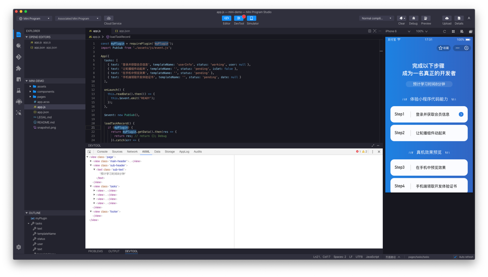
  <figcaption>
    Alipay DevTools with code editor, simulator, and debugger.
  </figcaption>
</figure>


<figure>
  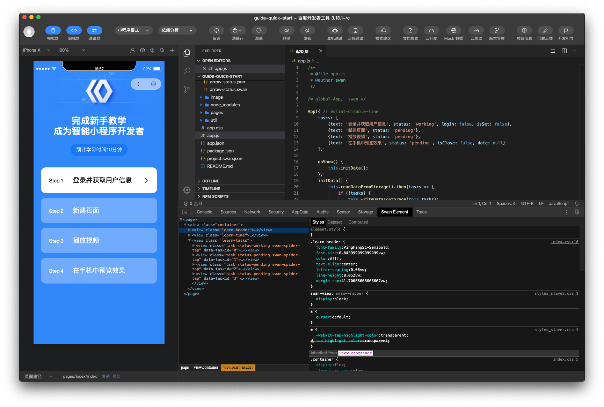
  <figcaption>
    Baidu DevTools with simulator, code editor, and debugger.
  </figcaption>
</figure>


<figure>
  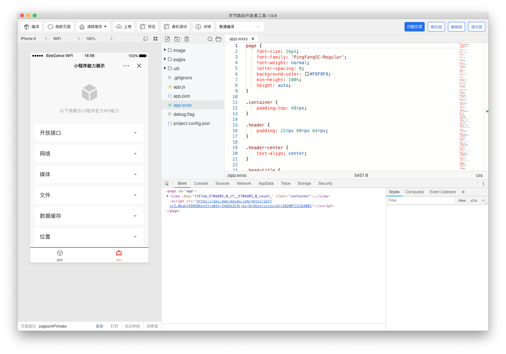
  <figcaption>
    ByteDance DevTools with simulator, code editor, and debugger.
  </figcaption>
</figure>


<figure>
  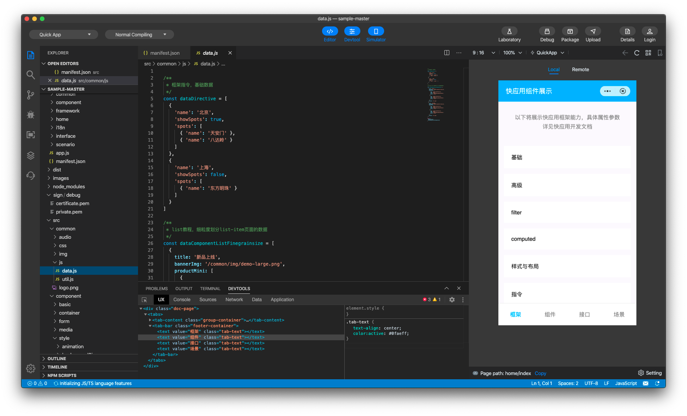
  <figcaption>
    Quick App DevTools with code editor, simulator, and debugger.
  </figcaption>
</figure>

As you can see, the fundamental components of all IDEs are very similar. You always have a code editor based on the [Monaco Editor](https://microsoft.github.io/monaco-editor/), the same project that also powers [VS Code](https://github.com/Microsoft/vscode). In all IDEs, there is a debugger based on the [Chrome DevTools front-end](https://github.com/ChromeDevTools/devtools-frontend) with some modifications, more on those later (see [Debugger](#debugger)). The IDEs *per se* are implemented either as [NW.js](https://nwjs.io/) or as [Electron](https://www.electronjs.org/) apps, the simulators in the IDEs are realized as an [NW.js `<webview>`](https://docs.nwjs.io/en/latest/References/webview%20Tag/) respectively [Electron `<webview>`](https://www.electronjs.org/docs/api/webview-tag), which in turn are based on a [Chromium `<webview>`](https://www.electronjs.org/docs/api/webview-tag). If you are interested in the IDE internals, you can oftentimes simply inspect them with Chrome DevTools with the keyboard shortcut <kbd>cmd</kbd>/<kbd>ctrl</kbd>+<kbd>alt</kbd>+<kbd>i</kbd>.


<figure>
  
  <figcaption>
    Inspecting Baidu DevTools with Chrome DevTools reveals that the simulator is realized as an Electron <code>&lt;webview&gt;</code>.
  </figcaption>
</figure>

### Simulator and real device testing and debugging

The simulator is comparable with what you might know from Chrome DevTools' [device mode](https://developers.google.com/web/tools/chrome-devtools/device-mode). You can simulate different Android and iOS devices, change the scale and device orientation, but also simulate various network states, memory pressure, a barcode reading event, unexpected termination, and dark mode.

While the built-in simulator suffices to get a rough feeling for how the app behaves, on-device testing, like with regular Web apps, is irreplaceable. Testing an in-development mini app is just a QR code scan away. For example, in ByteDance DevTools, scanning a dynamically IDE-generated QR code with a real device leads to a cloud-hosted version of the mini app that can then immediately be tested on the device. The way this works for ByteDance is that the URL behind the QR code ([example](https://t.zijieimg.com/JMvE5kM/?a=b)) redirects to a hosted page ([example](https://s.pstatp.com/toutiao/resource/tma_c_reveal_fe/static/redirect.html?version=v2&app_id=ttb3d2c56f2ce8e78c&scene=0&version_type=preview&token=3605997583095982&start_page=pages%2Fcomponent%2Findex&url=%7B%22id%22%3A%22ttb3d2c56f2ce8e78c%22%2C%22name%22%3A%22%E5%90%8D%E7%A7%B0%E9%87%8D%E7%BD%AEttb3d2c56f2ce8e78c%22%2C%22icon%22%3A%22%22%2C%22url%22%3A%22https%3A%2F%2Fsf1-ttcdn-tos.pstatp.com%2Fobj%2Fdeveloper%2Fapp%2Fttb3d2c56f2ce8e78c%2Fpreview%2F%22%2C%22orientation%22%3A0%2C%22ttid%22%3A%226857810517176942605%22%2C%22state%22%3A1%2C%22type%22%3A1%2C%22tech_type%22%3A1%2C%22version%22%3A%22undefined%22%7D&tech_type=1&bdpsum=281c864)), that contains links with special URI schemes like, for example, `snssdk1128://`, to preview the mini app on the various ByteDance super apps like Douyin or Toutiao ([example](snssdk1128://microapp?version=v2&app_id=ttb3d2c56f2ce8e78c&scene=0&version_type=preview&token=3605997583095982&start_page=pages%2Fcomponent%2Findex&url=%7B%22id%22%3A%22ttb3d2c56f2ce8e78c%22%2C%22name%22%3A%22%E5%90%8D%E7%A7%B0%E9%87%8D%E7%BD%AEttb3d2c56f2ce8e78c%22%2C%22icon%22%3A%22%22%2C%22url%22%3A%22https%3A%2F%2Fsf1-ttcdn-tos.pstatp.com%2Fobj%2Fdeveloper%2Fapp%2Fttb3d2c56f2ce8e78c%2Fpreview%2F%22%2C%22orientation%22%3A0%2C%22ttid%22%3A%226857810517176942605%22%2C%22state%22%3A1%2C%22type%22%3A1%2C%22tech_type%22%3A1%2C%22version%22%3A%22undefined%22%7D&tech_type=1&bdpsum=281c864)). Other super app providers do not go through an intermediate page, but open the preview directly.

<figure>
  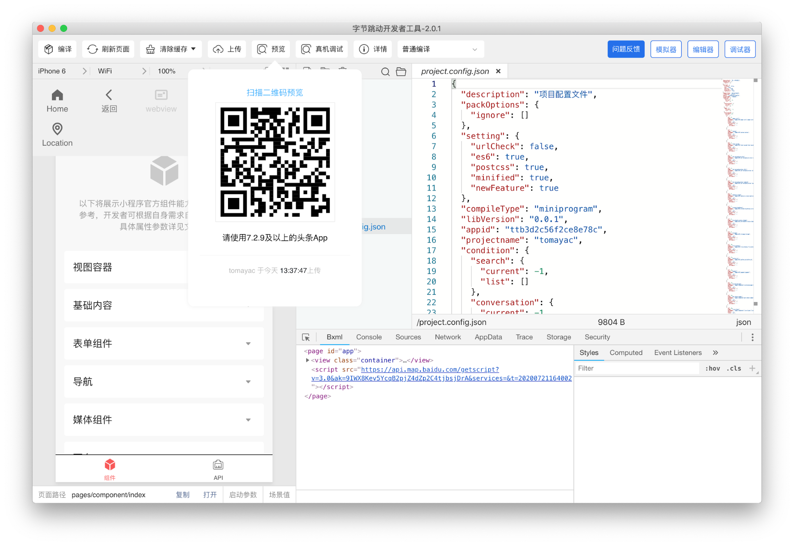
  <figcaption>
    ByteDance DevTools showing a QR code that the user can scan with the Douyin app for immediate on-device testing.
  </figcaption>
</figure>


<figure>
  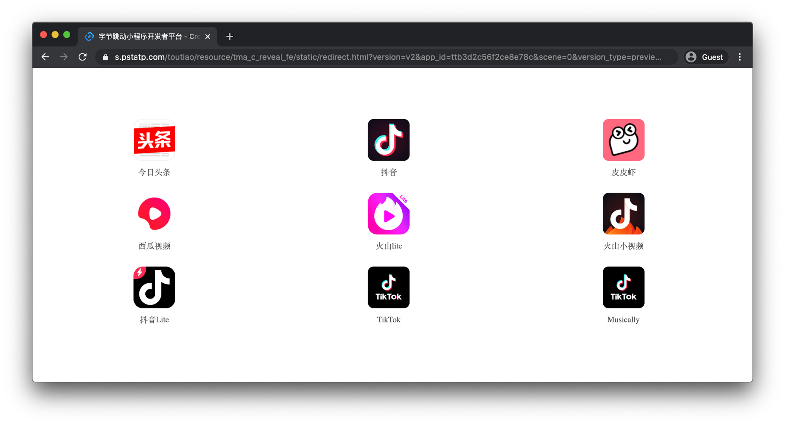
  <figcaption>
     Intermediate ByteDance landing page for previewing a mini app (opened on a desktop browser to show the flow).
  </figcaption>
</figure>

An even more compelling feature is cloud-based preview remote debugging. After simply scanning a special likewise IDE-generated QR code, the mini app opens on the physical device, with a Chrome DevTools window running on the computer for remote debugging.


<figure>
  
  <figcaption>
   Wirelessly remote-debugging a mini app on a real device with ByteDance DevTools.
  </figcaption>
</figure>

### Debugger

#### Elements debugging

The mini app debugging experience is very familiar to anyone who has ever worked with Chrome DevTools. There are some important differences, though, that make the workflow tailored to mini apps. Instead of the Chrome DevTools' [Elements panel](https://developers.google.com/web/tools/chrome-devtools#elements), mini app IDEs have a customized panel that is tailored to their particular dialect of HTML. For example, in the case of WeChat, the panel is called [Wxml](https://developers.weixin.qq.com/miniprogram/en/dev/framework/view/wxml/), which stands for WeiXin Markup Language. In Baidu DevTools, it's called [Swan Element](https://smartprogram.baidu.com/docs/develop/framework/dev/). ByteDance DevTools calls it [Bxml](https://microapp.bytedance.com/docs/zh-CN/mini-app/develop/guide/mini-app-framework/view/ttml). Alipay names it [AXML](https://opendocs.alipay.com/mini/framework/axml), and Quick App references the panel simply as [UX](https://doc.quickapp.cn/tutorial/framework/for.html). I will dive into these markup languages [below](#markup-languages).

<figure>
  
  <figcaption>
    Inspecting an <code>&lt;image&gt;</code> element with WeChat DevTools.
  </figcaption>
</figure>

#### Custom elements under the hood

Inspecting the WebView on a real device via [chrome://inspect/#devices](chrome://inspect/#devices) reveals that WeChat DevTools was deliberately lying to us. Where WeChat DevTools showed an `<image>`, the actual thing we are looking at is a custom element called `<wx-image>` with a `<div>` as its only child. It is interesting to note that this custom element does not use [shadow DOM](https://developer.mozilla.org/en-US/docs/Web/Web_Components/Using_shadow_DOM). More on these components [later](#components).

<figure>
  
  <figcaption>
    Inspecting an <code>&lt;image&gt;</code> element with WeChat DevTools reveals that it is actually a <code>&lt;wx-image&gt;</code> custom element.
  </figcaption>
</figure>

#### CSS debugging

Another difference is the new length unit `rpx` for responsive pixel in the various dialects of CSS (more on this unit [below](#styling)). WeChat DevTools uses device-independent CSS length units to make developing for different device sizes more intuitive.

<figure>
  
  <figcaption>
    Inspecting the padding specified in responsive pixels (<code>200rpx 0</code>) of a view with WeChat DevTools.
  </figcaption>
</figure>

#### Performance auditing

Performance is front and center for mini apps, so it is no surprise that WeChat DevTools and some other DevTools have a Lighthouse-inspired auditing tool integrated. The focus areas of the audits are Total, Performance, Experience, and Best Practice. The view of the IDE can be customized. In the screenshot below I have temporarily hidden the code editor to have more screen real estate for the audit tool.

<figure>
  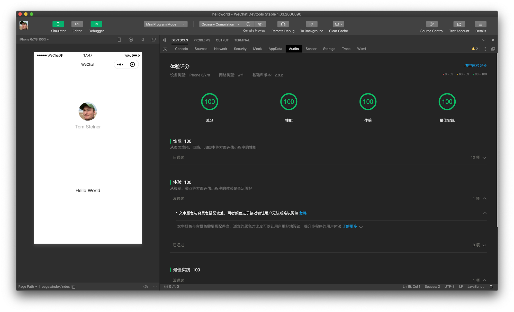
  <figcaption>
    The built-in Audit tool in WeChat DevTools showing Total, Performance, Experience, and Best Practice.
  </figcaption>
</figure>

#### API mocking

Rather than requiring the developer to set up a separate service, mocking API responses is directly part of WeChat DevTools. Via an easy-to-use interface the developer can set up API endpoints and the desired mock responses.


<figure>
  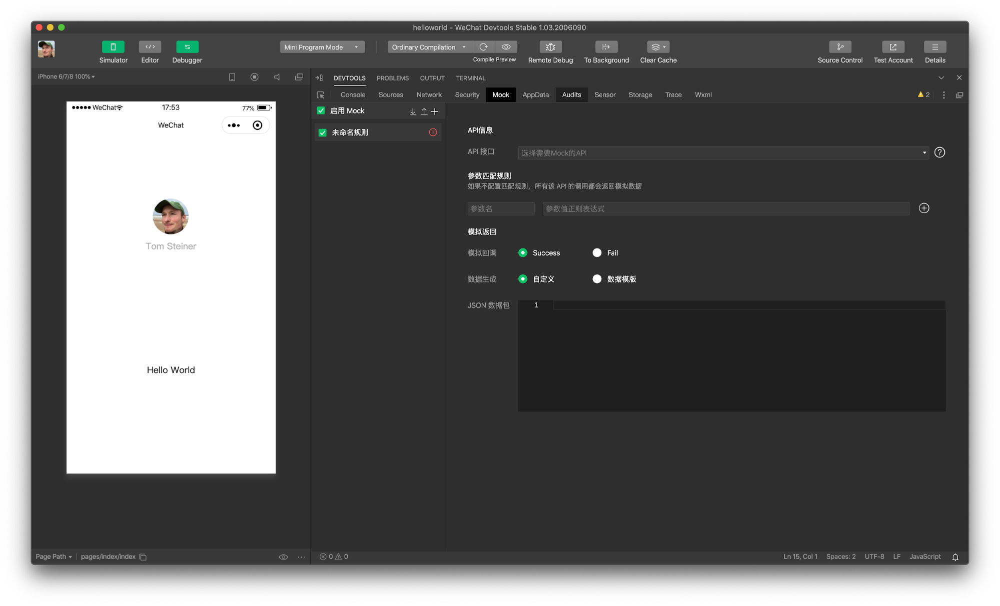
  <figcaption>
    WeChat DevTools' integrated API response mocking feature.
  </figcaption>
</figure>

### Markup languages

As outlined before, rather than with plain HTML, mini apps are written with dialects of HTML. If you have ever dealt with [Vue.js](https://vuejs.org/) text interpolation and directives, you will feel immediately at home, but similar concepts existed way before that in XML Transformations ([XSLT](https://www.w3.org/TR/xslt-30/). Below, you can see code samples from WeChat's [WXML](https://developers.weixin.qq.com/miniprogram/en/dev/framework/view/wxml/), but the concept is the same for all mini apps platforms, namely Alipay's [AXML](https://opendocs.alipay.com/mini/framework/axml), Baidu's [Swan Element](https://smartprogram.baidu.com/docs/develop/framework/dev/), ByteDance's [TTML](https://microapp.bytedance.com/docs/zh-CN/mini-app/develop/guide/mini-app-framework/view/ttml) (despite the DevTools calling it Bxml), and Quick App's [HTML](https://doc.quickapp.cn/tutorial/framework/for.html). Just like with Vue.js, the underlying mini app programming concept is the [model-view-viewmodel](https://en.wikipedia.org/wiki/Model%E2%80%93view%E2%80%93viewmodel) (MVVM).

#### Data Binding

Data binding corresponds to Vue.js' [text interpolation](https://vuejs.org/v2/guide/syntax.html#Text).

```html
<!-- wxml -->
<view> {{message}} </view>
```

```js
// page.js
Page({
  data: {
    message: 'Hello World!'
  }
});
```

#### List Rendering

List rendering works like Vue.js [`v-for` directive](https://vuejs.org/v2/guide/list.html).

```html
<!-- wxml -->
<view wx:for="{{array}}"> {{item}} </view>
```

```js
// page.js
Page({
  data: {
    array: [1, 2, 3, 4, 5]
  }
});
```

#### Conditional Rendering

Conditional rendering works like Vue.js' [`v-if` directive](https://vuejs.org/v2/guide/conditional.html).

```html
<!-- wxml -->
<view wx:if="{{view == 'one'}}">One</view>
<view wx:elif="{{view == 'two'}}">Two</view>
<view wx:else="{{view == 'three'}}">Three</view>
```

```js
// page.js
Page({
  data: {
    view: 'three'
  }
});
```

#### Templates

Rather than requiring the imperative [cloning of the `content` of an HTML template](https://developer.mozilla.org/en-US/docs/Web/API/HTMLTemplateElement/content), WXML templates can be used declaratively via the `is` attribute that links to a template definition.

```html
<!-- wxml -->
<template name="person">
  <view>
    First Name: {{firstName}}, Last Name: {{lastName}}
  </view>
</template>
```

```html
<template is="person" data="{{...personA}}"></template>
<template is="person" data="{{...personB}}"></template>
<template is="person" data="{{...personC}}"></template>
```

```js
// page.js
Page({
  data: {
    personA: {firstName: 'Alice', lastName: 'Foo'},
    personB: {firstName: 'Bob', lastName: 'Bar'},
    personC: {firstName: 'Charly', lastName: 'Baz'}
  }
});
```

### Styling

Styling happens with dialects of CSS. WeChat's is named [WXSS](https://developers.weixin.qq.com/miniprogram/en/dev/framework/quickstart/code.html#WXSS-Style). For Alipay, theirs is called [ACSS](https://opendocs.alipay.com/mini/framework/acss), Baidu's simply [CSS](https://smartprogram.baidu.com/docs/develop/framework/view_css/), and for ByteDance, their dialect is referred to as [TTSS](https://microapp.bytedance.com/docs/zh-CN/mini-app/develop/guide/mini-app-framework/view/ttss). What they have in common is that they extend CSS with responsive pixels. When writing regular CSS, developers need to convert all pixel units to adapt to different mobile device screens with different widths and pixel ratios. TTSS supports the `rpx` unit as its underlying layer, which means the mini app takes over the job from the developer and converts the units on their behalf, based on a specified screen width of `750rpx`. For example, on a Pixel 3a phone with a screen width of `393px` (and a device pixel ratio of `2.75`), responsive `200rpx` become `104px` on the real device when inspected with Chrome DevTools (393px / 750rpx * 200rpx ≈ 104px). In Android, the same concept is called [density-independent pixel](https://developer.android.com/training/multiscreen/screendensities#TaskUseDP).

<figure>
  
  <figcaption>
    Inspecting the actual padding on a Pixel 3a device with Chrome DevTools.
  </figcaption>
</figure>

```css
/* app.wxss */
.container {
  height: 100%;
  display: flex;
  flex-direction: column;
  align-items: center;
  justify-content: space-between;
  padding: 200rpx 0; /* ← responsive pixels */
  box-sizing: border-box;
}
```

Since components (see [below](#components)) do not use shadow DOM, styles declared on a page reach into all components. The common stylesheet file organization is to have one root stylesheet for global styles, and individual per-page stylesheets specific to each page of the mini app. Styles can be imported with an `@import` rule that behaves like the [`@import`](https://developer.mozilla.org/en-US/docs/Web/CSS/@import) CSS at-rule. Like in HTML, styles can also be declared inline, including dynamic text interpolation (see [above](#data-binding)).

```html
<view style="color:{{color}};" />
```

### Scripting

Mini apps support a "safe subset" of JavaScript that includes support for modules using varying syntaxes that remind of [CommonJS](http://www.commonjs.org/) or [RequireJS](https://requirejs.org/). JavaScript code cannot be executed via `eval()` and no functions can be created with `new Function()`. The scripting execution context is [V8](https://v8.dev/) or [JavaScriptCore](https://developer.apple.com/documentation/javascriptcore) on devices, and V8 or [NW.js](https://nwjs.io/) in the simulator. Coding with ES6 or newer syntax is usually possible, since the particular DevTools automatically transpile the code to ES5 if the build target is an operating system with an older WebView implementation (see [below](#the-build-process)). The documentations of the super app providers explicitly mention that their scripting languages are not to be confused with and are distinct from JavaScript. This statement, however, refers mostly just to the way modules work, that is, that they do not support standard [ES Modules](https://developer.mozilla.org/en-US/docs/Web/JavaScript/Guide/Modules) yet.

As mentioned [before](#markup-languages), the mini app programming concept is the [model-view-viewmodel](https://en.wikipedia.org/wiki/Model%E2%80%93view%E2%80%93viewmodel) (MVVM). The logic layer and the view layer run on different threads, which means the user interface does not get blocked by long-running operations. In Web terms, you can think of scripts running in a [Web Worker](https://developer.mozilla.org/en-US/docs/Web/API/Web_Workers_API/Using_web_workers).

WeChat's scripting language is called [WXS](https://developers.weixin.qq.com/miniprogram/en/dev/reference/wxs/), Alipay's [SJS](https://opendocs.alipay.com/mini/framework/sjs), ByteDance's likewise [SJS](https://microapp.bytedance.com/docs/zh-CN/mini-app/develop/framework/sjs-syntax-reference/sjs-introduction/). Baidu speaks of [JS](https://smartprogram.baidu.com/docs/develop/framework/devjs/) when referencing theirs. These scripts need to be included using a special kind of tag, for example, `<wxs>` in WeChat. In contrast, Quick App uses regular `<script>` tags and the ES6 [JS](https://doc.quickapp.cn/framework/script.html) syntax.

```html
<wxs module="m1">
  var msg = "hello world";
  module.exports.message = msg;
</wxs>

<view>{{m1.message}}</view>
```

Modules can also be loaded via a `src` attribute, or imported via `require()`.

```js
// /pages/tools.wxs
var foo = "'hello world' from tools.wxs";
var bar = function (d) {
  return d;
}
module.exports = {
  FOO: foo,
  bar: bar,
};
module.exports.msg = "some msg";
```

```html
<!-- page/index/index.wxml -->
<wxs src="./../tools.wxs" module="tools" />
<view>{{tools.msg}}</view>
<view>{{tools.bar(tools.FOO)}}</view>
```

```js
// /pages/logic.wxs
var tools = require("./tools.wxs");

console.log(tools.FOO);
console.log(tools.bar("logic.wxs"));
console.log(tools.msg);
```

#### JavaScript bridge API

The JavaScript bridge that connects mini apps with the native operating system renders working with native capabilities possible (see [Access to powerful features](#access-to-powerful-features). It also offers a number of convenience methods. For an overview, you can check out the different APIs of [WeChat](https://developers.weixin.qq.com/miniprogram/en/dev/api/), [Alipay](https://opendocs.alipay.com/mini/api), [Baidu](https://smartprogram.baidu.com/docs/develop/api/apilist/), [ByteDance](https://microapp.bytedance.com/docs/zh-CN/mini-app/develop/api/foundation/tt-can-i-use), and [Quick App](https://doc.quickapp.cn/features/).

Feature detection is straightforward, since all platforms provide a (literally called like this) `canIUse()` method whose name seems inspired by the website [caniuse.com](https://caniuse.com/). For example, ByteDance's [`tt.canIUse()`](https://microapp.bytedance.com/docs/zh-CN/mini-app/develop/api/foundation/tt-can-i-use) allows for support checks for APIs, methods, parameters, options, components, and attributes.

```js
// Testing if the `<swiper>` component is supported.
tt.canIUse('swiper');
// Testing if a particular field is supported.
tt.canIUse('request.success.data');
```

### Components

[Web components](https://developer.mozilla.org/en-US/docs/Web/Web_Components/) have started with the promise of letting developers piece them together and build great apps on top of them. Examples of such atomic components are GitHub's [time-elements](https://github.com/github/time-elements) Stefan Judis' [web-vitals-element](https://github.com/stefanjudis/web-vitals-element), or, shameless plug, Google's [dark mode toggle](https://github.com/GoogleChromeLabs/dark-mode-toggle/). When it comes to complete design systems, however, we have observed that people prefer to rely on a coherent set of components from the same vendor. An incomplete list of examples includes SAP's [UI5 Web Components](https://sap.github.io/ui5-webcomponents/), the [Polymer Elements](https://www.webcomponents.org/author/PolymerElements), [Vaadin's elements](https://www.webcomponents.org/author/vaadin), Microsoft's [FAST](https://github.com/microsoft/fast), the [Material Web Components](https://github.com/material-components/material-components-web-components), arguably the [AMP components](https://amp.dev/documentation/components/), and many more. Due to a number of factors out of scope for this article, a lot of developers, however, have also flocked to frameworks like [React](https://reactjs.org/), [Vue.js](https://vuejs.org/), [Ember.js](https://emberjs.com/), etc. Rather than giving the developer the freedom to choose from any of these options (or, dependent on your viewpoint, *forcing* them to make a technology choice), super app providers universally supply a set of components that developers must use.

You can think of these components like any of the component libraries mentioned above. To get an overview of the available components, you can browse [WeChat's component library](https://developers.weixin.qq.com/miniprogram/en/dev/component/), [ByteDance's components](https://microapp.bytedance.com/docs/zh-CN/mini-app/develop/component/all), [Alipay's components](https://opendocs.alipay.com/mini/component), [Baidu's](https://smartprogram.baidu.com/docs/develop/component/component/), and [Quick App components](https://doc.quickapp.cn/widgets/common-events.html).

While I have shown [earlier](#custom-elements-under-the-hood) that, for example, WeChat's `<image>` is a web component under the hood, not all of these components are technically web components. Some components, like `<map>` and `<video>`, are rendered as [OS-native components](https://developers.weixin.qq.com/ebook?action=get_post_info&docid=000caab39b88b06b00863ab085b80a) that get layered over the WebView. For the developer, this implementation detail is not revealed, they are programmed like any other component.

As always, the details vary, but the overall programming concepts are the same across all super app providers. An important concept is data binding, as shown before in [Markup languages](#markup-languages). Generally, components are grouped by function, so finding the right one for the job is easier. Below is an example from Alipay's categorization, which is similar to the component grouping of other vendors.

- View containers
  - `view`
  - `swiper`
  - `scroll-view`
  - `cover-view`
  - `cover-image`
  - `movable-view`
  - `movable-area`
- Basic content
  - `text`
  - `icon`
  - `progress`
  - `rich-text`
- Form components
  - `button`
  - `form`
  - `label`
  - `input`
  - `textarea`
  - `radio`
  - `radio-group`
  - `checkbox`
  - `checkbox-group`
  - `switch`
  - `slider`
  - `picker-view`
  - `picker`
- Navigation
  - `navigator`
- Media components
  - `image`
  - `video`
- Canvas
  - `canvas`
- Map
  - `map`
- Open components
  - `web-view`
  - `lifestyle`
  - `contact-button`
- Accessibility
  - `aria-component`

Below, you can see Alipay's [`<image>`](https://opendocs.alipay.com/mini/component/image) used in an `a:for` directive (see [List rendering](#list-rendering)) that loops over an image data array provided in `index.js`.

```js
/* index.js */
Page({
  data: {
    array: [{
      mode: 'scaleToFill',
      text: 'scaleToFill',
    }, {
      mode: 'aspectFit',
      text: 'aspectFit',
    }],
    src: 'https://images.example.com/sample.png',
  },
  imageError(e) {
    console.log('image', e.detail.errMsg);
  },
  onTap(e) {
    console.log('image tap', e);
  },
  imageLoad(e) {
    console.log('image', e);
  },
});
```

```html
<!-- index.axml -->
<view class="page">
  <view class="page-section" a:for="{{array}}" a:for-item="item">
    <view class="page-section-demo" onTap="onTap">
      <image class="image"
        mode="{{item.mode}}"
        onTap="onTap"
        onError="imageError"
        onLoad="imageLoad"
        src="{{src}}"
        lazy-load="true"
        default-source="https://images.example.com/loading.png"
      />
    </view>
  </view>
</view>
```

Note the data binding of the `item.mode` to the `mode` attribute, the `src` to the `src` attribute, and the three event handlers `onTap`, `onError`, and `onLoad` to the functions of the same name. As shown [before](#custom-elements-under-the-hood), the `<image>` tag internally gets converted into a `<div>` with a placeholder of the image's final dimensions, optional lazy-loading, a default source, etc.

The available configuration options of the component are all listed in the [documentation](https://opendocs.alipay.com/mini/component/image). An embedded-in-the-docs [component preview with simulator](https://herbox-embed.alipay.com/s/doc-image?chInfo=openhome-doc&theme=light) makes the code immediately tangible.

<figure>
  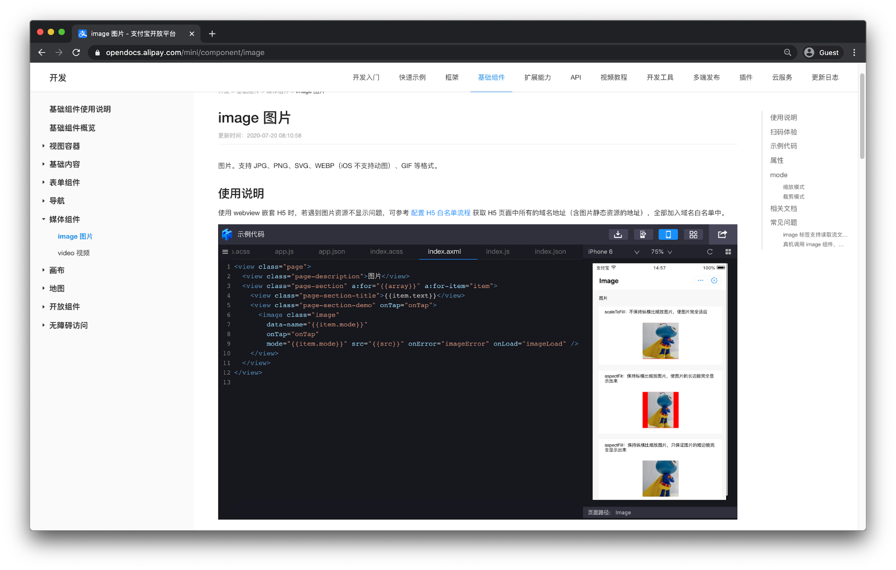
  <figcaption>
    Alipay component documentation with embedded component preview.
  </figcaption>
</figure>


<figure>
  
  <figcaption>
    Alipay component preview popped out into its own tab.
  </figcaption>
</figure>

Each component also has a QR code that can be scanned with the Alipay app that opens the component example in a self-contained minimal example.


<figure>
  
  <figcaption>
    Preview of the Alipay <code>&lt;image&gt;</code> component on a real device after following a <a href="https://qr.alipay.com/s6x01278ucjhjyknjd5ow53">QR code link</a> from the docs.
  </figcaption>
</figure>

Developers can jump from the documentation straight into Alipay DevTools IDE by leveraging a proprietary URI scheme `antdevtool-tiny://`. This allows the documentation to link directly into a to-be-imported mini app project, so developers can get started with the component immediately.

#### Custom components

Apart from using the vendor-provided components, developers can also create custom components. The concept exists for [WeChat](https://developers.weixin.qq.com/miniprogram/en/dev/framework/custom-component/), [ByteDance](https://microapp.bytedance.com/docs/zh-CN/mini-app/develop/guide/custom-component/custom-component), [Alipay](https://opendocs.alipay.com/mini/framework/component_configuration), and [Baidu](https://smartprogram.baidu.com/docs/develop/framework/custom-component/), as well as [Quick App](https://doc.quickapp.cn/tutorial/framework/parent-child-component-communication.html#%E7%BB%84%E4%BB%B6%E8%87%AA%E5%AE%9A%E4%B9%89). For example, a Baidu custom component consists of four files that must reside in the same folder: `custom.swan`, `custom.css`, `custom.js`, and `custom.json`.

The file `custom.json` denotes the folder contents as a custom component.

```json
{
  "component": true
}
```

The files `custom.swan` and `custom.css` contain the markup respectively the CSS.

```html
<view class="name" bindtap="tap">
  {{name}} {{age}}
</view>
```

```css
.name {
  color: red;
}
```

The file `custom.js` contains the logic. The component lifecycle functions are `attached()`, `detached()`, `created()`, and `ready()`. The component can additionally also react on [page lifecycle events](#page-lifecycle), namely `show()` and `hide()`.

```js
Component({
  properties: {
    name: {
      type: String,
      value: 'swan',
    }
  },
  data: {
    age: 1
  },
  methods: {
    tap: function(){}
  },
  lifetimes: {
        attached: function() {},
        detached: function() {},
        created: function() {},
        ready: function() {},
    },
    pageLifetimes: {
      show: function() {},
      hide: function() {}
    },
});
```

The custom component can then be imported in `index.json`, the key of the import determines the name (here: `"custom"`) that the custom component can then be used with in `index.swan`.

```json
{
  "usingComponents": {
    "custom": "/components/custom/custom"
  }
}
```

```html
<view>
  <custom name="swanapp"></custom>
</view>
```


### Mini app project structure

As before with the markup languages, the styling languages, and the components, with the mini app project structure, too, the details like the file extensions or the default names vary, but the overall idea is the same for all super app providers. The project structure always consists of a root file `app.js` that initializes the mini app, a configuration file `app.json` that *roughly* corresponds to a [Web App Manifest](https://developer.mozilla.org/en-US/docs/Web/Manifest), an optional common style sheet file `app.css` with shared default styles, and a `project.config.json` file that contains build information. All the pages are contained as individual subfolders in a `pages` folder. Each page subfolder contains a CSS file, a JS file, an HTML file, and an optional configuration JSON file. All files must be named like their containing folder, apart from the file extensions. Like that, the mini app just needs a pointer to the directory in the `app.json` file (the manifest-like file), and can find all subresources dynamically. From the perspective of a Web developer, mini apps are thus multi page apps.

```bash
├── app.js               # Initialization logic
├── app.json             # Common configuration
├── app.css              # Common style sheet
├── project.config.json  # Project configuration
└── pages                # List of pages
   ├── index               # Home page
   │   ├── index.css         # Page style sheet
   │   ├── index.js          # Page logic
   │   ├── index.json        # Page configuration
   │   └── index.html        # Page markup
   └── other               # Other page
       ├── other.css         # Page style sheet
       ├── other.js          # Page logic
       ├── other.json        # Page configuration
       └── other.html        # Page markup
```

### Mini app lifecycle

A mini app must be registered with the super app by calling the globally defined `App()` method. Referring to the project structure outlined [above](#mini-app-project-structure), this happens in `app.js`. The mini app lifecycle essentially consists of four events: `launch`, `show`, `hide`, and `error`. Handlers for these events can be passed to the `App()` method in the form of a configuration object, which can also contain a `globalData` property that holds data that should be globally available across all pages.

```js
/* app.js */
App({
  onLaunch (options) {
    // Do something when the app is launched initially.
  },
  onShow (options) {
    // Do something when the app is shown.
  },
  onHide () {
    // Do something when the app is hidden.
  },
  onError (msg) {
    console.log(msg)
  },
  globalData: 'I am global data',
});
```

As usual, the individual details vary, but the concept is the same for [WeChat](https://developers.weixin.qq.com/miniprogram/en/dev/reference/api/App.html), [Alipay](https://opendocs.alipay.com/mini/framework/app-detail), [Baidu](https://smartprogram.baidu.com/docs/develop/framework/app_service_register/), [ByteDance](https://microapp.bytedance.com/docs/zh-CN/mini-app/develop/framework/logic-layer/start-app/), and also [Quick App](https://doc.quickapp.cn/tutorial/framework/lifecycle.html#app-%E7%9A%84%E7%94%9F%E5%91%BD%E5%91%A8%E6%9C%9F).

### Page lifecycle

Similar to the app lifecycle, the page lifecycle, too, has lifecycle events that the developer can listen for and react upon. These core events are `load`, `show`, `ready`, `hide`, and `unload`. Some platforms offer additional events like `pulldownrefresh`. Setting up the event handlers happens in the `Page()` method that is defined for each page. For the `index` or the `other` pages from the project structure [above](#mini-app-project-structure), this would happen in `index.js` or `other.js` respectively.

```js
/* index.js */
Page({
  data: {
    text: "This is page data."
  },
  onLoad: function(options) {
    // Do something when the page is initially loaded.
  },
  onShow: function() {
    // Do something when the page is shown.
  },
  onReady: function() {
    // Do something when the page is ready.
  },
  onHide: function() {
    // Do something when the page is hidden.
  },
  onUnload: function() {
    // Do something when the page is closed.
  },
  onPullDownRefresh: function() {
    // Do something when the user pulls down to refresh.
  },
  onReachBottom: function() {
    // Do something when the user scrolls to the bottom.
  },
  onShareAppMessage: function () {
    // Do something when the user shares the page.
  },
  onPageScroll: function() {
    // Do something when the user scrolls the page.
  },
  onResize: function() {
    // Do something when the user resizes the page.
  },
  onTabItemTap(item) {
    // Do something when the user taps the page's tab.
  },
  customData: {
    foo: 'bar'
  }
})
```

### The build process

The build process of mini apps is abstracted away from the developer. Under the hood, it is using industry tools like the [Babel](https://babeljs.io/) compiler for transpilation and minification and the [postcss](https://postcss.org/) CSS transformer. The build experience is comparable to that of [Next.js](https://nextjs.org/) or [`create-react-app`](https://reactjs.org/docs/create-a-new-react-app.html), where developers, if they not explicitly choose to do so, never touch the build parameters. The resulting processed files are finally signed, encrypted, and packaged in one or several (sub)packages that then get uploaded to the servers of the super app providers. Subpackages are meant for lazy-loading, so a mini app does not have to be downloaded all at once. The packaging details are meant to be private and are not documented, but some package formats like WeChat's `wxapkg` format have been [reverse-engineered](https://github.com/sjatsh/unwxapkg).

## Standardization of mini apps

Mini apps have seen tremendous growth. WeChat mini apps as of June 2020 have reached [830 million active users](https://www.questmobile.com.cn/research/report-new/122), Alipay mini apps [401 million active users](https://kr-asia.com/the-mau-of-wechat-alipay-and-baidus-mini-programs-now-add-up-to-more-than-1-billion) as of April 2019, and Baidu mini apps in the same month [115 million active users](https://kr-asia.com/the-mau-of-wechat-alipay-and-baidus-mini-programs-now-add-up-to-more-than-1-billion). Effectively companies have traded building apps for the two operating systems iOS and Android and additionally the Web for building apps for three or more super apps platforms. The differences between each super app platform may not be as big as the differences between Android, iOS, and the Web, but nevertheless they exist. Where on Android, iOS, and the Web we have seen cross-platform approaches like [Flutter](https://flutter.dev/), [Ionic](https://ionicframework.com/), and [React Native](https://reactnative.dev/) ([for Web](https://github.com/necolas/react-native-web)) gain popularity, in the mini apps ecosystem, we can see an effort led by the [MiniApps Ecosystem Community Group](https://www.w3.org/community/miniapps/) with [members](https://www.w3.org/community/miniapps/participants) from, among others, Alibaba, Baidu, ByteDance, Huawei, Intel, Xiaomi, China Mobile, Facebook, and Google to standardize aspects of mini apps.

Notable publications of the group so far include a [whitepaper](https://w3c.github.io/miniapp/white-paper/), a [Comparison of APIs in MiniApps, W3C specs, and PWAs](https://www.w3.org/TR/mini-app-white-paper/comparison.html), and specifications and explainers on the following aspects:

- URI Scheme: [spec](https://w3c.github.io/miniapp/specs/uri/), [explainer](https://github.com/w3c/miniapp/blob/gh-pages/specs/uri/docs/explainer.md)
- Lifecycle: [spec](https://w3c.github.io/miniapp/specs/lifecycle/), [explainer](https://github.com/w3c/miniapp/blob/gh-pages/specs/lifecycle/docs/explainer.md)
- Manifest: [spec](https://w3c.github.io/miniapp/specs/manifest/), [explainer](https://github.com/w3c/miniapp/blob/gh-pages/specs/manifest/docs/explainer.md)
- Packaging: [spec](https://w3c.github.io/miniapp/specs/packaging/), [explainer](https://github.com/w3c/miniapp/blob/gh-pages/specs/packaging/docs/explainer.md)
- An exploration of [widget requirements](https://w3c.github.io/miniapp/specs/widget-req/)

W3C member and group participant Fuqiao Xue (W3C) has further published a [Comparison of MiniApps and web apps](https://xfq.github.io/miniapp-comparison/) on his own behalf, that is, not as an official group publication, but nonetheless worth the read.


<figure>
  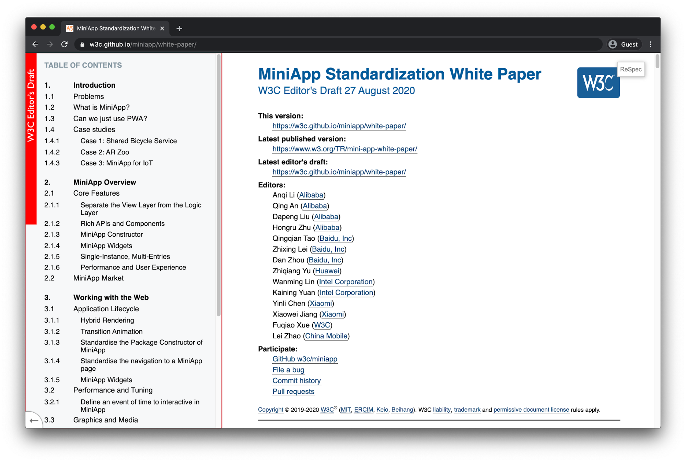
  <figcaption>
    The MiniApp Standardization White Paper.
  </figcaption>
</figure>

## Other mini app platforms

Apart from mobile devices, where mini apps are omnipresent and which are their natural habitat, mini apps have started to conquer other domains like cars and the classic desktop.

### Mini apps in cars

In July 2020 the German car maker BMW Group [announced](https://www.press.bmwgroup.com/china/article/detail/T0313254ZH_CN/%E2%80%9C2020-%E5%AE%9D%E9%A9%AC%E7%A7%91%E6%8A%80%E6%97%A5%E2%80%9D%E5%9C%A8%E7%BA%BF%E5%8F%91%E5%B8%83%E5%A4%9A%E6%AC%BE%E8%BD%A6%E5%86%85%E6%95%B0%E5%AD%97%E4%BA%A7%E5%93%81) a cooperation with Tencent branded as WeScenario, which, [according to Tencent](https://www.tencent.com/en-us/articles/2201068.html), will be rolled to *"30 leading auto companies in the world, and [bring the WeScenario] ecosystem of social, content and services to more than 110 mainstream automobile models"*.


<figure>
  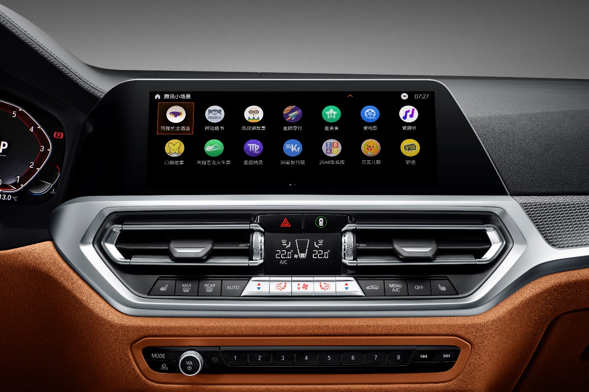
  <figcaption>
    Landing page of Tencent WeScenario (Source: <a href="https://www.press.bmwgroup.com/china/article/detail/T0313254ZH_CN/%E2%80%9C2020-%E5%AE%9D%E9%A9%AC%E7%A7%91%E6%8A%80%E6%97%A5%E2%80%9D%E5%9C%A8%E7%BA%BF%E5%8F%91%E5%B8%83%E5%A4%9A%E6%AC%BE%E8%BD%A6%E5%86%85%E6%95%B0%E5%AD%97%E4%BA%A7%E5%93%81">BMW</a>).
  </figcaption>
</figure>

### Mini apps on the desktop

#### Mini apps in WeChat Desktop

Using the WeChat desktop client available for [macOS](https://dldir1.qq.com/weixin/mac/WeChatMac.dmg) (make sure to *not* load the [version from the App Store](https://itunes.apple.com/cn/app/id836500024), since it is more limited) and [Windows](https://dldir1.qq.com/weixin/Windows/WeChatSetup.exe)), it is possible to run WeChat mini apps on the desktop.

To test it on macOS, share a mini app from a mobile device with yourself via the "File Transfer" account. This will result in a message that you can then open on the desktop client. In most cases, the mini app will then be directly clickable and runnable, in other cases, you have to forward the chat history to yourself again from a mobile device.

<figure>
  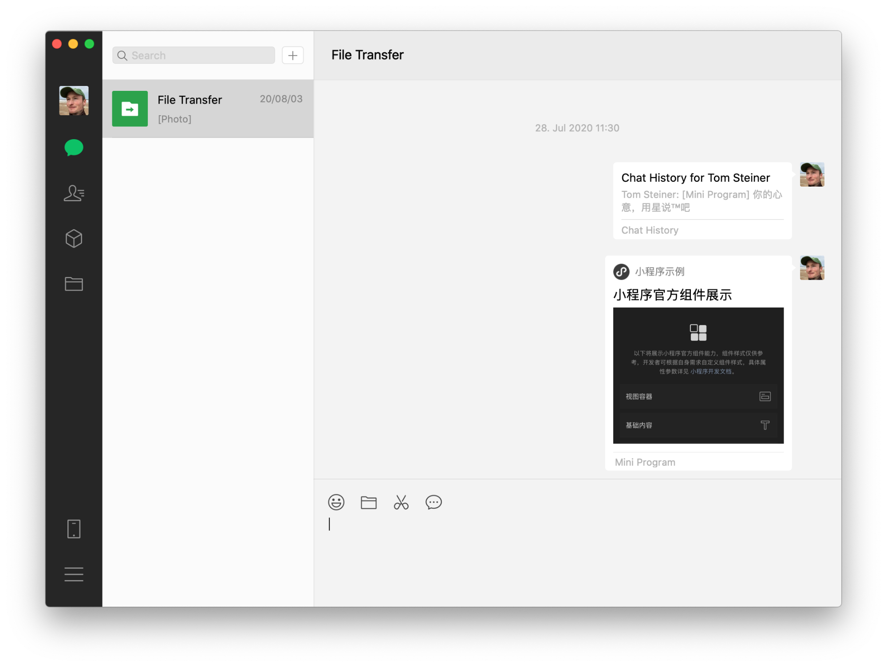
  <figcaption>
    Sharing a mini app with oneself in the WeChat macOS desktop client.
  </figcaption>
</figure>

On Windows, the workaround to share mini apps with oneself is not necessary, since there is a dedicated mini apps panel that shows the user's recently used mini apps and also includes an app search where new mini apps can be discovered.


<figure>
  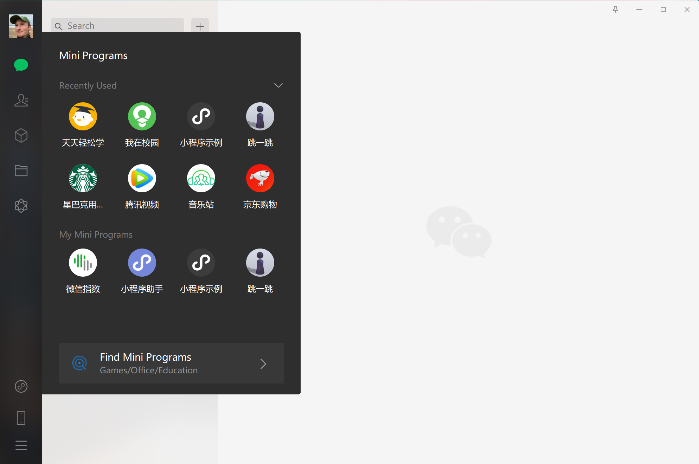
  <figcaption>
    The mini app panel in the WeChat Windows client.
  </figcaption>
</figure>


<figure>
  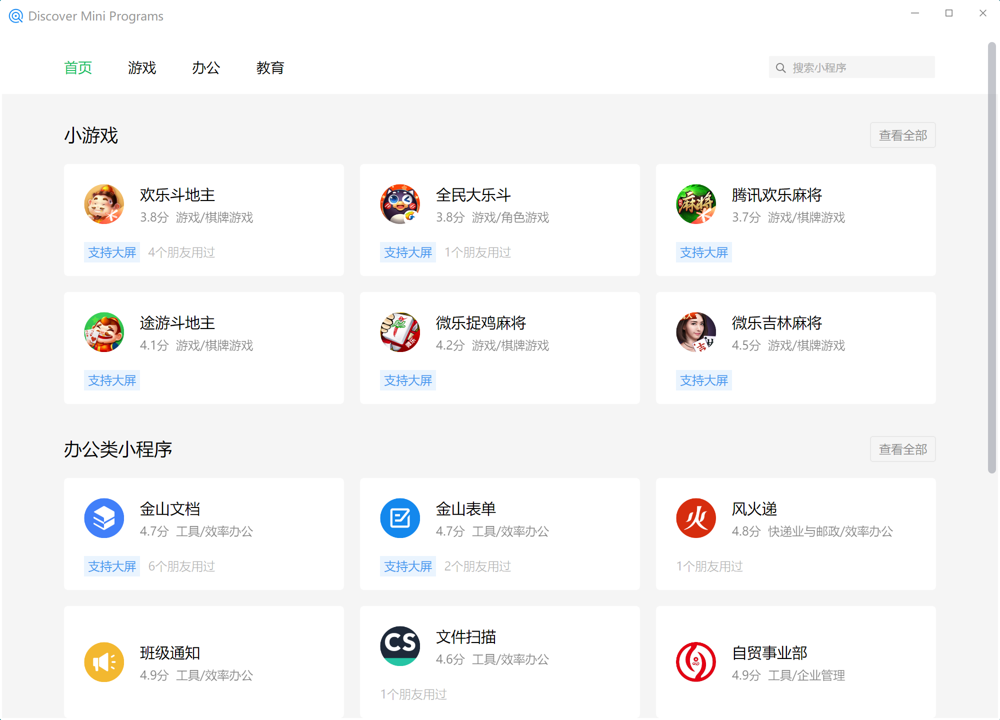
  <figcaption>
    The mini app search in the WeChat Windows client.
  </figcaption>
</figure>

WeChat mini apps on the desktop naturally integrate with the operating system. On both macOS and Windows, they get their own entry in the multitasking bar and have their own taskbar icon. While on macOS, there is an option to be kept in the Dock, the icon disappears the moment the WeChat client app gets closed. On Windows, mini app icons can be pinned to the taskbar, but cannot be launched. On macOS, the title of the app is always "WeChat" and not the actual title of the app, whereas the title is displayed correctly on Windows.


<figure>
  
  <figcaption>
    The Starbucks app is a mini app and can be multitasked to like any regular macOS app.
  </figcaption>
</figure>


<figure>
  
  <figcaption>
   Mini apps on macOS have WeChat as their title.
  </figcaption>
</figure>

Most mini apps are not optimized for desktop yet and run in a fixed, non-resizable window that includes the well-known UI affordances and permission prompts as on mobile (see [The user experience](#the-user-experience)).


<figure>
  
  <figcaption>
    The Starbucks mini app running on macOS asking for the user profile permission.
  </figcaption>
</figure>


<figure>
  
  <figcaption>
    The Starbucks mini app running on macOS in a fixed, non-resizable window.
  </figcaption>
</figure>

Responsive mini apps that are optimized for the desktop (apart from for mobile) can be displayed in a wider window that on macOS is currently still fixed, but that on Windows is flexibly resizable.

<figure>
  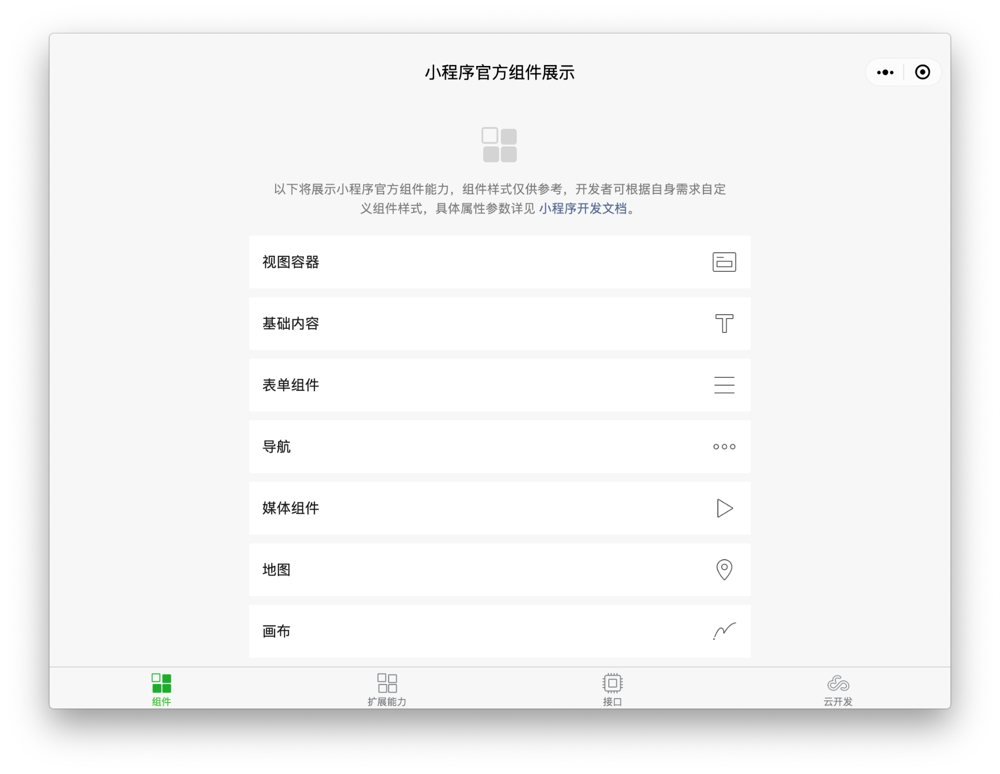
  <figcaption>
    The WeChat components demo app in a responsive app window.
  </figcaption>
</figure>


<figure>
  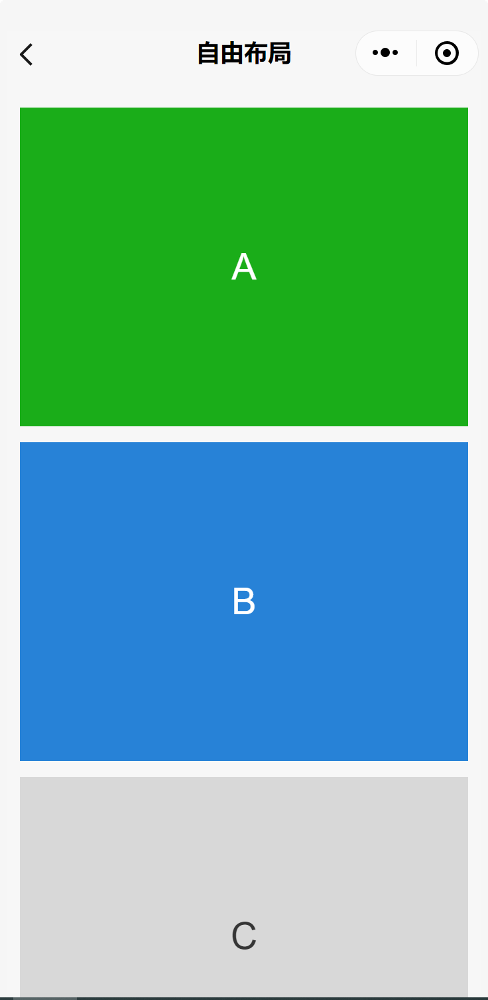
  <figcaption>
    The WeChat components demo app in a narrow app window.
  </figcaption>
</figure>


<figure>
  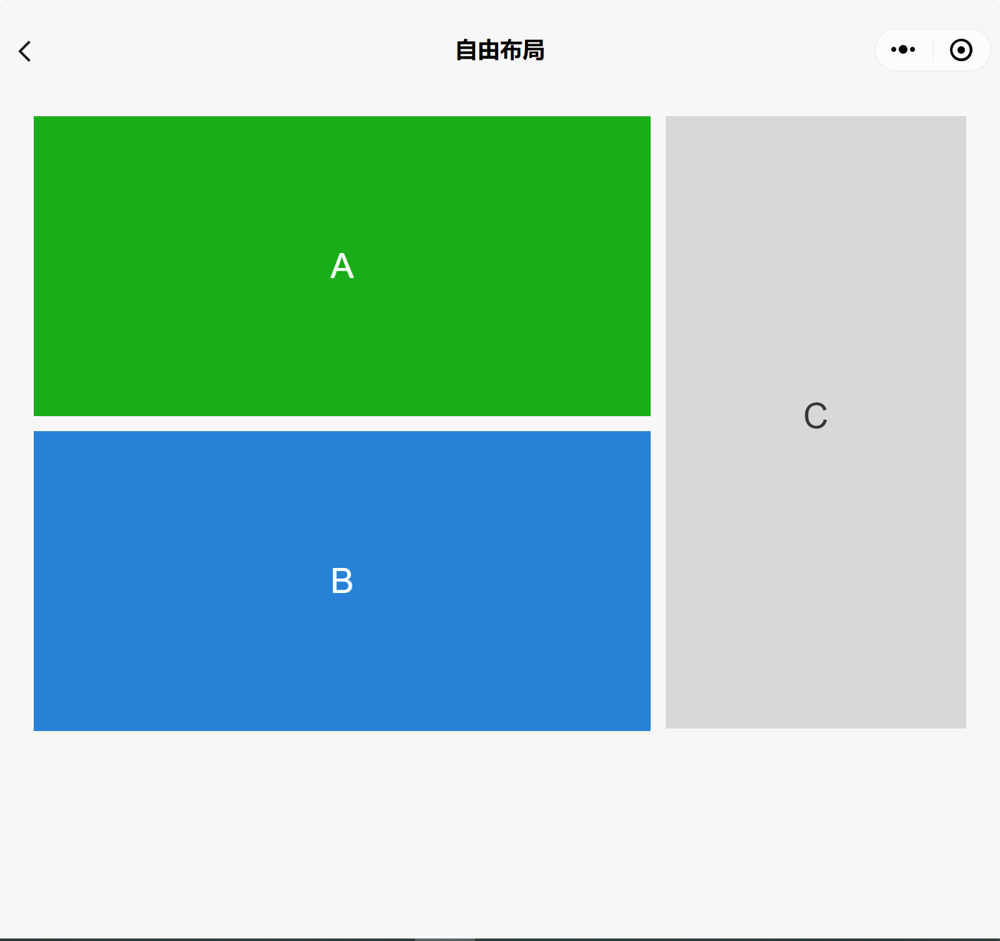
  <figcaption>
    The WeChat components demo app in a wide app window.
  </figcaption>
</figure>

Mini app permission settings on macOS can be changed via the context menu. On Windows, this does not seem to be possible and the location reported by the demo app appears to be the coarse location that Windows allows apps to obtain without asking for permission.

<figure>
  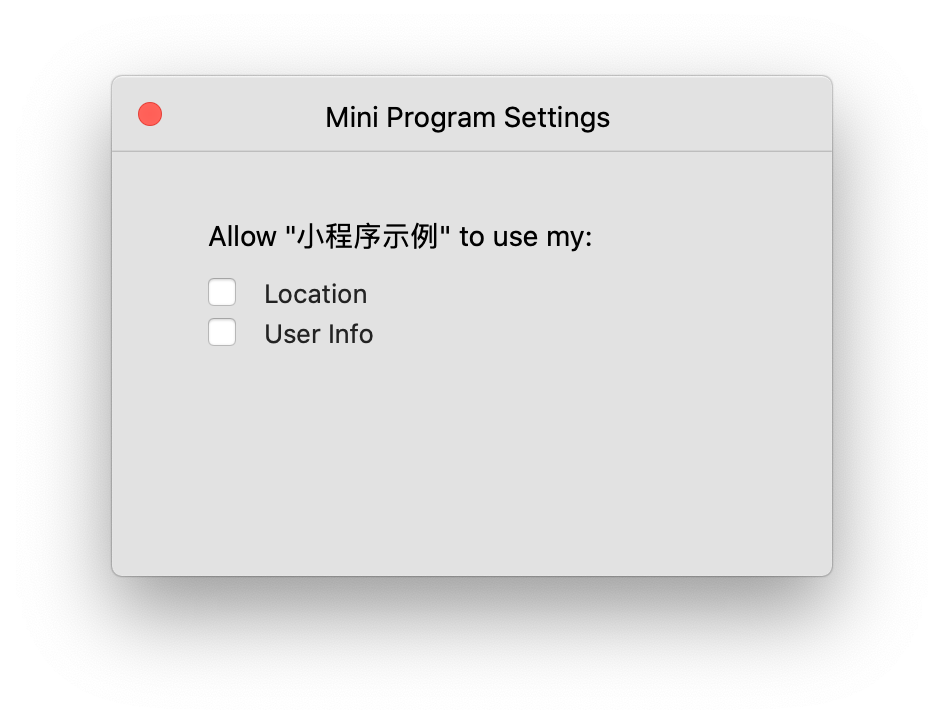
  <figcaption>
    WeChat mini app settings on macOS.
  </figcaption>
</figure>

#### Mini apps in the 360 Secure Browser

360 Secure Browser (360安全浏览器) is a web browser developed by the company Qihoo. Apart from [iOS and Android](https://mse.360.cn/), the browser is also available for [Windows](https://browser.360.cn/se/), [macOS](https://browser.360.cn/ee/mac/index.html), and [Linux](https://browser.360.cn/se/linux/index.html). On Windows, it is capable of running special [360 mini apps](https://mp.360.cn/#/). The [developer documentation](https://mp.360.cn/doc/miniprogram/dev/) and the [API](https://mp.360.cn/doc/miniprogram/dev/#/e1487ee88399013ec06eff05007391fc) is comparable to that of other vendors, however, 360 does not offer dedicated DevTools. Instead, developers need to create their mini apps in an IDE of their own choosing and can then test them in the browser using a special development mode. Debugging happens through Chrome Dev Tools. A [demo app](https://mp.360.cn/examples/appdemo.zip) is available for getting started.


<figure>
  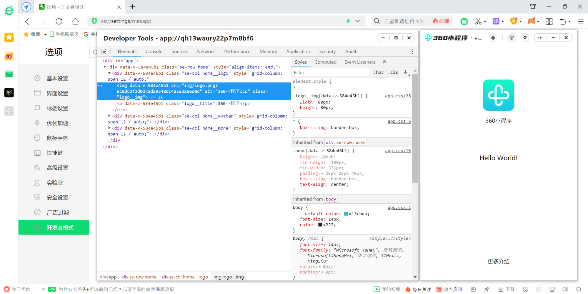
  <figcaption>
    Debugging a 360 mini app using Chrome Dev Tools.
  </figcaption>
</figure>

360 mini apps can run in fullscreen mode and do appear as separate entries in the multitasking bar. Via the context menu, a home screen icon can be added that allow for mini apps to be launched from the desktop.


<figure>
  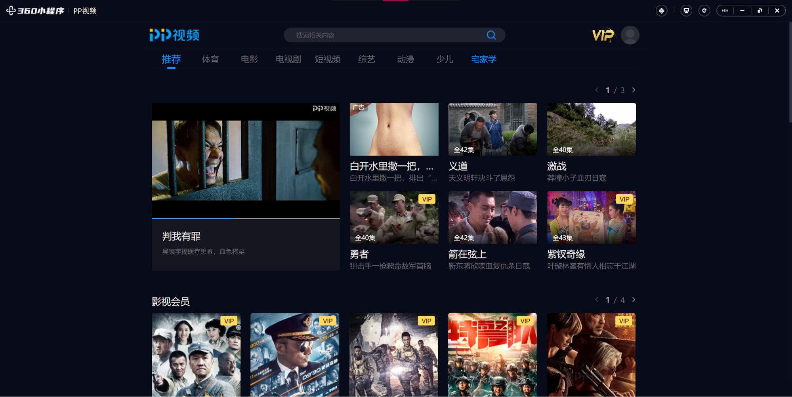
  <figcaption>
    360 mini app running in fullscreen mode.
  </figcaption>
</figure>

### Web-based mini apps

There are some mini app platforms that are Web-based, but that depend on the presence of a special WebView to unlock their full potential.

#### LINE

[LINE](https://line.me/) is an app for instant communications on electronic devices such as smartphones, tablet computers, and personal computers. In addition, LINE is a platform providing various services including digital wallet, news stream, video on demand, and digital comic distribution. The service is a subsidiary of Korean internet search engine company, [Naver Corporation](http://www.navercorp.com/).

Since LINE [mini apps](https://developers.line.biz/en/docs/line-mini-app/quickstart/) are [essentially just regular Web apps](https://developers.line.biz/en/docs/line-mini-app/discover/specifications/#supported-platforms-and-versions) (see [sample app](https://github.com/line/line-liff-v2-starter)) that pull in the [LINE Front-end Framework](https://developers.line.biz/en/docs/liff/developing-liff-apps/#developing-a-liff-app) (LIFF), they can also be accessed outside of the main LINE app through special [permanent links](https://developers.line.biz/en/docs/line-mini-app/develop/permanent-links/) ([example](https://liff.line.me/1653544369-LP5XbPYw)). However, not all APIs are available in such cases. Examples of not available in the browser APIs include the [`liff.scanCode()`](https://developers.line.biz/en/reference/liff/#scan-code) method for reading QR codes or Bluetooth-related APIs like [`liff.bluetooth.getAvailability()`](https://developers.line.biz/en/reference/liff/#bluetooth-get-availability). To get a feel for the platform, you can test the [LINE Playground app](https://liff.line.me/1653544369-LP5XbPYw) in the browser and the LINE app if you have a LINE account.


<figure>
  
  <figcaption>
   The LINE Playground demo app running on an iOS device.
  </figcaption>
</figure>


<figure>
  
  <figcaption>
   The LINE Playground demo app running in the Web browser.
  </figcaption>
</figure>


#### Google Spot

The [Google Spot Platform](https://developers.google.com/pay/spot ) allows developers to set up a Spot on [Google Pay](https://pay.google.com/)—a digital storefront that they can create, brand, and host however they choose. It is discoverable both online as well as through physical barcodes. Users can easily share a Spot on their favorite messaging app or find it on Google Pay. A Spot is built using HTML and JavaScript, so existing investments into mobile websites or PWAs can be easily transformed into a Spot by *"adding a few lines of JavaScript" according to the announcement post.

<figure>
  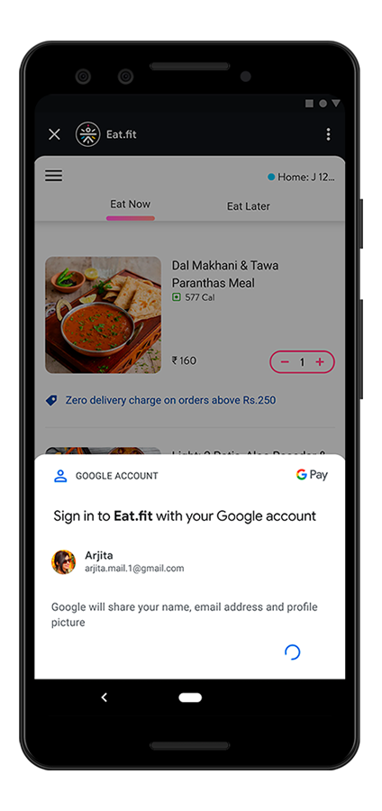
  <figcaption>
   The Eat.fit mini app running in the Google Pay super app (Source: <a href="https://developers.google.com/pay/spot">Google</a>).
  </figcaption>
</figure>

#### Snap Minis

[Snap Inc.](https://snap.com/) is an American camera and social media company most known for its chat app [Snapchat](https://www.snapchat.com/). Snap has announced [Snap Minis](https://minis.snapchat.com/), bite-size utilities made for friends. They are built with HTML5, so they are easy to develop. Plus, they work for all Snapchatters, on any kind of device, with no installation required.


<figure>
  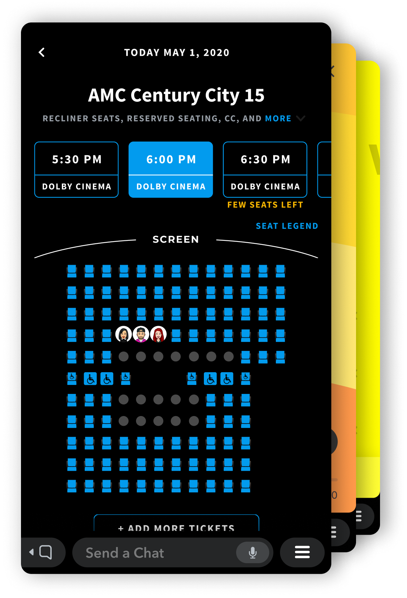
  <figcaption>
   The Atom Tickets mini app running in Snapchat (Source: <a href="https://minis.snapchat.com/">Snap</a>).
  </figcaption>
</figure>

## Noteworthy open source projects in the context of mini apps

### kbone

The [kbone](https://wechat-miniprogram.github.io/kbone/docs/) project ([open source on GitHub](https://github.com/Tencent/kbone)) implements an adapter that simulates a browser environment in the adaptation layer, so that code written for the Web can run without changes in a mini app. Several starter templates (among them [Vue](https://github.com/wechat-miniprogram/kbone-template-vue), [React](https://github.com/wechat-miniprogram/kbone-template-react), and [Preact](https://github.com/wechat-miniprogram/kbone-template-preact)) exist that make the onboarding experience for Web developers coming from these frameworks easier.

A new project can be created with the `kbone-cli` tool. A wizard asks what framework to initiate the project with. The code snippet below shows the Preact demo. In the code snippet below, the `mp` command builds the mini app, the `web` command builds the Web app, and `build` creates the production Web app.

```bash
npx kbone-cli init my-app
cd my-app
npm run mp
npm run web
npm run build
```

The code snippet below shows a simple counter component that then gets isomorphically rendered in a mini app and a Web app. The overhead of the mini app is significant, purely judging from the DOM structure.

```js
import { h, Component } from 'preact'
import './index.css'

class Counter extends Component {
  state = { count: 1 }

  sub = () => {
    this.setState(prevState => {
      return { count: --prevState.count }
    })
  }

  add = () => {
    this.setState(prevState => {
      return { count: ++prevState.count }
    })
  }

  clickHandle = () => {
    if ("undefined" != typeof wx && wx.getSystemInfoSync) {
      wx.navigateTo({
        url: '../log/index?id=1'
      })
    } else {
      location.href = 'log.html'
    }
  }

  render({ }, { count }) {
    return (
      <div>
        <button onClick={this.sub}>-</button>
        <span>{count}</span>
        <button onClick={this.add}>+</button>
        <div onClick={this.clickHandle}>跳转</div>
      </div>
    )
  }
}

export default Counter
```


<figure>
  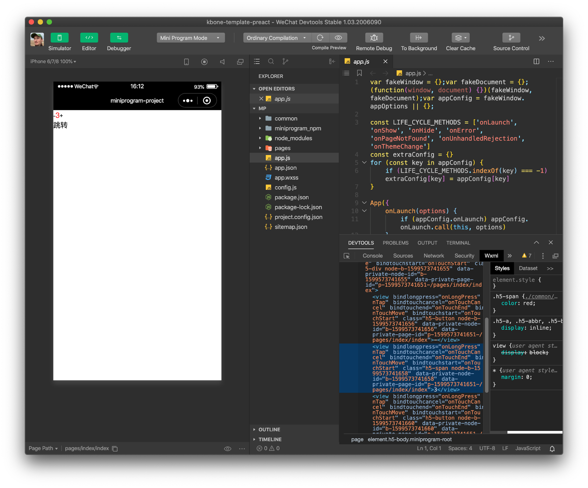
  <figcaption>
   The Preact kbone template demo app opened in WeChat DevTools. Note the complex DOM structure and how the plus and minus buttons are actually not <code>&lt;button&gt;</code> elements.
  </figcaption>
</figure>


<figure>
  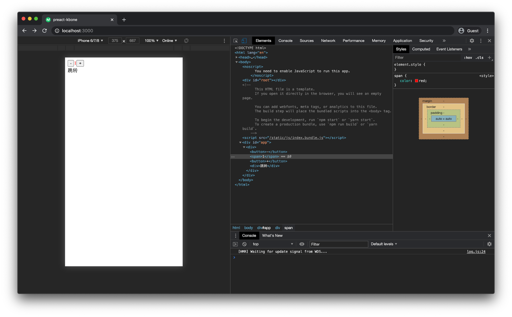
  <figcaption>
   The Preact kbone template demo app opened in the Web browser. Note the DOM structure.
  </figcaption>
</figure>

### kbone-ui

The [kbone-ui](https://wechat-miniprogram.github.io/kbone/docs/ui/intro/) project ([open source on GitHub](https://github.com/wechat-miniprogram/kbone-ui)) is a UI framework that facilitates both mini app development as well as Vue.js development with kbone. The kbone-ui components emulate the look and feel of [WeChat's "native" mini app components](https://developers.weixin.qq.com/miniprogram/dev/component/) (also see [Components](#components) above). A [demo](https://wechat-miniprogram.github.io/kboneui/ui/#/) that runs directly in the browser lets you explore the available components.


<figure>
  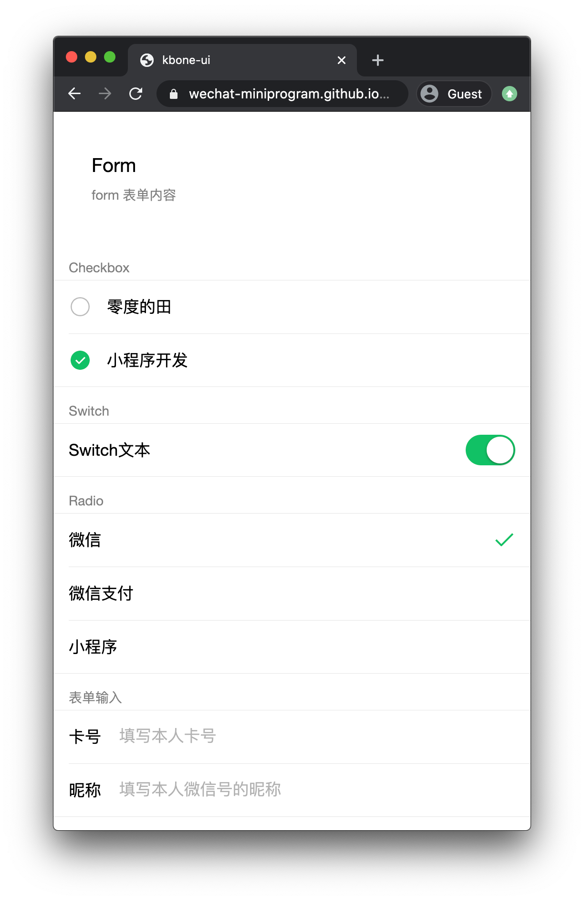
  <figcaption>
   The kbone-ui demo showing form-related components.
  </figcaption>
</figure>

### WeUI

[WeUI](https://github.com/Tencent/weui) is a set of basic style libraries consistent with WeChat's native visual experience. The official WeChat design team has tailored designs for WeChat internal web pages and WeChat mini apps to make users' perception of use more uniform. Including components such as `button`, `cell`, `dialog`,  `progress`,  `toast`, `article`, `actionsheet`, and `icon`. There are different versions of WeUI available like [weui-wxss](https://github.com/Tencent/weui-wxss/) for WeChat mini apps styled with WXSS (see [Styling](#styling) above), [weui.js](https://github.com/weui/weui.js/) for Web apps, and [react-weui](https://github.com/weui/react-weui/) for WeChat React components.


<figure>
  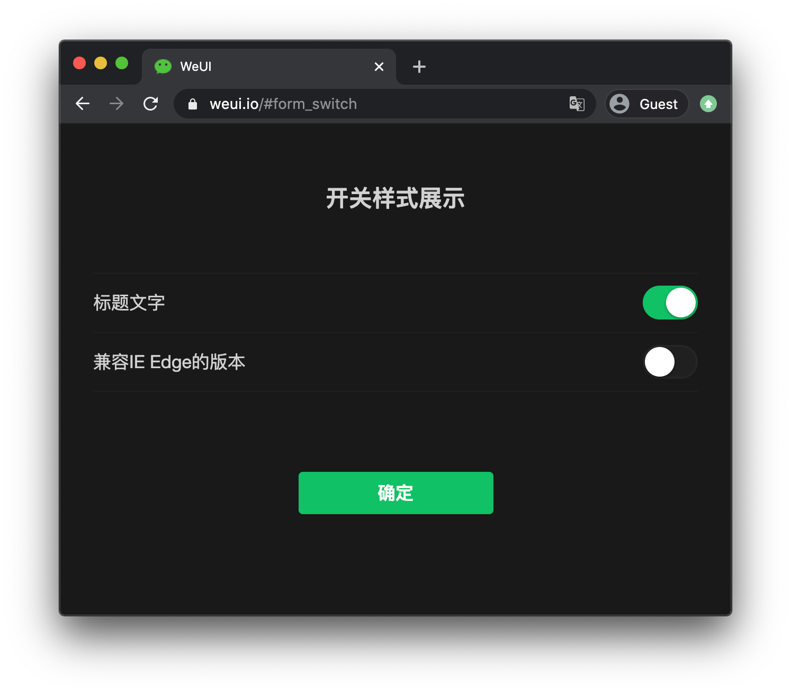
  <figcaption>
   The WeUI demo app showing switches.
  </figcaption>
</figure>

### Omi

[Omi](https://tencent.github.io/omi/) is a self-proclaimed front-end cross-frameworks framework ([open source on GitHub](https://github.com/Tencent/omi). It merges Web Components, JSX, Virtual DOM, functional style, observer or Proxy into one framework with tiny size and high performance. Its aim is to let developers write components once and use them everywhere, such as Omi, React, Preact, Vue.js, or Angular. Writing Omi components is very intuitive and free of almost all boilerplate.

```js
import { render, WeElement, define } from 'omi'

define('my-counter', class extends WeElement {
  data = {
    count: 1
  }

  static css = `
    span{
        color: red;
    }`

  sub = () => {
    this.data.count--
    this.update()
  }

  add = () => {
    this.data.count++
    this.update()
  }

  render() {
    return (
      <div>
        <button onClick={this.sub}>-</button>
        <span>{this.data.count}</span>
        <button onClick={this.add}>+</button>
      </div>
    )
  }
})

render(<my-counter />, 'body')
```

### Omiu

[Omiu](https://tencent.github.io/omi/components/docs/) is a cross framework UI component library ([open source on GitHub](https://github.com/Tencent/omi#omiu)) developed based on Omi, which outputs custom elements of standard web components.

<figure>
  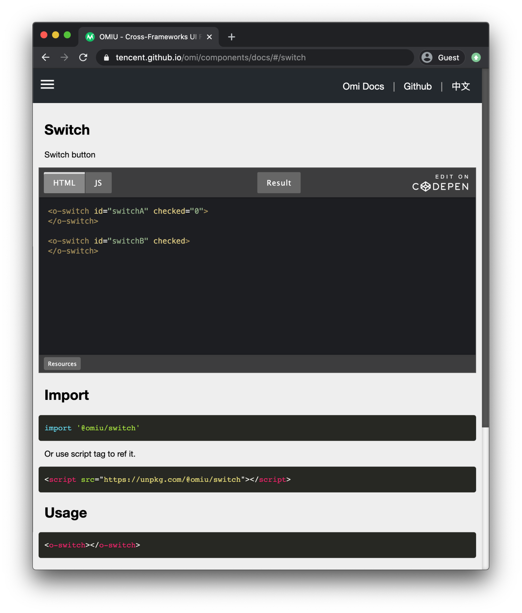
  <figcaption>
   The Omiu demo app showing switches.
  </figcaption>
</figure>

### WePY

[WePY](https://wepyjs.github.io/wepy-docs/) is a framework that allows mini apps to support componentized development. Through pre-compilation, developers can choose their favorite development style to develop mini apps. The detailed optimization of the framework and the introduction of Promises and async functions all make the development of mini app projects easier and more efficient. At the same time, WePY is also a growing framework, which has largely absorbed some optimized front-end tools and framework design concepts and ideas, mostly from Vue.js.

```html
<style lang="less">
@color: #4D926F;
  .num {
  color: @color;
  }
</style>
<template>
  <div class="container">
    <div class="num" @tap="num++">
      {{num}}
    </div>
    <custom-component></custom-component>
    <vendor-component></vendor-component>
    <div>{{text}}</div>
    <input v-model="text"/>
  </div>
</template>
<config>
{
  usingComponents: {
    customComponent: '@/components/customComponent',
    vendorComponent: 'module:vendorComponent'
  }
}
</config>

<script>
  import wepy from '@wepy/core';

  wepy.page({
    data: {
      num: 0,
      text: 'Hello World',
    },
  });
</script>
```


<figure>
  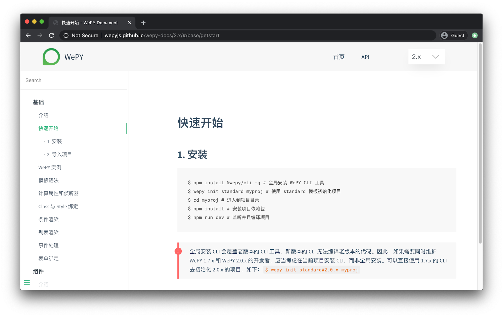
  <figcaption>
   WePY "getting started" documentation.
  </figcaption>
</figure>


### vConsole

The [vConsole](https://github.com/Tencent/vConsole) project provides a lightweight, extendable front-end developer tool for mobile web pages. It offers a DevTools-like debugger that can be injected directly into Web apps and mini apps. A [demo](http://wechatfe.github.io/vconsole/demo.html) showcases the opportunities. The vConsole includes tabs for logs, system, network, elements, and storage.

<figure>
  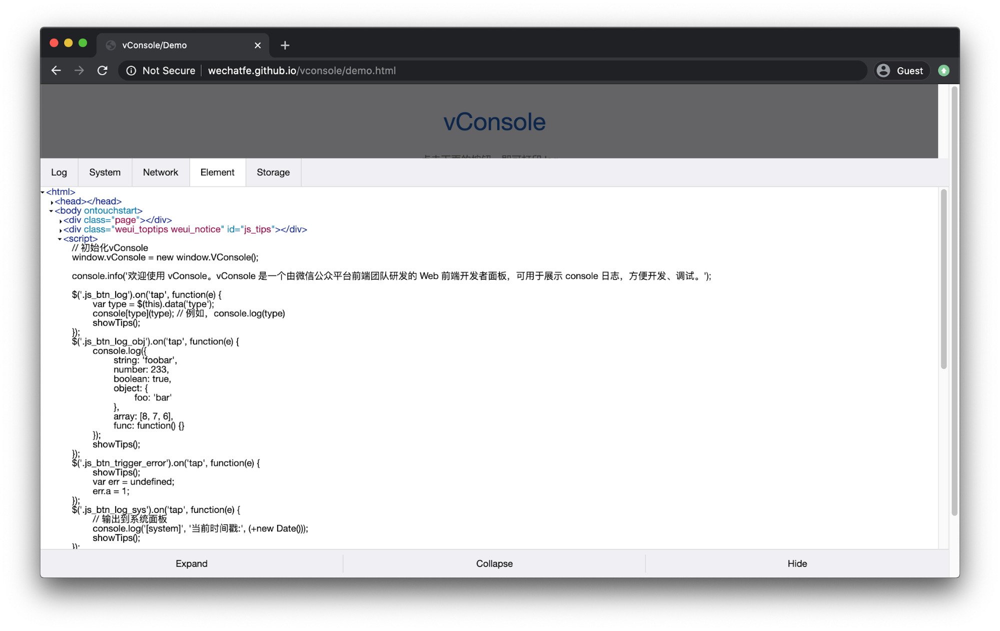
  <figcaption>
   vConsole demo app showing the elements explorer.
  </figcaption>
</figure>

### weweb

The [weweb](https://weidian-inc.github.io/hera/#/) project ([open source on GitHub](https://github.com/wdfe/weweb)) is the underlying front-end framework of the [Hera](https://weidian-inc.github.io/hera/#/) mini app framework that claims to be compatible with the syntax of WeChat mini apps, so you can write web applications in the way of mini apps. The documentation promises that if you already have a mini app, you can run it in the browser thanks to weweb. In my experiments, this did not work reliably for current mini apps, most probably due to the fact that the project has not seen updates recently leading to its compiler to miss changes in the WeChat platform.


<figure>
  
  <figcaption>
   Hera mini app framework documentation showing the list of supported WeChat APIs.
  </figcaption>
</figure>


<figure>
  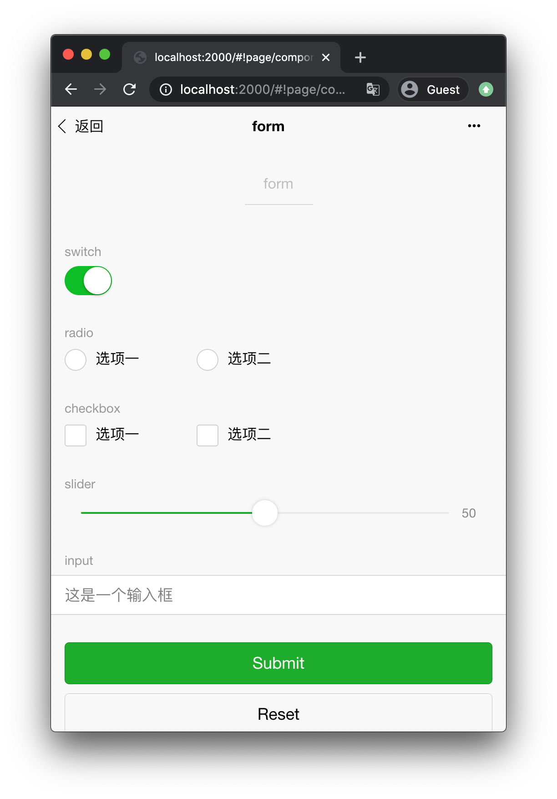
  <figcaption>
    The weweb demo mini app compiled with weweb to run in the browser.
  </figcaption>
</figure>
