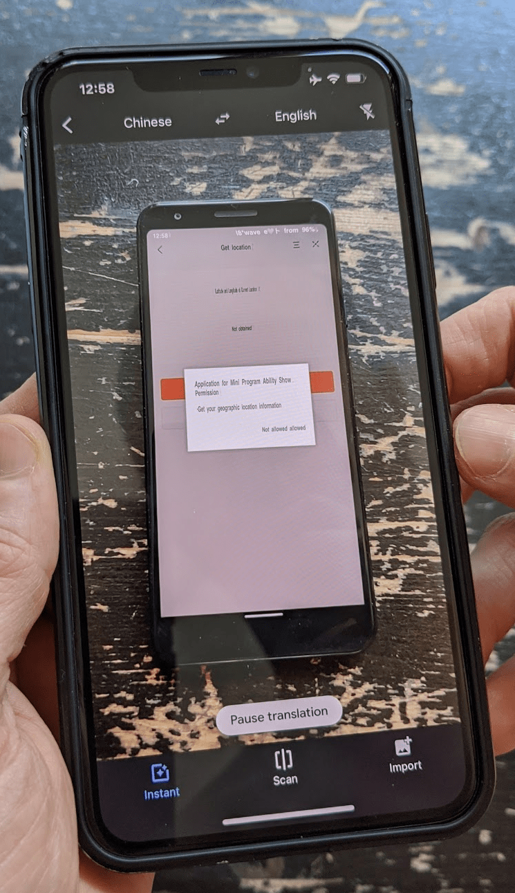

## Welcome to mini apps

When you look at the applications on your phone, you probably have specific apps for specific tasks.
You might have a banking app, you might have an app for buying public transit tickets, likely you
have an app for getting directions, etc. In this post, I introduce you to the concept of a different
kind of app, namely mini apps, sometimes also referred to as mini programs or applets. I first
provide some background on the various mini app platforms and their developer experience, and then
focus on things the Web can learn from mini apps. But before I start writing about mini apps, I
first need to talk about super apps.

## What are super apps?

Super apps are apps that are hosts to other apps that run within the super app: the so-called mini
apps. Popular super apps are Tencent's [WeChat](https://weixin.qq.com/) (微信), the app of the
search engine [Baidu](https://baidu.com/) (百度), Ant Group's (an affiliate company of the Chinese
Alibaba Group) [Alipay](https://www.alipay.com/) (支付宝), but also ByteDance's
[Douyin](https://www.douyin.com/) (抖音), which you might know as TikTok (蒂克托克). The first three
are commonly also referred to as BAT, which stems from **B**(aidu)**A**(libaba)**T**(encent). Super apps have taken the
Chinese market by storm, which is why a lot of the examples in this article are Chinese.

### Short characterization of each super app platform

WeChat aims to make itself a one-stop shop to meet almost any need users might have in their daily
lives. Alipay builds its platforms on top of its payment system, focusing on retail and finance
services, including credit, loan, insurance, installment, and local life services. Baidu strives to
transform its search engine from solely connecting people, services, and information into
information-as-a-service through mini programs for travel, retail, ads, payment, and more. Last but
not least Douyin wants to boost itself as a hub for social e-commerce and transform to more of an
entertainment and shopping platform.

### Installing super apps

Super apps are available on multiple operating systems. Please note that the versions available in
the official app stores may not always contain all features or be available in all locales. The
links below point to links that work universally, but that may require loading from untrusted
sources, so download and install the apps **at your own risk**. You typically need to create an
account, which involves revealing your phone number. You might want to consider getting a burner
phone. Be advised that many super apps only allow you to create a so-called overseas account, which
does not have all features of a domestic account.

- **WeChat:** [iOS](https://apps.apple.com/us/app/wechat/id414478124),
  [Android](https://weixin.qq.com/cgi-bin/readtemplate?uin=&stype=&promote=&fr=&lang=zh_CN&ADTAG=&check=false&t=weixin_download_method&sys=android&loc=weixin,android,web,0),
  [macOS](https://mac.weixin.qq.com/), [Windows](https://pc.weixin.qq.com/))
- **Baidu:** [iOS](https://apps.apple.com/us/app/%E7%99%BE%E5%BA%A6/id382201985),
  [Android](https://play.google.com/store/apps/details?id=com.baidu.searchbox&hl=en)
- **Alipay:** [iOS](https://itunes.apple.com/app/id333206289?mt=8),
  [Android](https://t.alipayobjects.com/L1/71/100/and/alipay_wap_main.apk)
- **Douyin:**
  [iOS](https://itunes.apple.com/cn/app/%E6%8A%96%E9%9F%B3%E7%9F%AD%E8%A7%86%E9%A2%91/id1142110895?l=zh&ls=1&mt=8)
  (CN-only), [Android](http://s.toutiao.com/UsMYE/)


Since the user interface of many super apps is Chinese-only, use the
[Google Translate app](https://translate.google.com/intl/en/about/#!#speak-with-the-world) in camera
mode with a secondary phone (given you have one) to understand what is going on if you do not speak Chinese.


<figure class="w-figure">
  
  <figcaption class="w-figure">
    Using Google Translate in camera mode to live-translate a Chinese mini app.
  </figcaption>
</figure>


  👉 Read on to [learn more about mini apps](/what-are-mini-apps/) in the next chapter.

