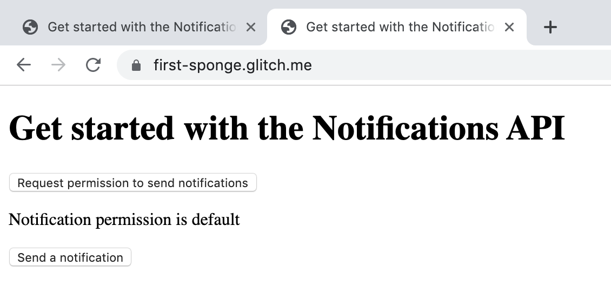

{#
backup glitches:
[start](https://glitch.com/edit/#!/real-eye?path=README.md:1:0)
[end](https://glitch.com/edit/#!/vintage-passionfruit?path=README.md:1:0)
#}

In this codelab, you'll use basic features of the
[Notifications API](https://developer.mozilla.org/en-US/docs/Web/API/Notifications_API) to:

* Request permission to send notifications
* Send notifications
* Experiment with notification options

## Remix the sample app and view it in a new tab

Notifications are automatically blocked from the embedded Glitch app, so you won't be able to preview the app on this page. Instead, here's what to do:




The Glitch should open in a new Chrome tab:



As you work through this codelab, make changes to the code in the embedded Glitch on this page. Refresh the new tab with your live app to see the changes.

## Get familiar with the starting app and its code

Start by checking out the live app in the new Chrome tab:

1.  

    You should see the following message in the Console:

    ```text
    Notification permission is default
    ```

    If you don't know what that means, don't worry; all will soon be revealed!

1.  Click the buttons in the live app: **Request permission to send notifications** and **Send a notification**.

    The console prints "TODO" messages from a couple of function stubs: `requestPermission` and `sendNotification`. These are the functions you'll implement in this codelab.

Now let's look at the sample app's code in the embedded Glitch on this page.
Open `public/index.js` and take a look at some important parts of the existing code:

*   The `showPermission` function uses the Notifications API to get
    the site's current permission state and log it to the console:

    ```js/3
    // Print current permission state to console;
    // update onscreen message.
    function showPermission() {
      let permission = Notification.permission;
      console.log('Notification permission is ' + permission);
      let p = document.getElementById('permission');
      p.textContent = 'Notification permission is ' + permission;
    }
    ```

    Before requesting permission, the permission state is `default`.
    In the `default` permission state,
    a site must request and be granted permission before it can send notifications.

*   The `requestPermission` function is a stub:

    ```js
    // Use the Notification API to request permission to send notifications.
    function requestPermission() {
      console.log('TODO: Implement requestPermission()');
    }
    ```

    You will implement this function in the next step.

*   The `sendNotification` function is a stub:

    ```js
    // Use the Notification constructor to create and send a new Notification.
    function sendNotification() {
      console.log('TODO: Implement sendNotification()');
    }
    ```

    You will implement this function after you have implemented `requestPermission`.

*   The `window.onload` event listener calls the `showPermission` function
    on page load, displaying the current permission state in the console and on the page:

    ```js
    window.onload = () => { showPermission(); };
    ```

## Request permission to send notifications

In this step, you'll add functionality to request the user's permission to send notifications.

You will use the `Notification.requestPermission()` method to trigger a popup that asks the user to allow or block notifications from your site.



`Notification.requestPermission()` returns a `Promise`. To perform actions after this promise resolves, you must place them inside a function and pass that function as a parameter to the promise's `then()` method:

```js
Notification.requestPermission().then((result) => {
  /* do stuff */
});
```

See the [`Promise` documentation on MDN](https://developer.mozilla.org/en-US/docs/Web/JavaScript/Reference/Global_Objects/Promise) for more information on how promises work.



1.  Replace the `requestPermission` function stub in public/index.js with the following code:

    ```js
    // Use the Notification API to request permission to send notifications.
    function requestPermission() {
      Notification.requestPermission()
        .then((permission) => {
          console.log('Promise resolved: ' + permission);
          showPermission();
        })
        .catch((error) => {
          console.log('Promise was rejected');
          console.log(error);
        });
    }
    ```

1.  Reload the Chrome tab in which you are viewing your live app.

1.  On the live app interface, click **Request permission to send notifications**. A popup appears.

The user can make one of three responses to the permission popup.

| **User response** | **Notification permission state** |
|-----|-----|
| User selects **Allow** | `granted` |
| User selects **Block**  | `denied` |
| User dismisses popup without making a selection | `default` |

**If the user clicks Allow:**

*   `Notification.permission` is set to `granted`.

*   The site will be able to display notifications.

*   Subsequent calls to `Notification.requestPermission` will resolve to `granted` without a popup.

**If the user clicks Block:**

*   `Notification.permission` is set to `denied`.

*   The site will _not_ be able to display notifications to the user.

*   Subsequent calls to `Notification.requestPermission` will resolve to `denied` without a popup.

**If the user dismisses the popup:**

*   `Notification.permission` remains `default`.

*   The site will not be able to display notifications to the user.

*   Subsequent calls to `Notification.requestPermission` will produce more popups.

    However, if the user continues to dismiss the popups, the browser might block the site, setting `Notification.permission` to `denied`. Neither permission request popups nor notifications can then be displayed to the user.

    At the time of writing, browser behavior in response to dismissed notifications permission popups is still subject to change. The best way to handle this is to always request notification permission in response to some interaction the user has initiated so that they are expecting it and know what's going on.



During development, to make the notification popup appear again, click the lock icon next to the Chrome URL bar. Chrome displays options to let you reset the site's notification permission setting to its default.



## Send a notification

In this step, you'll send a notification to the user.

You will use the `Notification` constructor to create a new notification and attempt to display it.
If the permission state is `granted`, your notification will be displayed.

1.  Replace the `sendNotification` function stub in index.js with the following code:

    ```js
    // Use the Notification constructor to create and send a new Notification.
    function sendNotification() {
      let title = 'Test';
      let options = {
        body: 'Test body',
        // Other options can go here
      };
      console.log('Creating new notification');
      let notification = new Notification(title, options);
    }
    ```

    The `Notification` constructor takes two parameters: `title` and `options`. `options` is an object with properties representing visual settings and data you can include in a notification. See the [MDN documentation on notification parameters](https://developer.mozilla.org/en-US/docs/Web/API/notification/Notification#Parameters) for more information.

1.  Refresh the Chrome tab in which you are viewing your live app
    and click the **Send notification** button.
    A notification with the text `Test body` should appear.

## What happens when you send notifications without permission?

In this step, you'll add a couple of lines of code that will let you see what happens
when you attempt to display a notification without the user's permission.

*   In `public/index.js`, at the end of the `sendNotification` function,
    define the new notification's `onerror` event handler:

```js/9-12/
// Use the Notification constructor to create and send a new Notification.
function sendNotification() {
  let title = 'Test';
  let options = {
    body: 'Test body',
    // Other options can go here
  };
  console.log('Creating new notification');
  let notification = new Notification(title, options);
  notification.onerror = (event) => {
    console.log('Could not send notification');
    console.log(event);
  };
}
```

**To observe a notification permission error:**

1.  Click the lock icon next to the Chrome URL bar and reset the site's notification permission setting to its default.

1.  Click **Request permission to send notifications**, and this time select **Block** from the popup.

1.  Click **Send notification** and see what happens.
    The error text (`Could not send notification`)
    and the event object are logged to the console.

Optionally, reset the site's notification permissions again.
You can try requesting permission and dismissing the popup multiple times to see what happens.

## Experiment with notification options

You've now covered the basics of how to request permission and send notifications.
You've also seen what impact user responses have on your app's ability to display notifications.

Now you can experiment with the many visual and data options available when creating a notification.
The full set of available options is below.
(See the [Notification documentation on MDN](https://developer.mozilla.org/en-US/docs/Web/API/Notification) for more information on these options.)

Note that browsers and devices implement these options differently,
so it's worth testing your notifications on different platforms to see how they look.

```js
let options = {
  dir: 'auto',              // Text direction
  lang: 'en-US',            // A language tag
  badge: '/orange-cat.png', // Display when insufficient room
  body: 'Hello World',      // Body text
  tag: 'mytag',             // Tag for categorization
  icon: '/line-cat.png',    // To display in the notification
  image: '/orange-cat.png', // To display in the notification
  data: {                   // Arbitrary data; any data type
    cheese: 'I like cheese',
    pizza: 'Excellent cheese delivery mechanism',
    arbitrary: {
      faveNumber: 42,
      myBool: true
    }},
  vibrate: [200, 100, 200], // Vibration pattern for hardware
  renotify: false,          // Notify if replaced? Default false
  requireInteraction: false,// Active until click? Default false
  /*
    actions:   // Array of NotificationActions
               // Only usable with a service worker
    [{
      action: 'shop',
      title: 'Shop!',
      icon: '/bags.png'
    },],
  */
}
```

See [Peter Beverloo's Notification Generator](https://tests.peter.sh/notification-generator/) for some more ideas!

If you got stuck, here's the completed code for this codelab: [glitch.com/edit/#!/codelab-notifications-get-started-completed](https://glitch.com/edit/#!/codelab-notifications-get-started-completed)

Take a look at the next codelab in this series, [Handle notifications with a service worker](codelab-notifications-service-worker), to explore further!
