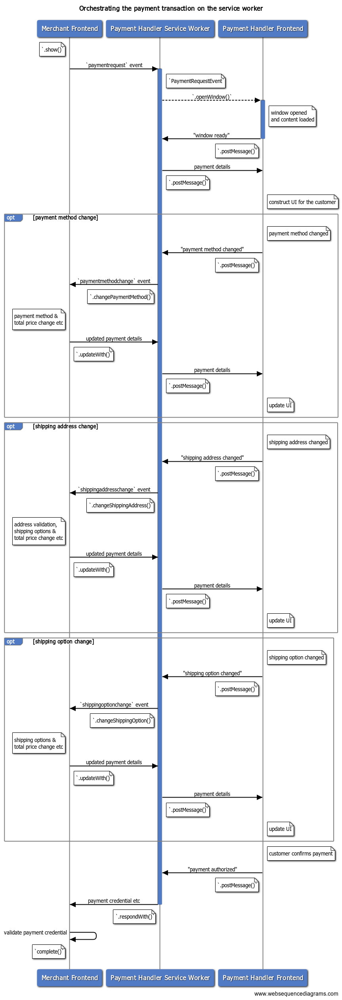

Once [a web-based payment app receives a payment request and initiates a payment
transaction](/orchestrating-payment-transactions-with-a-service-worker), the
service worker will act as the hub for communication between the merchant and
the payment app. This post explains how a payment app can pass information about
the payment method, shipping address, or contact information to the merchant
using a service worker.

<figure class="w-figure">
  
  <figcaption class="w-figcaption">
    Handling optional payment information with a service worker
  </figcaption>
</figure>

## Inform the merchant of a payment method change
Payment apps can support multiple payment instruments with different payment methods.

<div class="w-table-wrapper">
  <table>
    <thead>
      <tr>
        <th>Customer</th>
        <th>Payment Method</th>
        <th>Payment Instrument</th>
      </tr>
    </thead>
    <tbody>
      <tr>
        <td rowspan="3">A</td>
        <td>Credit Card Issuer 1</td>
        <td><code>****1234</code></td>
      </tr>
      <tr>
        <td>Credit Card Issuer 1</td>
        <td><code>****4242</code></td>
      </tr>
      <tr>
        <td>Bank X</td>
        <td><code>******123</code></td>
      </tr>
      <tr>
        <td rowspan="2">B</td>
        <td>Credit Card Issuer 2</td>
        <td><code>****5678</code></td>
      </tr>
      <tr>
        <td>Bank X</td>
        <td><code>******456</code></td>
      </tr>
    </tbody>
  </table>
</div>

For example, in the above table, Customer A's web-based wallet has two credit
cards and one bank account registered. In this case, the app is handling three
payment instruments (`****1234`, `****4242`, `******123`) and two payment
methods (Credit Card Issuer 1 and Bank X). On a payment transaction, the payment
app can let the customer pick one of the payment instruments and use it to pay
for the merchant.


The payment app can let the merchant know which payment method the customer
picked before sending the full payment response. This is useful when the
merchant wants to run a discount campaign for a specific payment method brand,
for example.

With the Payment Handler API, the payment app can send a "payment method change"
event to the merchant via service worker to notify the new payment method
identifier. Invoke `PaymentRequestEvent.changePaymentMethod()` with the new
payment method information.


Payment apps can pass a `methodDetails` object as the optional second argument
for `PaymentRequestEvent.changePaymentMethod()`. This object can contain
arbitrary payment method details required for the merchant to process the change
event.


Sharing detailed information about a customer with the merchant before the
transaction is finalized is potentially a privacy risk. As a best practice,
payment apps should omit unnecessary details as much as possible.



[payment handler] serviceworker.js


```js
…
// Received a message from the frontend
self.addEventListener('message', async e => {
  let details;
  try {
    switch (e.data.type) {
…
      case 'PAYMENT_METHOD_CHANGED':
        const newMethod = e.data.paymentMethod;
        const newDetails = e.data.methodDetails;
        // Redact or check that no sensitive information is passed in
        // `newDetails`.
        // Notify the merchant of the payment method change
        details = await payment_request_event.changePaymentMethod(newMethod, newDetails);
…
```

When the merchant receives a `paymentmethodchange` event from the Payment
Request API, they can update the payment details and respond with a
[`PaymentDetailsUpdate`](https://w3c.github.io/payment-request/#paymentdetailsupdate-dictionary)
object.


[merchant]


```js
request.addEventListener(`paymentmethodchange`, e => {
  if (e.methodName == 'another-pay') {
    // Apply $10 discount for example.
    const discount = {
      label: 'special discount',
      amount: {
        currency: 'USD',
        value: '-10.00'
      }
    };
    let total = 0;
    details.displayItems.push(discount);
    for (let item of details.displayItems) {
     total += parseFloat(item.amount.value);
    }
    details.total.amount.value = total.toString();
  }
  // Pass a promise to `updateWith()` and send updated payment details
  e.updateWith(details);
});
```

When the merchant responds, the promise that
[`PaymentRequestEvent.changePaymentMethod()`](https://w3c.github.io/payment-handler/#dom-paymentrequestevent-changepaymentmethod)
returned will resolve with a
[`PaymentRequestDetailsUpdate`](https://w3c.github.io/payment-handler/#the-paymentrequestdetailsupdate)
object.


[payment handler] serviceworker.js


```js
…
        // Notify the merchant of the payment method change
        details = await payment_request_event.changePaymentMethod(newMethod, newDetails);
        // Provided the new payment details,
        // send a message back to the frontend to update the UI
        postMessage('UPDATE_REQUEST', details);
        break;
…
```

Use the object to update the UI on the frontend. Since this object is
consistently used across `.changePaymentMethod()`, `.changeShippingAddress()`
and `.changeShippingOption()`, we'll cover this more in the [Reflect the updated
payment
details](https://docs.google.com/document/d/14DWsGKfNhXaOEcJa1fRkW_F44e09KXSdER1tk6aHXR4/edit#heading=h.7pgnamyn9gq8)
section of this article.

## Inform the merchant of a shipping address change

Payment apps can provide the customer's shipping address to the merchant as part
of the result of a payment transaction.

This is useful for merchants because they can delegate the address collection to
payment apps. And, because the address data will be provided in [the standard
data format](https://w3c.github.io/payment-request/#dom-addressinit), the
merchant can expect to receive shipping addresses in consistent structure.

This is beneficial for customers as well because once they register their
address information to their favorite payment app, they can reuse it in
different shops.


Payment apps can provide a UI to edit a shipping address or to select
pre-registered address information for the customer on a payment transaction.
When a shipping address is determined temporarily, the payment app can let the
merchant know of the redacted address information. This provides merchants with
multiple benefits:

* A merchant can determine whether the customer meets the regional restriction
  to ship the item (for example, domestic only).
* A merchant can change the list of shipping options based on the region of the
  shipping address (For example, international regular or express).
* A merchant can apply the new shipping cost based on the address and update the
  total price.

With the Payment Handler API, the payment app can send a "shipping address
change" event to the merchant from the service worker to notify the new shipping
address. Invoke
`[PaymentRequestEvent.changeShippingAddress()](https://w3c.github.io/payment-handler/#dom-paymentrequestevent-changeshippingaddress)`
with the [new address
object](https://www.w3.org/TR/payment-request/#dom-addressinit).



[payment handler] serviceworker.js


```js
...
// Received a message from the frontend
self.addEventListener('message', async e => {
  let details;
  try {
    switch (e.data.type) {
…
      case 'SHIPPING_ADDRESS_CHANGED':
        const newAddress = e.data.shippingAddress;
        details = await payment_request_event.changeShippingAddress(newAddress);
…
```


**Redacted address**: Informing the full shipping address to
the merchant in this case is not necessary and risks customers' privacy. This
API only informs the merchant of the redacted address that is enough to
determine the shipping cost. Specifically, the browser will clear the
`organization`, `phone`, `recipient`, `addressLine` fields from the payment app
provided address before raising the `shippingaddresschange` event in the
merchant's DOM.


The merchant will receive a `shippingaddresschange` event from the Payment
Request API so they can respond with the updated [`PaymentDetailsUpdate`](https://w3c.github.io/payment-request/#paymentdetailsupdate-dictionary).


[merchant]


```js
request.addEventListener(`shippingaddresschange`, e => {
  // Read the updated shipping address and update the request.
  const addr = request.shippingAddress;
  const details = getPaymentDetailsFromShippingAddress(addr);
  // `updateWith()` sends back updated payment details
  e.updateWith(details);
});
```

When the merchant responds, the promise
[`PaymentRequestEvent.changeShippingAddress()`](https://w3c.github.io/payment-handler/#dom-paymentrequestevent-changeshippingaddress)
returned will resolve with a
[`PaymentRequestDetailsUpdate`](https://w3c.github.io/payment-handler/#the-paymentrequestdetailsupdate)
object.


[payment handler] serviceworker.js


```js
…
        // Notify the merchant of the shipping address change
        details = await payment_request_event.changeShippingAddress(newAddress);
        // Provided the new payment details,
        // send a message back to the frontend to update the UI
        postMessage('UPDATE_REQUEST', details);
        break;
…
```

Use the object to update the UI on the frontend. Since this object is consistently used across `.changePaymentMethod()`, `.changeShippingAddress()` and `.changeShippingOption()`, we'll cover this in the [Reflect the updated payment details](https://docs.google.com/document/d/14DWsGKfNhXaOEcJa1fRkW_F44e09KXSdER1tk6aHXR4/edit#heading=h.7pgnamyn9gq8) section of this article.

## Inform the merchant of a shipping option change

Shipping options are delivery methods merchants use to ship purchased items to a customer. Typical shipping options include:
* Free shipping
* Express shipping
* International shipping
* Premium international shipping

Each comes with its own cost. Usually faster methods/options are more expensive.

Merchants using the Payment Request API can delegate this selection to a payment
app. The payment app can use the information to construct a UI and let the
customer pick a shipping option.


The list of shipping options specified in the merchant's Payment Request API is
propagated to the payment app's service worker as a property of
`PaymentRequestEvent`.


[merchant]


```js
const request = new PaymentRequest([{
  supportedMethods: 'https://bobpay.xyz/pay',
  data: { transactionId: '****' }
}], {
  displayItems: [{
    label: 'Anvil L/S Crew Neck - Grey M x1',
    amount: { currency: 'USD', value: '22.15' }
  }],
  shippingOptions: [{
    id: 'standard',
    label: 'Standard',
    amount: { value: '0.00', currency: 'USD' },
    selected: true
  }, {
    id: 'express',
    label: 'Express',
    amount: { value: '5.00', currency: 'USD' }
  }],
  total: {
    label: 'Total due',
    amount: { currency: 'USD', value : '22.15' }
  }
}, {  requestShipping: true });
```

The payment app can let the merchant know which shipping option the customer
picked. This is important for both the merchant and the customer because
changing the shipping option means the total price will be changed as well. The
merchant needs to be informed of the latest price for the payment verification
later and the customer also needs to be aware of the change.

With the Payment Handler API, the payment app can send a "shipping option
change" event to the merchant from the service worker. Invoke
[`PaymentRequestEvent.changeShippingOption()`](https://w3c.github.io/payment-handler/#dom-paymentrequestevent-changeshippingoption)
with the new shipping option ID.



[payment handler] serviceworker.js


```js
…
// Received a message from the frontend
self.addEventListener('message', async e => {
  let details;
  try {
    switch (e.data.type) {
…
      case 'SHIPPING_OPTION_CHANGED':
        const newOption = e.data.shippingOptionId;
        details = await payment_request_event.changeShippingOption(newOption);
…
```

The merchant will receive a `shippingoptionchange` event from the Payment
Request API. Use the information to update the total price and then respond with
the updated
[`PaymentDetailsUpdate`](https://w3c.github.io/payment-request/#paymentdetailsupdate-dictionary).


[merchant]


```js
request.addEventListener(`shippingoptionchange`, e => {
  // selected shipping option
  const shippingOption = request.shippingOption;
  const newTotal = {
    currency: "USD",
    label: "Total due",
    value: calculateNewTotal(shippingOption),
  };
  // `updateWith()` sends back updated payment details
  e.updateWith({ total: newTotal });
});
```

When the merchant responds, the promise that
[`PaymentRequestEvent.changeShippingOption()`](https://w3c.github.io/payment-handler/#dom-paymentrequestevent-changeshippingoption)
returned will resolve with a
[`PaymentRequestDetailsUpdate`](https://w3c.github.io/payment-handler/#the-paymentrequestdetailsupdate)
object.


[payment handler] serviceworker.js


```js
…
        // Notify the merchant of the shipping option change
        details = await payment_request_event.changeShippingOption(newOption);
        // Provided the new payment details,
        // send a message back to the frontend to update the UI
        postMessage('UPDATE_REQUEST', details);
        break;
…
```

Use the object to update the UI on the frontend. Since this object is
consistently used across `.changePaymentMethod()`, `.changeShippingAddress()`
and `.changeShippingOption()`, we'll cover this in the [Reflect the updated
payment
details](https://docs.google.com/document/d/14DWsGKfNhXaOEcJa1fRkW_F44e09KXSdER1tk6aHXR4/edit#heading=h.7pgnamyn9gq8)
section of this article.

## Reflect the updated payment details {: #reflect-the-updated-payment-details }

Once the merchant finishes updating the payment details, the promises returned
from `.changePaymentMethod()`, `.changeShippingAddress()` and
`.changeShippingOption()` will resolve with a common
[`PaymentRequestDetailsUpdate`](https://w3c.github.io/payment-handler/#the-paymentrequestdetailsupdate)
object. The payment handler can use the result to reflect updated total price
and shipping options to the UI.


 The `PaymentRequestDetailsUpdate` object is passed from the merchant and it
 contains the exact information the merchant put in the `PaymentDetailsUpdate`
 object via the Payment Request API. The most important thing to handle things
 gracefully is to provide good developer documentation so that merchants will
 give you the right information you expect to receive. Or you may provide a
 JavaScript library to control the expectation.


Beware that the merchant may return errors. Errors can be caused for a few reasons:
* The payment method is not acceptable.
* The shipping address is outside of their supported regions.
* The shipping address contains invalid information.
* The shipping option is not selectable for the provided shipping address or
  some other reason

Use `.error`, `.shippingAddressErrors`, or `.paymentMethodErrors` to reflect the error status.

* **`error`**: Human readable error string. This is the best string to display
  to customers.
* **`shippingAddressErrors`**:
  [`AddressErrors`](https://www.w3.org/TR/payment-request/#dom-addresserrors)
  object that contains in-detail error string per address property. This is
  useful if you want to open a form that lets the customer edit their address
  and you need to point them directly to the invalid fields.
* **`paymentMethodErrors`**: Payment-method-specific error object. You can ask
  merchants to provide a structured error like
  [`BasicCardErrors`](https://www.w3.org/TR/payment-method-basic-card/#dom-basiccarderrors)
  for basic-card, but we recommend keeping it as simple as a simple string.

## Next steps

In this article, we learned how to handle optional information on the service
worker. The final step for building a web-based payment app is to learn how to
build the frontend.
* Handling payments on the payment frontend
