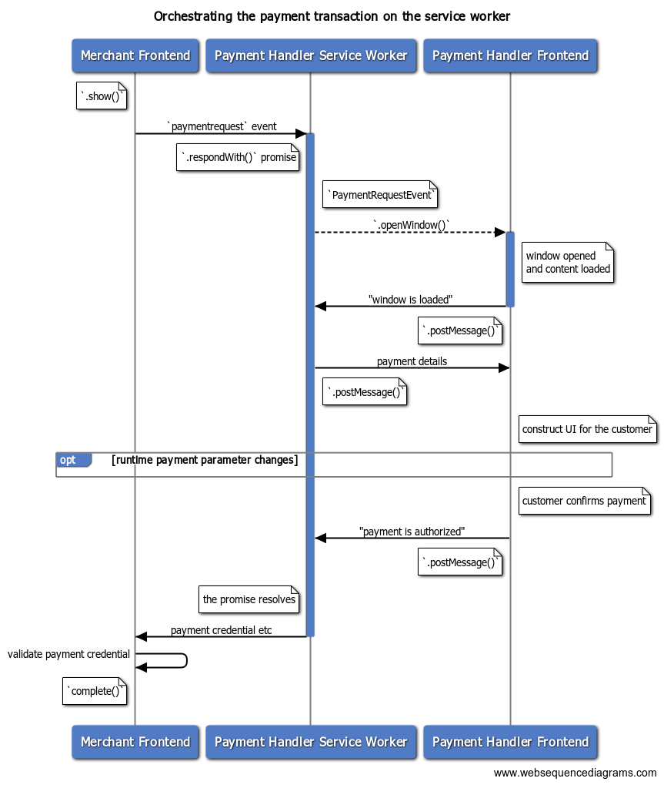

Once [the payment app is
registered](https://docs.google.com/document/d/1vfgHeuvskPlE18l_IXtlijP3hGomC4FT52b4MqS4BiM/edit#),
you are ready to accept payment requests from merchants. This post explains how
to orchestrate a payment transaction from a service worker during runtime (i.e.
when a window is displayed and the user is interacting with it).

<figure class="w-figure">
  
  <figcaption class="w-figcaption">
    Orchestrating payment transactions with a service worker
  </figcaption>
</figure>

"Runtime payment parameter changes" refer to a set of events that allows the
merchant and payment handler to exchange messages while the user is interacting
with the payment handler. Learn more in [Handling optional payment information
with a service
worker](/handling-optional-payment-information-with-a-service-worker).

## Receive a payment request event from the merchant

When a customer chooses to pay with your web-based payment app and [the merchant
invokes
`PaymentRequest.show()`](/life-of-a-payment-transaction/#step-4:-the-browser-launches-the-payment-app),
your service worker will receive a `paymentrequest` event. Add an event listener
to the service worker to capture the event and prepare for the next action.


[payment handler] serviceworker.js:


```js
…
let payment_request_event;
let resolver;
let client;

// `self` is the global object in service worker
self.addEventListener('paymentrequest', async e => {
  if (payment_request_event) {
    // If there's an ongoing payment transaction, reject it.
    resolver.reject();
  }
  // Preserve the event for future use
  payment_request_event = e;
…
```


Remember that a service worker is a single instance across different tabs and
windows in the same browser. Global variables are shared across all tabs and
windows.


The preserved `PaymentRequestEvent` contains important information about this
transaction:

<div class="w-table-wrapper">
  <table>
    <thead>
      <tr>
        <th>Property name</th>
        <th>Description</th>
      </tr>
    </thead>
    <tbody>
      <tr>
      <td><code>topOrigin</code></td>
        <td>
          A string that indicates the origin of the top-level web page (usually the payee merchant). Use this to identify the merchant origin.
        </td>
      </tr>
      <tr>
        <td><code>paymentRequestOrigin</code></td>
        <td>
          A string that indicates the origin of the invoker. This can be the same as <code>topOrigin</code> when the merchant invokes the Payment Request API directly, but may be different if the API is invoked from within an iframe by a third party such as a payment gateway.
        </td>
      </tr>
      <tr>
        <td><code>paymentRequestId</code></td>
        <td>
          The <code>id</code> property of the <code><a href="https://w3c.github.io/payment-request/#paymentdetailsinit-dictionary">PaymentDetailsInit</a></code> provided to the Payment Request API. If the merchant omits, the browser will provide an auto-generated id.
        </td>
      </tr>
      <tr>
        <td><code>methodData</code></td>
        <td>
          The payment-method-specific data provided by the merchant as part of <code><a href="https://w3c.github.io/payment-request/#dom-paymentmethoddata">PaymentMethodData</a></code>.
Use this to determine the payment transaction details.
        </td>
      </tr>
      <tr>
        <td><code>total</code></td>
        <td>
          The total amount provided by the merchant as part of <code><a href="https://w3c.github.io/payment-request/#dom-paymentdetailsinit">PaymentDetailsInit</a></code>.
Use this to construct a UI to let the customer know the total amount to pay.
        </td>
      </tr>
      <tr>
        <td><code>instrumentKey</code></td>
        <td>
          The instrument key selected by the user. This reflects the <code><a href="https://w3c.github.io/payment-handler/#paymentinstruments-interface">instrumentKey</a></code> you provided in advance. An empty string indicates that the user did not specify any instruments.
        </td>
      </tr>
      <tr>
        <td><code>paymentOptions</code></td>
        <td>
          The <code><a href="https://w3c.github.io/payment-request/#dom-paymentoptions">PaymentOptions</a></code> object provided to the Payment Request API by the merchant. Indicates whether the merchant is requesting shipping with <code>requestShipping</code>, the type of shipping with <code>shippingType</code>, billing address with <code>requestBillingAddress</code>, payer's email, name, phone respectively with <code>requestPayerEmail</code>, <code>requestPayerName</code>, <code>requestPayerPhone</code>.
Use this to determine what information to include in the <code><a href="https://w3c.github.io/payment-handler/#paymenthandlerresponse-dictionary">PaymentHandlerResponse</a></code> on a payment authorization.
        </td>
      </tr>
      <tr>
        <td><code>shippingOptions</code></td>
        <td>
          The <code>shippingOptions</code> property of the <code><a href="https://w3c.github.io/payment-request/#paymentdetailsbase-dictionary">PaymentDetailsUpdate</a></code> provided to the Payment Request API.
Use this to construct a UI to let the customer select a shipping option.
        </td>
      </tr>
    </tbody>
  </table>
</div>

## Open the payment handler window to display the web-based payment app frontend

When a `paymentrequest` event is received, the payment app can open a payment
handler window by calling `PaymentRequestEvent.openWindow()`. The payment
handler window will present the customers your payment app's interface where
they can authenticate, choose shipping address and options, and authorize the
payment. We'll cover how to write the frontend code in [Handling payments on the
payment
frontend](https://docs.google.com/document/d/18-zDc1k0s_9529S6TJi3dFT86cxXMTo044Ehk7VjRds/edit#).

<figure class="w-figure" style="width:300px; margin:auto;">
  <video controls autoplay loop muted class="w-screenshot">
    <source src="https://storage.googleapis.com/web-dev-assets/payments/web-based-payment-app.webm" type="video/webm">
    <source src="https://storage.googleapis.com/web-dev-assets/payments/web-based-payment-app.mp4" type="video/mp4">
  </video>
  <figcaption class="w-figcaption">
    Checkout flow with a web-based payment app.
  </figcaption>
</figure>

Pass a preserved promise to `PaymentRequestEvent.respondWith()` so that you can
resolve it with a payment result in the future.


[payment handler] serviceworker.js:


```js
…
self.addEventListener('paymentrequest', async e => {
…
  // Retain a promise for future resolution
  // Polyfill for PromiseResolver is provided below.
  resolver = new PromiseResolver();

  // Pass a promise that resolves when payment is done.
  e.respondWith(resolver.promise);
  // Open the checkout page.
  try {
    // Open the window and preserve the client
    client = await e.openWindow(checkoutURL);
    if (!client) {
      // Reject if the window fails to open
      throw 'Failed to open window';
    }
  } catch (err) {
    // Reject the promise on failure
    resolver.reject(err);
  };
});
…
```


Use a convenient `PromiseResolver` polyfill to resolve a promise at arbitrary timing.
```js
class PromiseResolver {
  constructor() {
    this.promise_ = new Promise((resolve, reject) => {
      this.resolve_ = resolve;
      this.reject_ = reject;
    })
  }
  get promise() { return this.promise_ } 
  get resolve() { return this.resolve_ }
  get reject() { return this.reject_ }
}
```



For security reasons, the frontend page opened in the payment handler window
must have valid HTTPS certificates and no [mixed
content](https://developers.google.com/web/fundamentals/security/prevent-mixed-content/what-is-mixed-content);
otherwise the payment request will be cancelled by Chrome. Learn more at
[Debugging a web-based payment
app](https://docs.google.com/document/d/1vfgHeuvskPlE18l_IXtlijP3hGomC4FT52b4MqS4BiM/edit#heading=h.genktfd5wi5v).


## Exchange information with the frontend

The payment app's service worker can exchange messages with the payment app's
frontend through `ServiceWorkerController.postMessage()`. To receive messages
from the frontend, listen to `message` events.



[payment handler] serviceworker.js:


```js
// Define a convenient `postMessage()` method
const postMessage = (type, contents = {}) => {
  if (client) client.postMessage({ type, ...contents });
}
```

### Receive the ready signal from the frontend

Once the payment handler window is opened, the service worker should wait for a
ready-state signal from the payment app frontend. The service worker can pass
important information to the frontend when it is ready.


[payment handler] frontend:


```js
navigator.serviceWorker.controller.postMessage({
  type: 'WINDOW_IS_READY'
});
```


[payment handler] serviceworker.js:


```js
…
// Received a message from the frontend
self.addEventListener('message', async e => {
  let details;
  try {
    switch (e.data.type) {
      // `WINDOW_IS_READY` is a frontend's ready state signal
      case 'WINDOW_IS_READY':
        const { total, paymentOptions, shippingOptions } = payment_request_event;
…
```

### Pass the transaction details to the frontend

Now send the payment details back. In this case you're only sending the total of
the payment request, but you can pass more details if you like.


[payment handler] serviceworker.js:


```js
…
        // Pass the payment details to the frontend
        postMessage('PAYMENT_IS_READY', {
          total, paymentOptions, shippingOptions
        });
        break;
…
```


[payment handler] frontend:


```js
let paymentOptions;
let total;
let shippingOptions;

navigator.serviceWorker.addEventListener('message', async e => {
  switch (e.data.type) {
      case 'PAYMENT_IS_READY':
        ({ total, paymentOptions, shippingOptions } = e.data);
        // Update the UI
        renderHTML(total, paymentOptions, shippingOptions);
        break;
…
```

## Return the customer's payment credential

When the customer authorizes the payment, the frontend can send a post message
to the service worker to proceed. You can resolve the promise passed to
`PaymentRequestEvent.respondWith()` to send the result back to the merchant.
Pass a
[`PaymentHandlerResponse`](https://w3c.github.io/payment-handler/#dom-paymenthandlerresponse)
object.

<div class="w-table-wrapper">
  <table>
    <thead>
      <tr>
        <th>Property name</th>
        <th>Description</th>
      </tr>
    </thead>
    <tbody>
      <tr>
      <td><code>methodName</code></td>
        <td>
          The payment method identifier used to make payment.
        </td>
      </tr>
      <tr>
        <td><code>details</code></td>
        <td>
          The payment method specific data that provides necessary information for the merchant to process payment.
If <code>PaymentRequestEvent.paymentOptions.requestBillingAddress === true</code>, append the billing address as a <code>PaymentAddress</code> object as part of this.
        </td>
      </tr>
      <tr>
        <td><code>payerName</code></td>
        <td>
          If <code>PaymentRequestEvent.paymentOptions.requestPayerName === true</code>, provide the payer's name.
        </td>
      </tr>
      <tr>
        <td><code>payerEmail</code></td>
        <td>
          If <code>PaymentRequestEvent.paymentOptions.requestPayerEmail === true</code>, provide the payer's email address.
        </td>
      </tr>
      <tr>
        <td><code>payerPhone</code></td>
        <td>
          If <code>PaymentRequestEvent.paymentOptions.requestPayerPhone === true</code>, provide the payer's phone number.
        </td>
      </tr>
      <tr>
        <td><code>shippingAddress</code></td>
        <td>
          If <code>PaymentRequestEvent.paymentOptions.requestShipping === true</code>, provide the customer's shipping address with a <code><a href="https://w3c.github.io/payment-request/#paymentaddress-interface">PaymentAddress</a></code> object.
        </td>
      </tr>
      <tr>
        <td><code>shippingOption</code></td>
        <td>
          If <code>PaymentRequestEvent.paymentOptions.requestShipping</code>, provide the identifier of the customer's selected shipping option.
        </td>
      </tr>
    </tbody>
  </table>
</div>


[payment handler] frontend:


```js
  const paymentMethod = …
  const shippingOptionId = …
  const shippingAddress = …
  const contacts = …

  postMessage('PAYMENT_AUTHORIZED', {
    paymentMethod,              // Payment method identifier
    shippingOptionId,           // Shipping option id
    shippingAddress,            // shipping address object
    payerName: contacts.name,   // Payer name
    payerPhone: contacts.phone, // Payer Phone
    payerEmail: contacts.email, // Payer Email
  });
```


[payment handler] serviceworker.js:


```js
…
// Received a message from the frontend
self.addEventListener('message', async e => {
  let details;
  try {
    switch (e.data.type) {
…
      case 'PAYMENT_AUTHORIZED':
        // Resolve the payment request event promise
        // with a payment response object
        const response = {
          methodName: e.data.paymentMethod,
          details: { id: 'payment credential comes here' },
        }
        let { paymentOptions } = payment_request_event;
        if (paymentOptions.requestBillingAddress) {
          response.details.billingAddress = e.data.methodData.billingAddress;
        }
        if (paymentOptions.requestShipping) {
          response.shippingAddress = e.data.shippingAddress;
          response.shippingOption = e.data.shippingOptionId;
        }
        if (paymentOptions.requestPayerEmail) {
          response.payerEmail = e.data.payerEmail;
        }
        if (paymentOptions.requestPayerName) {
          response.payerName = e.data.payerName;
        }
        if (paymentOptions.requestPayerPhone) {
          response.payerPhone = e.data.payerPhone;
        }
        resolver.resolve(response);
        // Don't forget to initialize.
        payment_request_event = null;
        break;
…
```

## Cancel the payment transaction

To allow the customer to cancel the transaction, the frontend can send a post
message to the service worker to do so. The service worker can then resolve the
promise passed to `PaymentRequestEvent.respondWith()` with `null` to indicate to
the merchant that the transaction has been cancelled.


[payment handler] frontend:


```js
  postMessage('CANCEL_PAYMENT');
```


[payment handler] serviceworker.js:


```js
…
// Received a message from the frontend
self.addEventListener('message', async e => {
  let details;
  try {
    switch (e.data.type) {
…
      case 'CANCEL_PAYMENT':
        // Resolve the payment request event promise
        // with null
        resolver.resolve(null);
        // Don't forget to initialize.
        payment_request_event = null;
        break;
…
```

## Next Steps

In this article, we learned how to orchestrate a payment transaction from a
service worker. The next step is to learn how to add some more advanced features
to the service worker.
* [Handling optional payment information with a service worker](/handling-optional-payment-information-with-a-service-worker)


