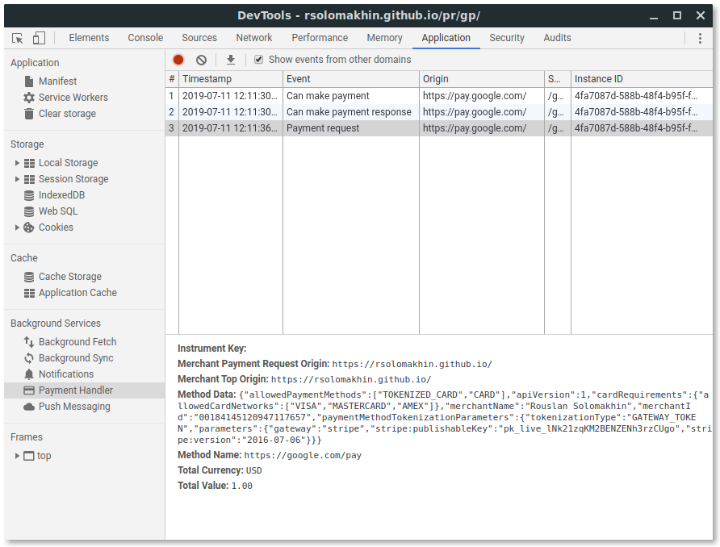

Web-based payment apps are [Progressive Web Apps
(PWA)](/progressive-web-apps/) and run on top of [service
workers](https://developer.mozilla.org/docs/Web/API/Service_Worker_API). The
service worker in a payment app plays an important role as it captures payment
requests from a merchant, launches the payment app, and mediates the
communication with the merchant.

To configure a web-based payment app, you need to register available payment
methods, delegation options, and a service worker. You can configure your
web-based payment app declaratively with a web app manifest or imperatively with
JavaScript.



## Configuring a payment app with a web app manifest

To configure your web-based payment app declaratively, [serve a web app
manifest](/setting-up-a-payment-method/#step-3:-serve-a-web-app-manifest).

The following properties in the web app manifest are relevant for web-based payment apps:
* `name`
* `icons`
* `serviceworker`
    * `src`
    * `scope`
    * `use_cache`
* `payment`
    * `supported_delegations`

Check out [Setting up a payment
method](/setting-up-a-payment-method/#step-3:-serve-a-web-app-manifest)
to make sure your payment method manifest points to your web app manifest
properly.

### Registering a service worker just-in-time (JIT)


Service workers are usually registered using JavaScript, but they can also be
automatically registered by the browser when the user chooses to pay with a
web-based payment app on a merchant website. This is called *just-in-time (JIT)
registration*.


The JIT registration requires only serving [the web app
manifest](/setting-up-a-payment-method/#step-3:-serve-a-web-app-manifest)
and no additional coding. If you've already configured your web app manifest and
are serving it properly, you should be all set. The browser will handle the
rest.


While a single payment method identifier can support multiple payment apps,
JIT registration happens only when the payment method manifest points to a
single payment app.


## Configure a payment app with JavaScript

Configuring a web-based payment app using JavaScript allows you to register
multiple payment methods and manually unregister service workers.

### Manually register a service worker

A service worker is a JavaScript file you can register using
[`navigator.serviceWorker.register()`](https://developer.mozilla.org/docs/Web/API/ServiceWorkerContainer/register).
If you have a service worker file named `service-worker.js`, you can register it
to the visitor's browser by running the following code:

<!--
  
  -->

[payment handler] payment app's landing page

```js
// Feature detection
if ('serviceWorker' in navigator) {
  // Register a service worker
  navigator.serviceWorker.register(
    // A service worker JS file is separate
    'service-worker.js'
  );
  // PaymentManager requires the service worker to be active.
  // One simple method to activate a service worker is through
  // a `ready` promise.
  const registration = await navigator.serviceWorker.ready;
…
```




If you are new to the service worker, learn more at [Service Workers: an
Introduction](https://developers.google.com/web/fundamentals/primers/service-workers).


### Set a payment instrument


Payment apps can support multiple ways for making a payment. For example, a
customer can add multiple credit cards or e-wallets to a payment app. Each of
them is a payment instrument.


Once the service worker is registered, [a service worker registration
object](https://developer.mozilla.org/docs/Web/API/ServiceWorkerRegistration) is
returned. Call
[`registration.paymentManager.instrument.set()`](https://w3c.github.io/payment-handler/#paymentinstruments-interface)
to set a payment instrument. It accepts two arguments, a string that represents
the instrument key and a [`PaymentInstrument`
object](https://w3c.github.io/payment-handler/#dom-paymentinstrument) that
contains details about the instrument.

[payment handler] payment app's landing pages

```js
…
  // Feature detection
  if (!registration.paymentManager) return;


  await registration.paymentManager.instruments.set(
    // Payment instrument key
    'bobpay_card_1',
    // Payment instrument details
    {
      // This parameter will be ignored in Chrome
      name: 'Payment Handler Example',
      // This parameter will be used to match against
      // the PaymentRequest.
      method: 'https://bobpay.xyz/pay'
    }
  );
```

<div class="w-table-wrapper">
  <table>
    <thead>
      <tr>
        <th colspan="2">Arguments</th>
        <th>Description</th>
      </tr>
    </thead>
    <tbody>
      <tr>
        <td colspan="2">
          <a href="https://w3c.github.io/payment-handler/#paymentinstruments-interface"><code>instrumentKey</code></a> (required)
        </td>
        <td>
          An arbitrary string used only to identify the instrument when you want to update it. It's not visible to customers and it's recommended you use an identifier from your payment app backend.
        </td>
      </tr>
      <tr>
        <td rowspan="5">
          <a href="https://w3c.github.io/payment-handler/#paymentinstrument-dictionary"><code>PaymentInstrument</code></a>
        </td>
        <td></td>
        <td>
          Details of the payment instrument.
        </td>
      </tr>
      <tr>
        <td>
          <a href="https://developer.mozilla.org/docs/Web/Manifest/name"><code>name</code></a> (required)
        </td>
        <td>
          Sets a string as the instrument name. Required but ignored in Chrome.
        </td>
      </tr>
      <tr>
        <td>
          <a href="https://developer.mozilla.org/docs/Web/Manifest/icons"><code>icons</code></a>
        </td>
        <td>
          Sets an array of <a href="https://w3c.github.io/payment-handler/#imageobject-dictionary"><code>ImageObject</code></a>s that the Payment Request sheet will display. Ignored in Chrome.
        </td>
      </tr>
      <tr>
        <td>
          <code>method</code>
        </td>
        <td>
          A supported payment method identifier.
        </td>
      </tr>
      <tr>
        <td>
          <code>capabilities</code>
        </td>
        <td>
          Sets the <a href="https://w3c.github.io/payment-handler/#capabilities-example">payment method specific parameters as an object</a>. As of July 2020, basic-card is the only payment method that accepts capabilities.
        </td>
      </tr>
    </tbody>
  </table>
</div>


Chrome ignores the `name` and `icons` properties. It respects the [web app
manifest](/setting-up-a-payment-method/#step-3:-serve-a-web-app-manifest)'s
respective properties instead, but other browsers may behave differently.


### Enable delegations

Entering shipping address and contact information through a web form can be a
cumbersome experience for customers. It can cause errors and lower conversion
rate.

That's why the Payment Request API supports a feature to request shipping
address and contact information. This provides multiple benefits:

* Users can pick the right address with just a few taps.
* The address is always returned in [the standardized
  format](https://w3c.github.io/payment-request/#paymentaddress-interface).
* Submitting an incorrect address is less likely.

Payment apps can integrate this functionality to offer a more unified payment
experience. This is called *delegation*.

<figure class="w-figure" style="width:300px; margin:auto;">
  <video controls autoplay loop muted class="w-screenshot">
    <source src="https://storage.googleapis.com/web-dev-assets/payments/skip-the-sheet.webm" type="video/webm">
    <source src="https://storage.googleapis.com/web-dev-assets/payments/skip-the-sheet.mp4" type="video/mp4">
  </video>
  <figcaption class="w-figcaption">
    Checkout flow with a web-based payment app.
  </figcaption>
</figure>

Web-based payment apps can declare their support for delegation using the web
app manifest's `payment.supported_delegations` field or through JavaScript.

To let the browser know that the payment app accepts a delegation, use
[`PaymentManager.enableDelegations()`](https://w3c.github.io/payment-handler/#enabledelegations-method).

[payment handler] payment app's landing page

```js
…
 await registration.paymentManager.enableDelegations([
  'shippingAddress', 'payerName'
]);
…
```

You can declare supported delegation options as an array of strings:

* `shippingAddress`: The payment handler can provide a shipping address.
* `payerName`: The payment handler can provide the payer's name.
* `payerPhone`: The payment handler can provide the payer's phone number.
* `payerEmail`: The payment handler can provide the payer's address.

## Debugging a web-based payment app

When developing a web-based payment app frontend, you'll probably jump between
merchant context and payment app context. The following debugging tips will help
your developing experience on Chrome.

### Developing on a local server

Which server do you use for development? Many developers tend to use localhost
or a company-internal server environment which can be challenging because
powerful features in the browser tend to require a secure environment (HTTPS)
and a valid certificate. The Payment Request API and the Payment Handler API are
no exception and localhosts or company-internal servers usually don't come with
a valid certificate.

The good news is some browsers, including Chrome, exempt certificates for
`http://localhost` by default. Also in Chrome, you can exempt the certificate
requirement by launching a Chrome instance. For example, to exempt the
requirement from `http://*.corp.company.com`, use the following flags:

* [`--ignore-certificate-errors`](https://chromiumdash.appspot.com/commit/988b56b519836f3d3d94f145ba3554a0c0a7d0a8)
* [`--unsafely-treat-insecure-origin-as-secure=http://*.corp.company.com`](https://chromiumdash.appspot.com/commit/77a7e1a65d14072149ec4420a0ab523586011d8a)

**macOS**

```shell
/Applications/Google\ Chrome.app/Contents/MacOS/Google\ Chrome --ignore-certificate-errors --unsafely-treat-insecure-origin-as-secure=http://*.corp.company.com
```

**Windows**

```shell
chrome.exe --ignore-certificate-errors --unsafely-treat-insecure-origin-as-secure=http://*.corp.company.com
```

Learn more about running Chrome with a runtime flag at [Run Chromium with
flags](https://www.chromium.org/developers/how-tos/run-chromium-with-flags).

### Port forwarding a local server

You can port forward the local web server to an Android device using Chrome's
DevTools and test how it works from a mobile browser. To learn how to do it,
check out [Access Local
Servers](https://developers.google.com/web/tools/chrome-devtools/remote-debugging/local-server).

### Remote debugging a website on Android Chrome from desktop DevTools

You can also debug Android Chrome on desktop DevTools. To learn how to do it,
check out [Get Started with Remote Debugging Android
Devices](https://developers.google.com/web/tools/chrome-devtools/remote-debugging).

### Payment Handler event logging

[DevTools can display Payment Handler API
events](https://developers.google.com/web/updates/2019/09/devtools#payments) for
easier local development. Open DevTools on the merchant context and go to the
"Payment Handler" section under the **Application** pane. Check "Show events
from other domains" and click the "Record" button to start capturing events sent
to the service worker that handles payments.

<figure class="w-figure">
  
  <figcaption class="w-figcaption">
    Payment Handler event logging.
  </figcaption>
</figure>

## Next steps

You learned how to register a service worker, set payment instruments, and
define delegation availability for a web-based payment app. The next step is to
learn how the service worker can orchestrate a payment transaction at runtime.

* [Orchestrating payment transactions with a service
  worker](/orchestrating-payment-transactions)
