When you play Progressive Web App buzzword bingo, it is a safe bet to set on "PWAs are just websites". Microsoft's PWA documentation [agrees](https://docs.microsoft.com/en-us/microsoft-edge/progressive-web-apps-chromium/#progressive-web-apps-on-windows:~:text=PWAs%20are%20just%20websites), we [say it](/progressive-web-apps/#content:~:text=Progressive%20Web%20Apps,Websites) on this very site, and even PWA nominators Frances Berriman and Alex Russell [write so](https://infrequently.org/2015/06/progressive-apps-escaping-tabs-without-losing-our-soul/#post-2263:~:text=they%E2%80%99re%20just%20websites), too. Yes, PWAs are just websites, but they are also way more than that. If done right, a PWA will not feel like a website, but like a "real" app. Now what does it mean to feel like a real app?

In order to answer this question, let me use the Apple [Podcasts](https://support.apple.com/en-us/HT201859) app as an example.
It is available on macOS on desktop and on iOS (and iPadOS respectively) on mobile.
While Podcasts is a media application, the core ideas I illustrate with its help apply to other categories of apps, too.

<figure class="w-figure">
  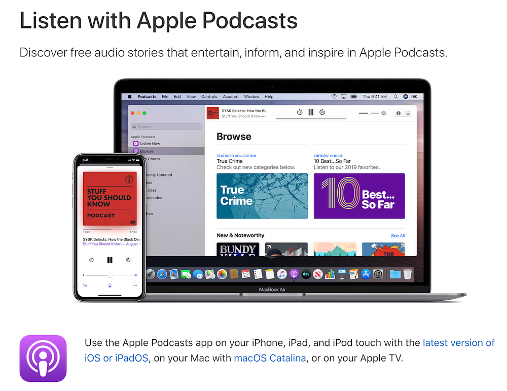
  <figcaption class="w-figcaption">Apple Podcasts on iPhone and on macOS (<a href="https://support.apple.com/en-us/HT201859">Source</a>).</figcaption>
</figure>


Each iOS/Android/desktop app feature that is listed below has a **How to do this on the web**
component that you can open for more details.
Please note that not all browsers on the various operating systems support all the listed APIs
or functionalities. Be sure to carefully review the compatibility notes in the linked articles.


## Capable of running offline

If you take a step back and think of some of the platform-specific applications you may have on your mobile phone or desktop computer, one thing clearly stands out: you never get nothing. In the Podcasts app, even if I am offline, there is always something. When there is no network connection, the app naturally still opens. The **Top Charts** section does not show any content, but instead falls back to a **Can't connect right now** message paired with a **Retry** button. It may not be the most welcoming experience, but I get something.

<figure class="w-figure">
  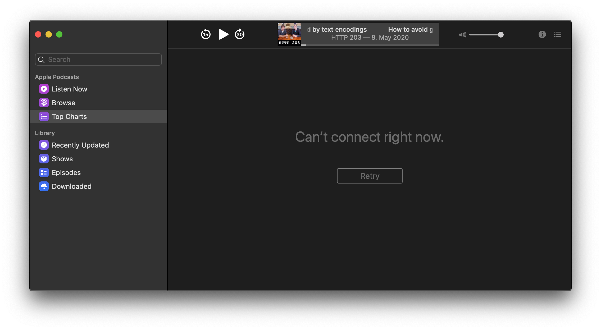
  <figcaption class="w-figcaption">Podcasts app without network connection.</figcaption>
</figure>



  How to do this on the web

  The Podcasts app follows the so-called app shell model. All the static content that is needed to show the core app is cached locally,
  including decorative images like the left-hand menu icons and the core player UI icons.
  Dynamic content like the <b>Top Charts</b> data is only loaded on demand, with locally cached fallback content available should the loading fail.
  Read the  article <a href="https://developers.google.com/web/fundamentals/architecture/app-shell">The App Shell Model</a>
  to learn how to apply this architectural model to your web app.


## Offline content available and media playable

While offline, via the left-hand drawer, I can still navigate to the **Downloaded** section and enjoy downloaded podcast episodes that are ready to be played
and are displayed with all metadata like artwork and descriptions.

<figure class="w-figure">
  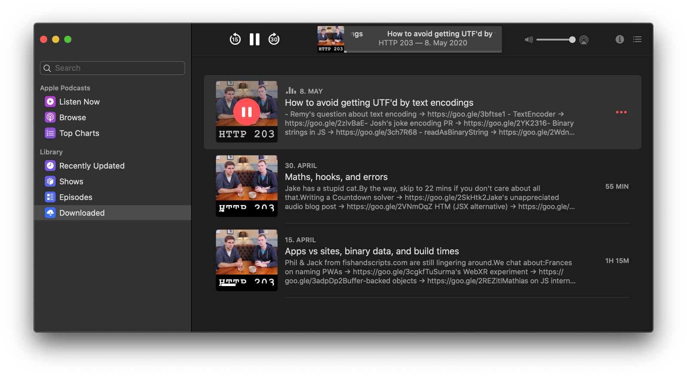
  <figcaption class="w-figcaption">Downloaded podcast episodes can be played even without network.</figcaption>
</figure>



  How to do this on the web

  Previously downloaded media content can be served from the cache, for example using the
  <a href="https://developers.google.com/web/tools/workbox/guides/advanced-recipes#cached-av">Serve cached audio and video</a>
  recipe from the <a href="https://developers.google.com/web/tools/workbox">Workbox</a> library.
  Other content can always be stored in the cache, or in IndexedDB. Read the article <a href="/storage-for-the-web/">Storage for the web</a>
  for all details and to know when to use what storage technology.
  If you have data that should be persistently stored without the risk of being purged when the
  available amount of memory gets low, you can use the
  <a href="/persistent-storage/">Persistent Storage API</a>.


## Proactive background downloading

When I am back online, I can of course search for content with a query like `http 203`, and when I decide to subscribe to the search result, the [HTTP 203 podcast](/podcasts/), the latest episode of the series is immediately downloaded, no questions asked.

<figure class="w-figure">
  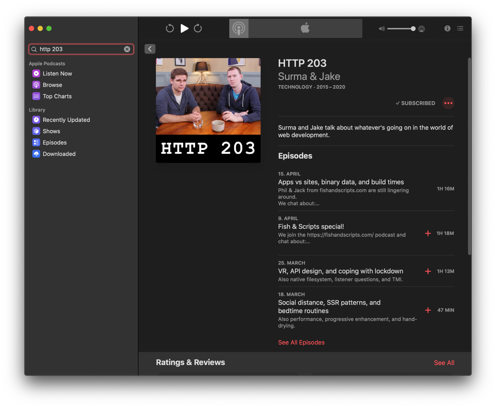
  <figcaption class="w-figcaption">After subscribing to a podcast, the latest episode is immediately downloaded.</figcaption>
</figure>



  How to do this on the web

  Downloading a podcast episode is an operation that potentially can take longer. The <a href="https://developers.google.com/web/updates/2018/12/background-fetch">Background Fetch API</a> lets you delegate downloads to the browser, which takes care of them in the background.
  On Android, the browser in turn can even delegate these downloads further on to the operating system, so the browser does not need to be continuously running.
  Once the download has completed, your app's service worker gets woken up and you can decide what to do with the response.


## Sharing to and interacting with other applications

The Podcasts app integrates naturally with other applications. For example, when I right-click an episode that I like, I can share it to other apps on my device, like the Messages app. It also naturally integrates with the system clipboard. I can right-click any episode and copy a link to it.

<figure class="w-figure">
  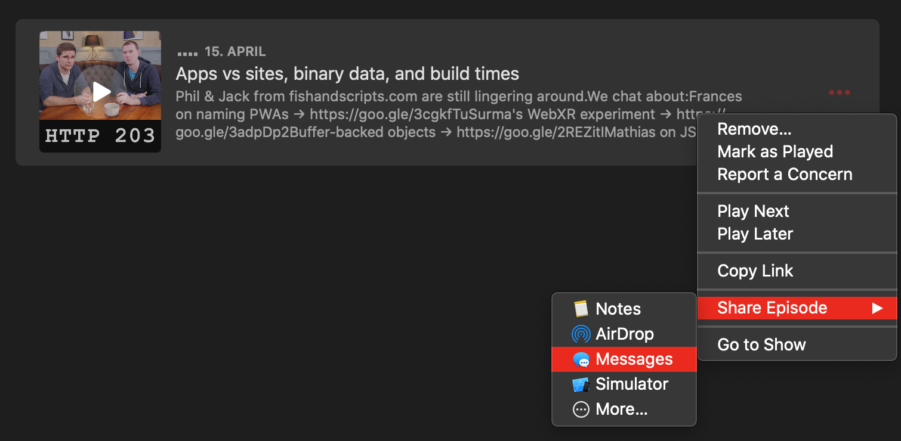 Messages' option selected." width="600">
  <figcaption class="w-figcaption">Sharing a podcast episode to the Messages app.</figcaption>
</figure>



  How to do this on the web

  The <a href="/web-share/">Web Share API</a> and the <a href="/web-share-target/">Web Share Target API</a>
  allow your app to share and receive texts, files, and links to and from other applications on the device.
  Although it is not yet possible for a web app to add menu items to the operating system's built-in right-click menu, there are lots of other ways to link to and from other apps on the device.
  With the <a href="/image-support-for-async-clipboard/">Async Clipboard API</a>, you can programmatically read and write
  text and image data (PNG images) to the system clipboard.
  On Android, you can use the <a href="/contact-picker/">Contact Picker API</a> to select entries from the device's contacts manager.
  If you offer both a platform-specific app and a PWA, you can use the <a href="/get-installed-related-apps/">Get Installed Related Apps API</a>
  to check if the platform-specific app is installed, in which case you do not need to encourage the user to install the PWA or accept web push notifications.


## Background app refreshing

In the Podcasts app's settings, I can configure the app to download new episodes automatically. Like that, I do not even have to think about it, updated content will always just be there. Magic.

<figure class="w-figure">
  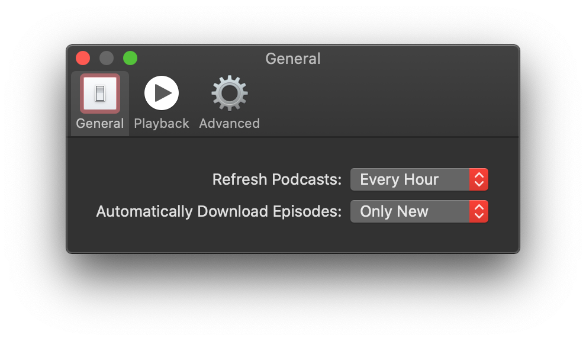
  <figcaption class="w-figcaption">Podcasts configured to check for new podcast episode every hour.</figcaption>
</figure>



  How to do this on the web

  The <a href="/periodic-background-sync/">Periodic Background Sync API</a>
  allows your app to refresh its content regularly in the background without the need for it to be running.
  This means new content is proactively available, so your users can start delving into it right away whenever they decide.


## State synchronized over the cloud

At the same time, my subscriptions are synchronized across all devices I own. In a seamless world, I do not have to worry about manually keeping my podcast subscriptions in sync. Likewise, I do not have to be afraid that my mobile device's memory will be consumed by episodes I have already listened to on my desktop and vice versa. The play state is kept in sync, and listened-to episodes are automatically deleted.

<figure class="w-figure">
  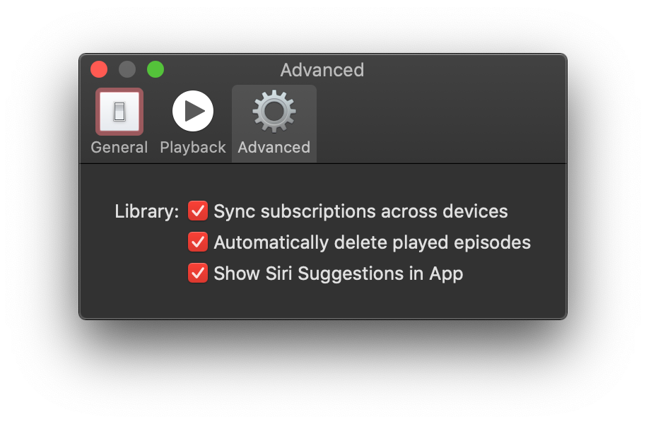
  <figcaption class="w-figcaption">State is synchronized over the cloud.</figcaption>
</figure>



  How to do this on the web

  Syncing app state data is a task that you can delegate to the <a href="https://developers.google.com/web/updates/2015/12/background-sync">Background Sync API</a>. The sync operation itself does not have to happen immediately, just <em>eventually</em>, and maybe even when the user has closed the app again already.


## Hardware media key controls

When I am busy with another application, say, reading a news page in the Chrome browser, I can still control the Podcasts app with the media keys on my laptop.
There is no need to switch to the app just to skip forward or backward.

<figure class="w-figure">
  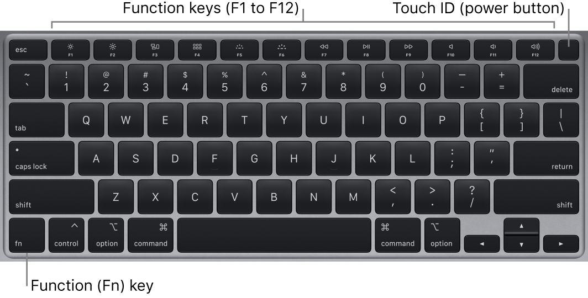
  <figcaption class="w-figcaption">The media keys allow for controlling the Podcasts app (<a href="https://support.apple.com/guide/macbook-pro/magic-keyboard-apdd0116a6a2/mac">Source</a>).</figcaption>
</figure>



  How to do this on the web

  Media keys are supported by the <a href="/media-session/">Media Session API</a>.
  Like that, users can make use of the hardware media keys on their physical keyboards, headphones, or even control the web app
  from the software media keys on their smartwatches.
  An additional idea to smooth seeking operations is to send a
  <a href="https://developer.mozilla.org/en-US/docs/Web/API/Vibration_API">vibration pattern</a>
  when the user seeks over a significant part of the content, for example, passing the opening credits or a chapter boundary.


## Multitasking and app shortcut

Of course I can always multitask back to the Podcasts app from anywhere. The app has a clearly distinguishable icon that I can also put on my desktop or application dock so Podcasts can be launched immediately when I feel like it.

<figure class="w-figure">
  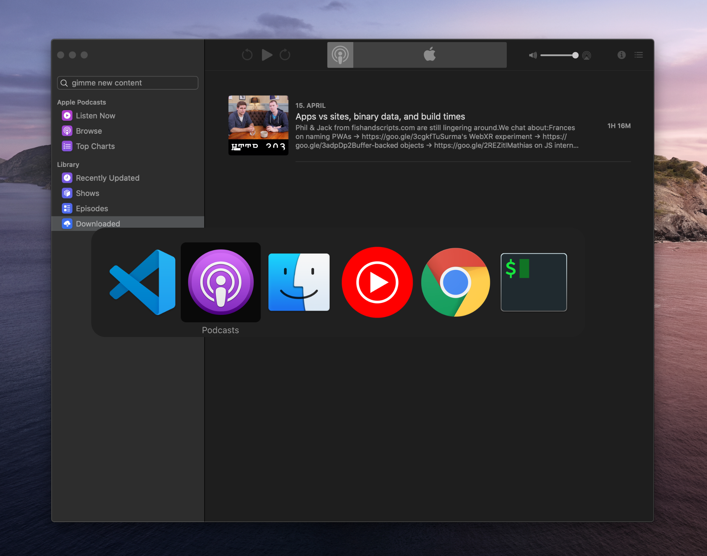
  <figcaption class="w-figcaption w-figcaption--fullbleed">Multitasking back to the Podcasts app.</figcaption>
</figure>



  How to do this on the web

  Progressive Web Apps on both desktop and mobile can be installed to the home screen, start menu, or application dock.
  Installation can happen based on a proactive prompt, or fully controlled by the app developer.
  The article <a href="/install-criteria/">What does it take to be installable?</a> covers everything you need to know.
  When multitasking, PWAs appear independent from the browser.


## Quick actions in context menu

The most common app actions, **Search** for new content and **Check for New Episodes**, are available right from the context menu of the app in the Dock. Via the **Options** menu, I can also decide to open the app at login time.

<figure class="w-figure">
  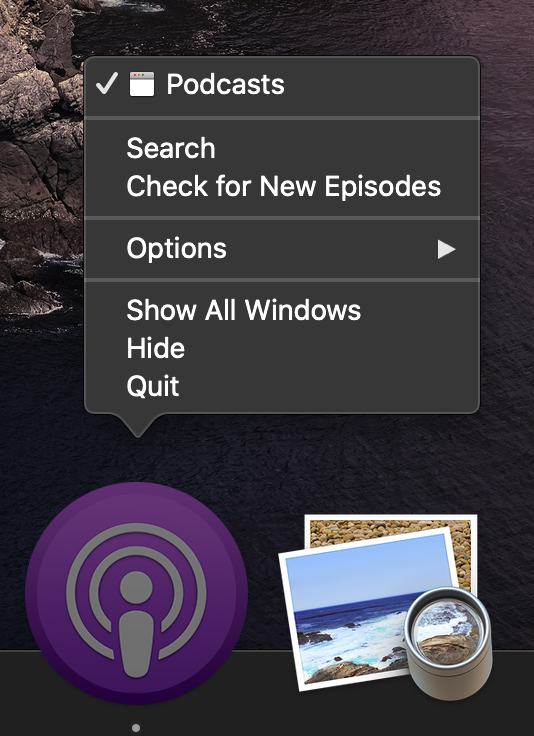
  <figcaption class="w-figcaption">Quick actions are immediately available right from the app icon.</figcaption>
</figure>



  How to do this on the web

  By specifying <a href="/app-shortcuts/">app icon shortcuts</a>
  in the PWA's web app manifest, you can register quick routes to common tasks that users can reach directly from the app icon.
  On operating systems like macOS, users can also right-click the app icon and set the app to launch at login time.
  There is ongoing work on a proposal for <a href="https://github.com/MicrosoftEdge/MSEdgeExplainers/blob/main/RunOnLogin/Explainer.md">run on login</a>.


## Act as default app

Other iOS applications and even websites or emails can integrate with the Podcasts app by leveraging the `podcasts://` URL scheme. If I follow a link like [`podcasts://podcasts.apple.com/podcast/the-css-podcast/id1042283903`](podcasts://podcasts.apple.com/podcast/the-css-podcast/id1042283903) while in the browser, I am brought right into the Podcasts app and can decide to subscribe or listen to the podcast.

<figure class="w-figure">
  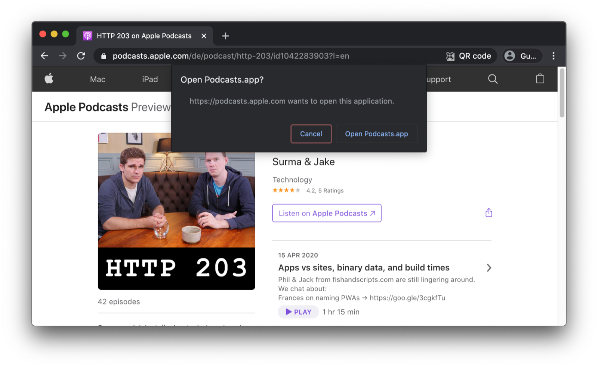
  <figcaption class="w-figcaption">The Podcasts app can be opened right from the browser.</figcaption>
</figure>



  How to do this on the web

  Handling fully custom URL schemes is not yet possible, but there is ongoing work on a proposal for
  <a href="https://github.com/MicrosoftEdge/MSEdgeExplainers/blob/main/URLProtocolHandler/explainer.md">URL Protocol Handling</a>
  for PWAs. Currently, <a href="https://developer.mozilla.org/en-US/docs/Web/API/Navigator/registerProtocolHandler"><code>registerProtocolHandler()</code></a> with a <code>web+</code> scheme prefix is the best alternative.


## Local file system integration

You may not immediately think of it, but the Podcasts app naturally integrates with the local file system. When I download a podcast episode, on my laptop it is stored in `~/Library/Group Containers/243LU875E5.groups.com.apple.podcasts/Library/Cache`. Unlike, say `~/Documents`, this directory is of course not meant to be accessed directly by regular users, but it is there.
Other storage mechanisms than files are referenced in the [offline content](#offline-content-available-and-media-playable) section.

<figure class="w-figure">
  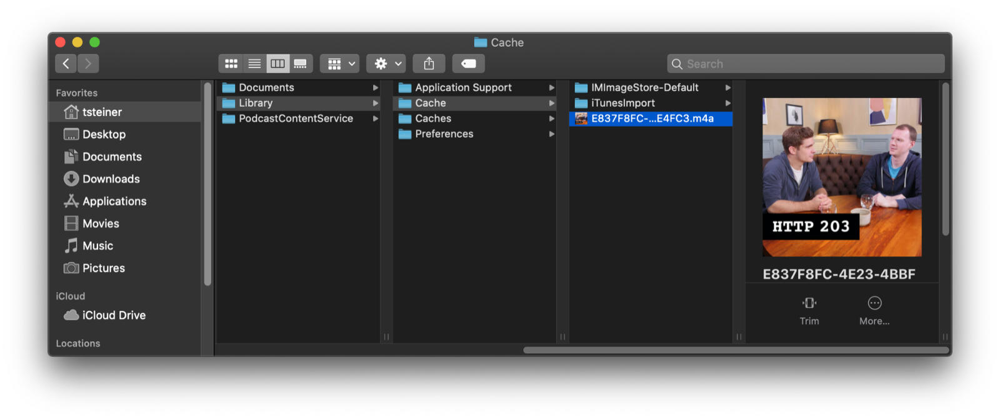
  <figcaption class="w-figcaption">Podcast episodes are stored in a special system app folder.</figcaption>
</figure>



  How to do this on the web

  The <a href="/file-system-access/">File System Access API</a> enables developers to get access to the local file system
  of the device. You can use it directly or via the <a href="https://github.com/GoogleChromeLabs/browser-fs-access">browser-fs-access</a>
  support library that transparently provides a fallback for browsers that do not support the API.
  For security reasons, system directories are not web-accessible.


## Platform look and feel

There is a more subtle thing that is self-evident for an iOS application like Podcasts: none of the text labels are selectable and all text blends in with the system font of the machine. Also my choice of system color theme (dark mode) is respected.

  <figure class="w-figure">
    
    <figcaption class="w-figcaption">The Podcasts app supports light and dark mode.</figcaption>
  </figure>
  <figure class="w-figure">
    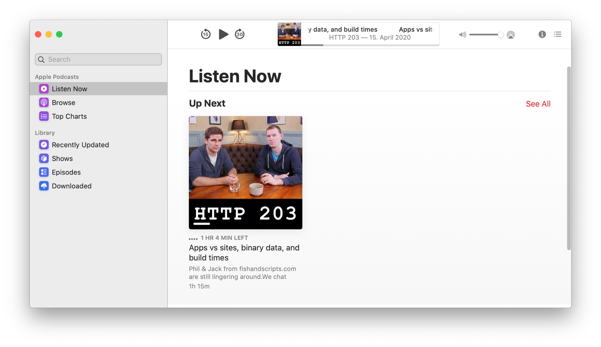
    <figcaption class="w-figcaption">The app uses the default system font.</figcaption>
  </figure>



  How to do this on the web

  By leveraging the <a href="https://developer.mozilla.org/en-US/docs/Web/CSS/user-select"><code>user-select</code></a>
  CSS property with the value of <a href="https://developer.mozilla.org/en-US/docs/Web/CSS/user-select#Syntax:~:text=none,-The"><code>none</code></a>,
  you can protect UI elements from being accidentally selected.
  Be sure, though, to not abuse this property for making <em>app contents</em> unselectable.
  It should only be used for UI elements like button texts, etc.
  The <a href="https://developer.mozilla.org/en-US/docs/Web/CSS/font-family#<generic-name>:~:text=system%2Dui,-Glyphs"><code>system-ui</code></a>
  value for the <a href="https://developer.mozilla.org/en-US/docs/Web/CSS/font-family"><code>font-family</code></a> CSS property allows you to
  specify the default UI font of the system to be used for your app.
  Finally, your app can obey to the user's color scheme preference by respecting their <a href="/prefers-color-scheme/"><code>prefers-color-scheme</code></a> choice, with an optional <a href="https://github.com/GoogleChromeLabs/dark-mode-toggle">dark mode toggle</a>
  to override it.
  Another thing to decide on might be what the browser should do when reaching
  the boundary of a scrolling area, for example, to implement custom <em>pull to refresh</em>.
  This is possible with the <a href="https://developer.mozilla.org/en-US/docs/Web/CSS/overscroll-behavior"><code>overscroll-behavior</code></a> CSS property.


## Customized title bar

When you look at the Podcasts app window, you notice that it does not have a classic integrated title bar and toolbar, like, for example, the Safari browser window, but a customized experience that looks like a sidebar docked to the main player window.

<figure class="w-figure">
  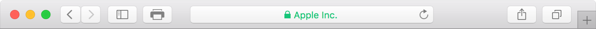
  <figcaption class="w-figcaption"></figcaption>
</figure>

<figure class="w-figure">
  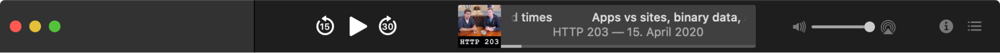
  <figcaption class="w-figcaption">Customized title bars of Safari and Podcasts.</figcaption>
</figure>



  How to do this on the web

  While not currently possible, <a href="https://github.com/MicrosoftEdge/MSEdgeExplainers/blob/main/TitleBarCustomization/explainer.md">title bar customization</a> is being worked on at the moment.
  You can (and should), however, specify the <a href="/add-manifest/#display"><code>display</code></a> and the
  <a href="/add-manifest/#theme-color"><code>theme-color</code></a> properties of the web app manifest to
  determine the look and feel of your application window and to decide which default browser controls—potentially none of them—should be shown.


## Snappy animations

In-app animations are snappy and smooth in Podcasts. For example, when I open the **Episode Notes** drawer on the right, it elegantly slides in. When I remove one episode from my downloads, the remaining episodes float up and consume the screen real estate that was freed by the deleted episode.

<figure class="w-figure">
  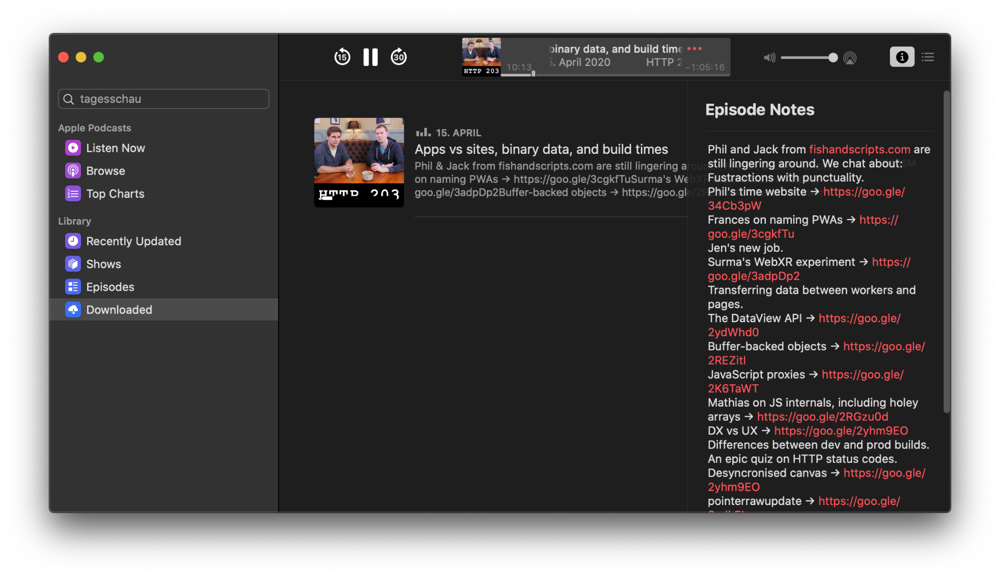
  <figcaption class="w-figcaption">In-app animations like when opening a drawer are snappy.</figcaption>
</figure>



  How to do this on the web

  Performant animations on the web are certainly possible if you take into account a number of best practices
  outlined in the article <a href="https://developers.google.com/web/fundamentals/design-and-ux/animations/animations-and-performance">Animations and Performance</a>.
  Scroll animations as commonly seen in paginated content or media carousels can be massively improved by using the <a href="https://developers.google.com/web/updates/2018/07/css-scroll-snap">CSS Scroll Snap</a> feature.
  For full control, you can use the <a href="https://developer.mozilla.org/en-US/docs/Web/API/Web_Animations_API">Web Animations API</a>.


## Content surfaced outside of app

The Podcasts app on iOS can surface content in other locations than the actual application, for example, in the system's Widgets view, or in the form of a Siri Suggestion. Having proactive, usage-based calls-to-action that just require a tap to interact with can greatly increase the re-engagement rate of an app like Podcasts.

<figure class="w-figure">
  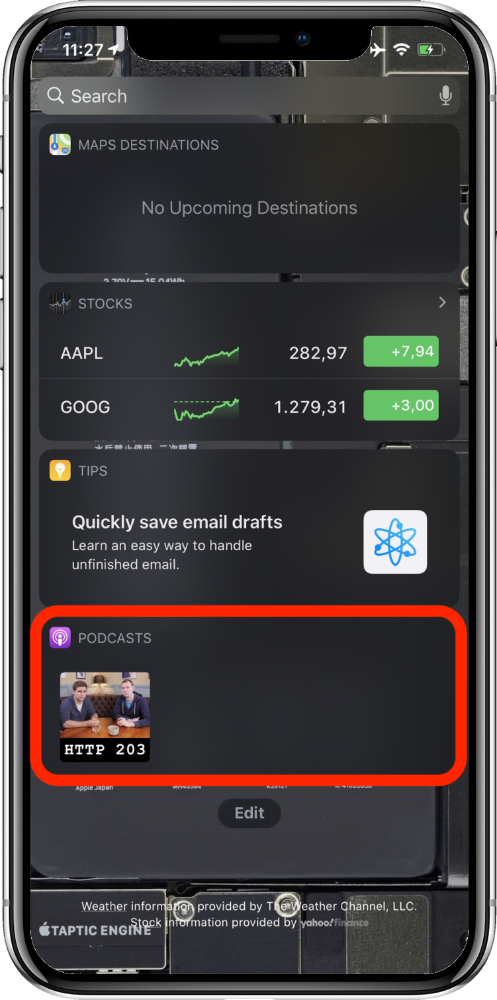
  <figcaption class="w-figcaption">App content is surfaced outside of the main Podcasts app.</figcaption>
</figure>



  How to do this on the web

  The <a href="/content-indexing-api/">Content Index API</a> allows your application
  to tell the browser which content of the PWA is available offline.
  This allows the browser to surface this content outside of the main app.
  By marking up interesting content in your app as suitable for <a href="https://developers.google.com/search/docs/data-types/speakable">speakable</a>
  audio playback and by using <a href="https://developers.google.com/search/docs/guides/search-gallery">structured markup</a> in general,
  you can help search engines and virtual assistants like the Google Assistant present your offerings in an ideal light.


## Lock screen media control widget

When a podcast episode is playing, the Podcasts app shows a beautiful control widget on the lock screen that features metadata like the episode artwork, the episode title, and the podcast name.

<figure class="w-figure">
  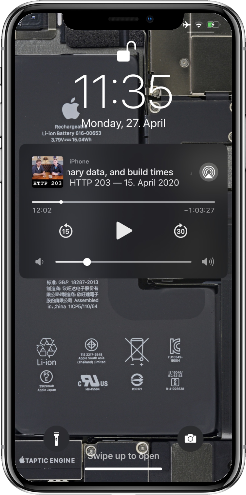
  <figcaption class="w-figcaption">Media playing in the app can be controlled from the lock screen.</figcaption>
</figure>



  How to do this on the web

  The <a href="/media-session/">Media Session API</a> lets you specify metadata like artwork, track titles, etc.
  that then gets displayed on the lock screen, smartwatches, or other media widgets in the browser.


## Push notifications

Push notifications have become a bit of an annoyance on the web
(albeit [notification prompts are a lot quieter](https://blog.chromium.org/2020/01/introducing-quieter-permission-ui-for.html) now).
But if used properly, they can add a lot of value.
For example, the iOS Podcasts app can optionally notify me of new episodes of podcasts I am subscribed to or recommend new ones, as well as alert me of new app features.

<figure class="w-figure">
  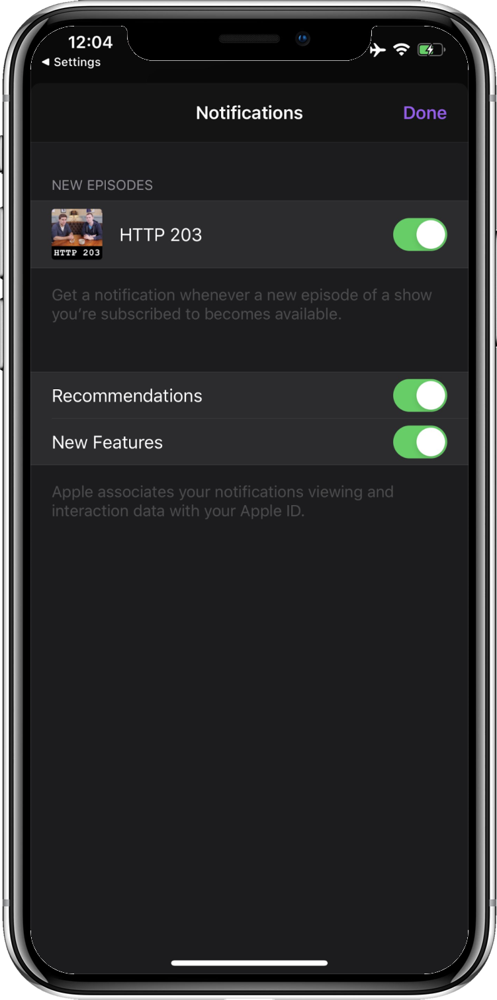
  <figcaption class="w-figcaption">Apps can send push notifications to inform the user about new content.</figcaption>
</figure>



  How to do this on the web

  The <a href="https://developers.google.com/web/fundamentals/push-notifications">Push API</a>
  allows your app to receive push notifications so you can notify your users about noteworthy events around your PWA.
  For notifications that should fire at a known time in the future and that do not require a network connection,
  you can use the <a href="/notification-triggers/">Notification Triggers API</a>.


## App icon badging

Whenever there are new episodes available for one of the podcasts I am subscribed to, an app icon badge on the Podcasts home screen icon appears, again encouraging me to re-engage with the app in a way that is not intrusive.

<figure class="w-figure">
  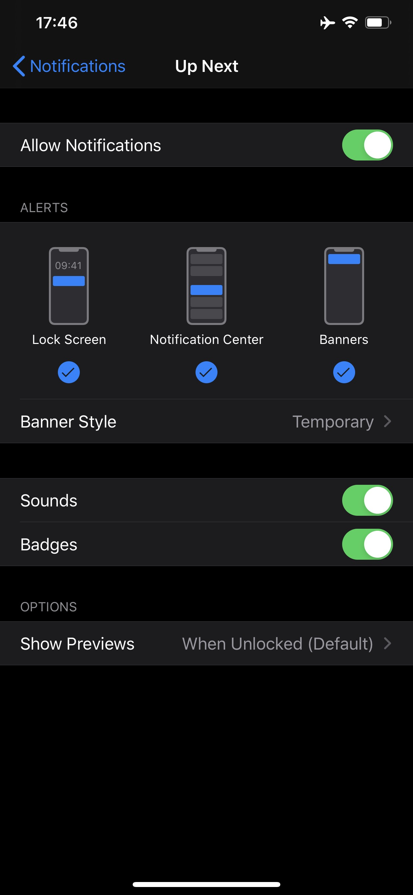
  <figcaption class="w-figcaption">Badges are a subtle way for applications to inform users about new content.</figcaption>
</figure>



  How to do this on the web

  You can set app icon badges with the <a href="/badging-api/">Badging API</a>.
  This is especially useful when your PWA has some notion of "unread" items or when you need a means
  to unobtrusively draw the user's attention back to the app.


## Media playback takes precedence over energy saver settings

When podcast media is playing, the screen may turn off, but the system will not enter standby mode.
Apps can optionally keep the screen awake, too, for example to display lyrics or captions.

<figure class="w-figure">
  
  <figcaption class="w-figcaption">Apps can keep the screen awake.</figcaption>
</figure>



  How to do this on the web

  The <a href="/wakelock/">Screen Wake Lock API</a> allows you to prevent the screen from turning off.
  Media playback on the web automatically prevents the system from entering standby mode.


## App discovery through an app store

While the Podcasts app is part of the macOS desktop experience, on iOS it needs to be installed from the App Store.
A quick search for `podcast`, `podcasts`, or `apple podcasts` immediately turns the app up in the App Store.

<figure class="w-figure">
  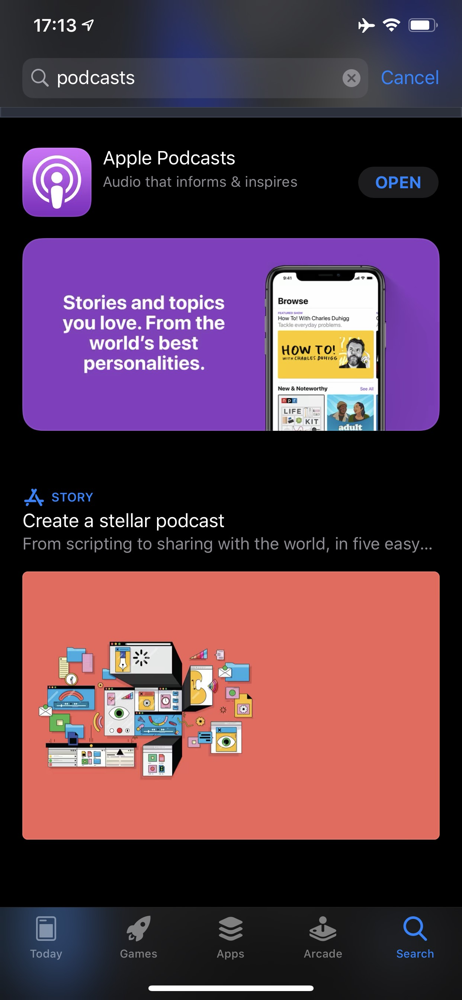
  <figcaption class="w-figcaption">Users have learned to discover apps in app stores.</figcaption>
</figure>



  How to do this on the web

  While Apple does not allow PWAs on the App Store, on Android, you can submit your PWA
  <a href="/using-a-pwa-in-your-android-app/">wrapped in a Trusted Web Activity</a>.
  The <a href="https://github.com/GoogleChromeLabs/bubblewrap"><code>bubblewrap</code></a> script makes this a painless operation.
  This script is also what internally powers <a href="https://www.pwabuilder.com/">PWABuilder</a>'s Android app export feature,
  which you can use without touching the command line.


## Feature summary

The table below shows a compact overview of all features and provides a list of useful resources for realizing them on the web.

  <table>
    <thead>
      <tr>
        <th>Feature</th>
        <th>Useful resources for doing this on the web</th>
      </tr>
    </thead>
    <tbody>
      <tr>
        <td><a href="#capable-of-running-offline">Capable of running offline</a></td>
        <td>
          <ul>
            <li>
              <a href="https://developers.google.com/web/fundamentals/architecture/app-shell"
                >App shell model</a
              >
            </li>
          </ul>
        </td>
      </tr>
      <tr>
        <td><a href="#offline-content-available-and-media-playable">Offline content available and media playable</a></td>
        <td>
          <ul>
            <li>
              <a
                href="https://developers.google.com/web/tools/workbox/guides/advanced-recipes#cached-av"
                >Serve cached audio and video</a
              >
            </li>
            <li><a href="https://developers.google.com/web/tools/workbox">Workbox library</a></li>
            <li><a href="/storage-for-the-web/">Storage API</a></li>
            <li><a href="/persistent-storage/">Persistent Storage API</a></li>
          </ul>
        </td>
      </tr>
      <tr>
        <td><a href="#proactive-background-downloading">Proactive background downloading</a></td>
        <td>
          <ul>
            <li>
              <a href="https://developers.google.com/web/updates/2018/12/background-fetch"
                >Background Fetch API</a
              >
            </li>
          </ul>
        </td>
      </tr>
      <tr>
        <td><a href="#sharing-to-and-interacting-with-other-applications">Sharing to and interacting with other applications</a></td>
        <td>
          <ul>
            <li><a href="/web-share/">Web Share API</a></li>
            <li><a href="/web-share-target/">Web Share Target API</a></li>
            <li>
              <a href="/image-support-for-async-clipboard/">Async Clipboard API</a>
            </li>
            <li><a href="/contact-picker/">Contact Picker API</a></li>
            <li>
              <a href="/get-installed-related-apps/"
                >Get Installed Related Apps API</a
              >
            </li>
          </ul>
        </td>
      </tr>
      <tr>
        <td><a href="#background-app-refreshing">Background app refreshing</a></td>
        <td>
          <ul>
            <li>
              <a href="/periodic-background-sync/">Periodic Background Sync API</a>
            </li>
          </ul>
        </td>
      </tr>
      <tr>
        <td><a href="#state-synchronized-over-the-cloud">State synchronized over the cloud</a></td>
        <td>
          <ul>
            <li>
              <a href="https://developers.google.com/web/updates/2015/12/background-sync"
                >Background Sync API</a
              >
            </li>
          </ul>
        </td>
      </tr>
      <tr>
        <td><a href="#hardware-media-key-controls">Hardware media key controls</a></td>
        <td>
          <ul>
            <li><a href="/media-session/">Media Session API</a></li>
          </ul>
        </td>
      </tr>
      <tr>
        <td><a href="#multitasking-and-app-shortcut">Multitasking and app shortcut</a></td>
        <td>
          <ul>
            <li><a href="/install-criteria/">Installability criteria</a></li>
          </ul>
        </td>
      </tr>
      <tr>
        <td><a href="#quick-actions-in-context-menu">Quick actions in context menu</a></td>
        <td>
          <ul>
            <li><a href="/app-shortcuts/">App icon shortcuts</a></li>
            <li>
              <a href="https://github.com/MicrosoftEdge/MSEdgeExplainers/tree/master/RunOnLogin"
                >Run on login</a
              > (early stage)
            </li>
          </ul>
        </td>
      </tr>
      <tr>
        <td><a href="#act-as-default-app">Act as default app</a></td>
        <td>
          <ul>
            <li>
              <a
                href="https://github.com/MicrosoftEdge/MSEdgeExplainers/blob/main/URLProtocolHandler/explainer.md"
                >URL protocol handling</a
              > (early stage)
            </li>
            <li>
              <a
                href="https://developer.mozilla.org/en-US/docs/Web/API/Navigator/registerProtocolHandler"
                ><code>registerProtocolHandler()</code></a
              >
            </li>
          </ul>
        </td>
      </tr>
      <tr>
        <td><a href="#local-file-system-integration">Local file system integration</a></td>
        <td>
          <ul>
            <li><a href="/file-system-access/">File System Access API</a></li>
            <li>
              <a href="https://github.com/GoogleChromeLabs/browser-fs-access"
                >browser-fs-access library</a
              >
            </li>
          </ul>
        </td>
      </tr>
      <tr>
        <td><a href="#platform-look-and-feel">Platform look and feel</a></td>
        <td>
          <ul>
            <li>
              <a
                href="https://developer.mozilla.org/en-US/docs/Web/CSS/user-select#Syntax:~:text=none,-The"
                ><code>user-select: none</code></a
              >
            </li>
            <li>
              <a href="https://developer.mozilla.org/en-US/docs/Web/CSS/font-family"
                ><code>font-family: system-ui</code></a
              >
            </li>
            <li>
              <a href="/prefers-color-scheme/"><code>prefers-color-scheme</code></a>
            </li>
            <li>
              <a href="https://github.com/GoogleChromeLabs/dark-mode-toggle">Dark mode toggle</a>
            </li>
          </ul>
        </td>
      </tr>
      <tr>
        <td><a href="#customized-title-bar">Customized title bar</a></td>
        <td>
          <ul>
            <li>
              <a
                href="https://github.com/MicrosoftEdge/MSEdgeExplainers/blob/main/TitleBarCustomization/explainer.md"
                >Title bar customization</a
              > (early stage)
            </li>
            <li><a href="/add-manifest/#display">Display mode</a></li>
            <li><a href="/add-manifest/#theme-color">Theme color</a></li>
          </ul>
        </td>
      </tr>
      <tr>
        <td><a href="#snappy-animations">Snappy animations</a></td>
        <td>
          <ul>
            <li>
              <a
                href="https://developers.google.com/web/fundamentals/design-and-ux/animations/animations-and-performance"
                >Animations and performance tips</a
              >
            </li>
            <li>
              <a href="https://developers.google.com/web/updates/2018/07/css-scroll-snap"
                >CSS Scroll Snap</a
              >
            </li>
            <li>
              <a href="https://developer.mozilla.org/en-US/docs/Web/API/Web_Animations_API"
                >Web Animations API</a
              >
            </li>
          </ul>
        </td>
      </tr>
      <tr>
        <td><a href="#content-surfaced-outside-of-app">Content surfaced outside of app</a></td>
        <td>
          <ul>
            <li><a href="/content-indexing-api/">Content Index API</a></li>
            <li>
              <a href="https://developers.google.com/search/docs/data-types/speakable"
                >Speakable content</a
              >
            </li>
            <li>
              <a href="https://developers.google.com/search/docs/guides/search-gallery"
                >Structured markup</a
              >
            </li>
          </ul>
        </td>
      </tr>
      <tr>
        <td><a href="#lock-screen-media-control-widget">Lock screen media control widget</a></td>
        <td>
          <ul>
            <li><a href="/media-session/">Media Session API</a></li>
          </ul>
        </td>
      </tr>
      <tr>
        <td><a href="#push-notifications">Push notifications</a></td>
        <td>
          <ul>
            <li>
              <a href="https://developers.google.com/web/fundamentals/push-notifications"
                >Push API</a
              >
            </li>
            <li><a href="/notification-triggers/">Notification Triggers API</a></li>
          </ul>
        </td>
      </tr>
      <tr>
        <td><a href="#app-icon-badging">App icon badging</a></td>
        <td>
          <ul>
            <li><a href="/badging-api/">Badging API</a></li>
          </ul>
        </td>
      </tr>
      <tr>
        <td><a href="#media-playback-takes-precedence-over-energy-saver-settings">Media playback trumps energy saver settings</a></td>
        <td>
          <ul>
            <li><a href="/wakelock/">Screen Wake Lock API</a></li>
          </ul>
        </td>
      </tr>
      <tr>
        <td><a href="#app-discovery-through-an-app-store">App discovery through an app store</a></td>
        <td>
          <ul>
            <li>
              <a href="/using-a-pwa-in-your-android-app/">Trusted Web Activity</a>
            </li>
            <li>
              <a href="https://github.com/GoogleChromeLabs/bubblewrap"
                ><code>bubblewrap</code> library</a
              >
            </li>
            <li><a href="https://www.pwabuilder.com/">PWABuilder tool</a></li>
          </ul>
        </td>
      </tr>
    </tbody>
  </table>

## Conclusion

PWAs have come a long way since their introduction in 2015.
In the context of [Project Fugu 🐡](/fugu-status), the cross-company Chromium team is working on closing the last remaining gaps.
By following even only some of the pieces of advice in this article,
you can piece by piece get closer to that app-like feeling and make your users forget
that they are dealing with "just a website", because, honestly, most of them do not care
how your app is built (and why should they?), as long as it feels like a *real* app.

## Acknowledgements

This article was reviewed by
[Kayce Basques](/authors/kaycebasques/),
[Joe Medley](/authors/joemedley/),
[Joshua Bell](https://github.com/inexorabletash),
[Dion Almaer](https://blog.almaer.com/),
[Ade Oshineye](http://www.oshineye.com/),
[Pete LePage](/authors/petelepage/),
[Sam Thorogood](/authors/samthor/),
[Reilly Grant](https://github.com/reillyeon),
and [Jeffrey Yasskin](https://github.com/jyasskin).
