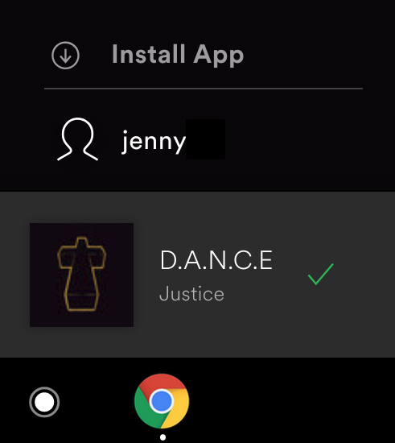

Many browsers make it possible for you to enable and promote the installation
of your Progressive Web App (PWA) directly within the user interface of your
PWA. Installation (sometimes formerly referred to as Add to Home Screen),
makes it easy for users to install your PWA on their mobile or desktop device.
Installing a PWA adds it to a user's launcher, allowing it to be run like any
other installed app.

In addition to the [browser provided install experience](/promote-install/#browser-promotion),
it's possible to provide your own custom install flow, directly within your app.

<figure class="w-figure w-figure--inline-right">
  
  <figcaption class="w-figcaption">
    "Install App" button provided in the Spotify PWA
  </figcaption>
</figure>

When considering whether to promote install, it's best to think about how
users typically use your PWA.  For example, if there's a set of users who
use your PWA multiple times in a week, these users might benefit from the
added convenience of launching your app from a smartphone homescreen or
from the Start menu in a desktop operating system.  Some productivity and
entertainment applications also benefit from the extra screen real-estate
created by removing the browser toolbars from the window in installed
`standalone` or `minimal-ui` modes.

<div class="w-clearfix"></div>

## Promoting installation {: #promote-installation }

To indicate your Progressive Web App is installable, and to provide a custom
in-app install flow:

1. Listen for the `beforeinstallprompt` event.
2. Save the `beforeinstallprompt` event, so it can be used to trigger the
   install flow later.
3. Alert the user that your PWA is installable, and provide a button or other
   element to start the in-app installation flow.


  The `beforeinstallprompt` event, and the `appinstalled` event have been moved
  from the Web App Manifest spec to their own
  [incubator](https://github.com/WICG/beforeinstallprompt). The Chrome team
  remains committed to supporting them, and has no plans to remove or deprecate
  support. Google's Web DevRel team continues to recommend using them to provide a customized
  install experience.


### Listen for the `beforeinstallprompt` event {: #beforeinstallprompt }

If your Progressive Web App meets the required [installation criteria](/install-criteria/),
the browser fires a `beforeinstallprompt` event. Save a reference to the
event, and update your user interface to indicate that the user can install
your PWA. This is highlighted below.

```js
let deferredPrompt;

window.addEventListener('beforeinstallprompt', (e) => {
  // Prevent the mini-infobar from appearing on mobile
  e.preventDefault();
  // Stash the event so it can be triggered later.
  deferredPrompt = e;
  // Update UI notify the user they can install the PWA
  showInstallPromotion();
});
```


There are many different [patterns](/promote-install/) that you can use to
notify the user your app can be installed and provide an in-app install
flow, for example, a button in the header, an item in the navigation menu,
or an item in your content feed.


### In-app installation flow {: #in-app-flow }

To provide in-app installation, provide a button or other interface element
that a user can click to install your app. When the element is
clicked, call `prompt()` on the saved `beforeinstallprompt` event (stored
in the `deferredPrompt` variable). It shows the user a modal install dialog,
asking them to confirm they want to install your PWA.

```js
buttonInstall.addEventListener('click', (e) => {
  // Hide the app provided install promotion
  hideMyInstallPromotion();
  // Show the install prompt
  deferredPrompt.prompt();
  // Wait for the user to respond to the prompt
  deferredPrompt.userChoice.then((choiceResult) => {
    if (choiceResult.outcome === 'accepted') {
      console.log('User accepted the install prompt');
    } else {
      console.log('User dismissed the install prompt');
    }
  });
});
```

The `userChoice` property is a promise that resolves with the user's choice.
You can only call `prompt()` on the deferred event once. If the user
dismisses it, you'll need to wait until the `beforeinstallprompt` event
is fired again, typically immediately after the `userChoice` property
has resolved.


[Make a site installable using the beforeinstallprompt event](/codelab-make-installable).


## Detect when the PWA was successfully installed {: #detect-install }

You can use the `userChoice` property to determine if the user installed
your app from within your user interface. But, if the user installs your
PWA from the address bar or other browser component, `userChoice` won't
help. Instead, you should listen for the `appinstalled` event. It is fired
whenever your PWA is installed, no matter what mechanism is used to install
your PWA.

```js
window.addEventListener('appinstalled', (evt) => {
  // Log install to analytics
  console.log('INSTALL: Success');
});
```

## Detect how the PWA was launched {: #detect-launch-type }

The CSS `display-mode` media query indicates how the PWA was launched,
either in a browser tab, or as an installed PWA. This makes it possible to
apply different styles depending on how the app was launched. For example,
always hide the install button and provide a back button when launched as an
installed PWA.

### Track how the PWA was launched

To track how users launch your PWA, use `matchMedia()` to test the
`display-mode` media query. Safari on iOS doesn't support
this yet, so you must check `navigator.standalone`, it returns a boolean
indicating whether the browser is running in standalone mode.

```js
window.addEventListener('DOMContentLoaded', () => {
  let displayMode = 'browser tab';
  if (navigator.standalone) {
    displayMode = 'standalone-ios';
  }
  if (window.matchMedia('(display-mode: standalone)').matches) {
    displayMode = 'standalone';
  }
  // Log launch display mode to analytics
  console.log('DISPLAY_MODE_LAUNCH:', displayMode);
});
```

### Track when the display mode changes

To track if the user changes between `standalone`, and `browser tab`, listen for
changes to the `display-mode` media query.

```js
window.addEventListener('DOMContentLoaded', () => {
  window.matchMedia('(display-mode: standalone)').addListener((evt) => {
    let displayMode = 'browser tab';
    if (evt.matches) {
      displayMode = 'standalone';
    }
    // Log display mode change to analytics
    console.log('DISPLAY_MODE_CHANGED', displayMode);
  });
});
```

### Update UI based on the current display mode

To apply a different background color for a PWA when launched as an installed
PWA, use conditional CSS:

```css
@media all and (display-mode: standalone) {
  body {
    background-color: yellow;
  }
}
```

## Updating your app's icon and name

### Chrome on Android

On Android, when your PWA is launched, Chrome will check the currently
installed manifest against the live manifest. If an update is required, it
will be [queued and updated][update-flow] once the device is plugged in and
connected to Wi-Fi.

### Chrome on Desktop

On Desktop, the manifest is not automatically updated, but this is planned for
a future update.

[update-flow]: https://developers.google.com/web/fundamentals/integration/webapks#update-webapk
